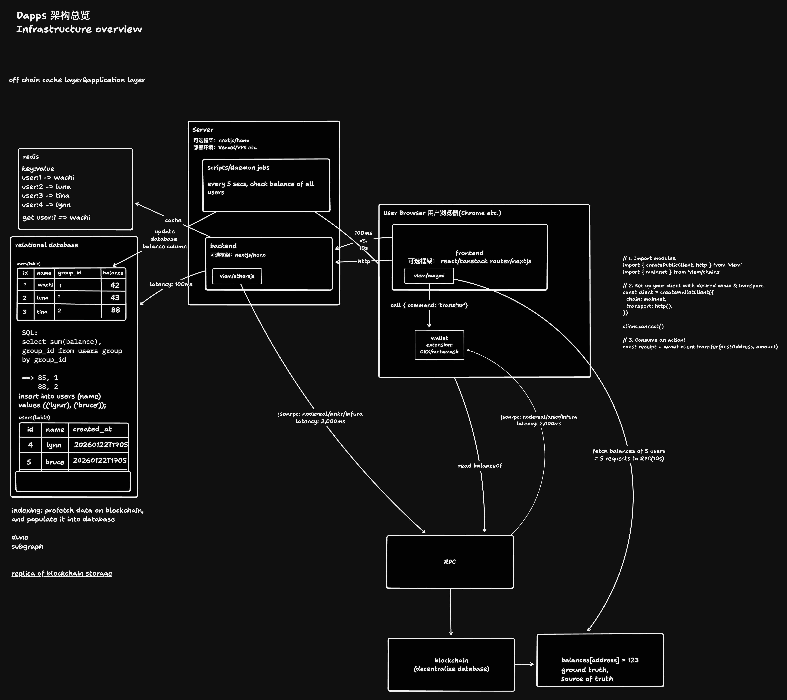

在去中心化应用（DApp）的构建过程中，开发者面临的核心挑战在于如何在区块链的透明可信与用户体验的极致性能之间取得平衡。作为架构师，我们必须意识到：DApp 的成败不仅取决于智能合约的安全性，更取决于其基础设施架构的响应能力。

## 1. 架构设计哲学与全景概述

### 核心分析

参考“Dapps 架构总览”，我们将系统解构为“链下缓存/应用层”与“链上存储/数据库层”的双层结构。这种混合架构（Hybrid Architecture）的引入，实质上是为了实现状态读写路径的解耦。

- **链上存储层 (Ground Truth)**
  区块链被视为唯一的**“去中心化数据库”**，承载着资产余额（如 `balances[address] = 123`）等核心真相。

- **链下缓存层**
  为了缓解 RPC 层的“数据可用性瓶颈”，我们通过后端守护进程构建区块链数据的**“高性能副本”**。

### 评估决策

> **💡 提示**
> 
> DApp 不能完全依赖实时链上交互，主因在于 JSON-RPC 通信的固有延迟。

引入服务端架构并非为了取代去中心化，而是通过建立 **"Replica of Blockchain Storage"**，将真相来源（Ground Truth）的访问延迟从秒级（2,000ms+）降低至毫秒级（100ms），从而解决 Web3 原生交互中的性能短板。

## 2. 前端交互与钱包连接层

在 Web3 基础设施中，前端已演变为用户加密身份、钱包插件与后端服务的连接枢纽。

### 技术选型与实现

推荐采用 **React / TanStack Router / Next.js** 作为核心框架，并深度集成 **viem / wagmi**。相较于传统的 web3.js，viem 提供了更优的组合性（Composability）以及对底层传输层（Transport Layers）的精细控制，这对于处理高延迟的 RPC 调用至关重要。

### 实现逻辑示例（基于 viem）

1.  **模块引入**
    `import { createPublicClient, http } from 'viem'` 及链定义。

2.  **客户端初始化**
    配置 `chain: mainnet` 与 `transport: http()` 以建立与 RPC 的连接。

3.  **动作执行**
    调用 `client.transfer(destAddress, amount)` 触发 transfer 指令。

### 深度解析

当用户在浏览器（Chrome 等）发起 transfer 操作时，前端通过 viem 将指令推送到钱包插件（如 OKX / MetaMask）。

*   **钱包层**： 负责读取 balanceOf 并执行交易签名。
*   **“所以呢？”分析**： 采用 viem 的战略优势在于其能够更好地封装异步响应逻辑。在面对 RPC 2,000ms+ 的延迟峰值时，其低级别的 API 允许开发者自定义重试策略和并发控制，从而确保前端在处理用户余额读取时具备更高的鲁棒性。

## 3. 服务端守护进程与业务后端架构

现代 DApp 架构需要一个常驻的状态同步器（State-Synchronizer），即后端守护进程，用于桥接异步的区块链状态与同步的用户体验。

### 核心组件设计

- **技术架构**
  基于 **Next.js** 或 **Hono** 开发，部署于 Vercel 或高性能 VPS。

- **Daemon Jobs 逻辑**
  后端脚本执行循环（Loop），**每 5 秒** 触发一次余额自检，扫描所有活跃用户的 balance 状态。

- **后端服务**
  利用 **viem/ethers.js** 执行 View 层函数。后端不再仅仅是 API 接口，更是数据的“预处理器”。

### 性能评估

在处理多用户场景时，前端直接 RPC 的局限性极其明显：

| 交互路径 | 场景 | 协议 | 响应时延 |
| :--- | :--- | :--- | :--- |
| 前端直接 RPC | 并发获取 5 个用户余额 | JSON-RPC | 10,000ms (10s) |
| 后端缓存读取 | 高频业务查询 | HTTP | 100ms |

通过后端守护进程，我们将复杂的读操作转化为简单的 SQL/Redis 查询，极大提升了系统吞吐量。

## 4. 链下数据缓存与持久化存储

为了支撑高扩展性，架构必须维护一份区块链数据的“副本”。

### 数据流转机制

1.  **高速缓存 (Redis)**： 存储高频 KV 数据，例如 `user:1 -> wachi`。当 Daemon Jobs 更新 balance 时，同步刷新 Redis 以供前端秒开调用。
2.  **关系型数据库 (SQL)**： 负责处理复杂业务逻辑和聚合统计。
    *   **Schema 示例**： `users(table)` 包含 `id`, `name`, `group_id`, `balance`, 以及时间戳 `created_at` (格式如 20260122T1705)。
    *   **插入操作**： `insert into users (name) values (('lynn'), ('bruce'));`
3.  **数据索引 (Indexing)**： 利用 Subgraph 或 Dune 进行预取（Prefetch），将零散的链上状态转化为结构化的本地数据。

### 价值分析：聚合查询的必要性

区块链底层的键值存储无法处理类似 `select sum(balance), group_id from users group by group_id` 的复杂查询。

在本架构下，此类查询可立即返回结果（如：85, 1；88, 2），而若在链上执行，其计算成本和延迟将是开发者无法接受的。

## 5. RPC 通信协议与链上交互层

RPC 是 DApp 与“真相之源”对话的唯一通道，其稳定性决定了架构的下限。

### 底层通信细节

*   **服务商选择**： 集成 Nodereal / Ankr / Infura 等专业 RPC 供应商。
*   **时延剖析**： 基于 JSON-RPC 协议的单次调用延迟通常在 2,000ms。由于 HTTP 往返与节点处理时间的堆叠，批量请求（如 5 个 request）会导致性能呈指数级下降。
*   **真相来源（Ground Truth）**： 尽管 Redis/SQL 提供了 100ms 的极速体验，但 **区块链（Decentralized Database）** 始终是 Ground Truth。

> **⚠️ 架构师建议**
> 
> 系统必须建立一套定期校验机制。虽然前端展示依赖 100ms 的缓存数据，但关键交易逻辑必须异步比对 2,000ms 后的链上真相，以确保数据完整性（Data Integrity）。

## 6. 基础设施部署指南与性能基准

### 实战部署清单

1.  **前端层**
    集成 viem 配置，实现 3 步走调用逻辑（Import -> Setup -> Action）。

2.  **后端同步层**
    配置 Daemon Jobs，设定 5s 周期同步所有用户余额。

3.  **存储层**
    初始化 Redis 缓存并建立 SQL 索引，配置 Subgraph 任务定期 Populate 链上历史。

4.  **RPC 优化**
    针对高频请求建立 Failover 机制，在多供应商间分流。

### 性能基准对照表

| 交互路径 | 通信协议 | 预期延迟 | 备注 |
| :--- | :--- | :--- | :--- |
| 前端 - 后端 | HTTP | 100ms | 极致的用户体验路径 |
| 后端 - 数据库 | SQL / TCP | 100ms | 支持复杂业务聚合逻辑 |
| 后端/前端 - RPC | JSON-RPC | 2,000ms+ | 单次读取“真相”的代价 |
| 批量 RPC 请求 (5次) | JSON-RPC | 10,000ms | 系统性能瓶颈点 |

