## 一、Solidity 语言概览

### 1. Solidity 语言要点

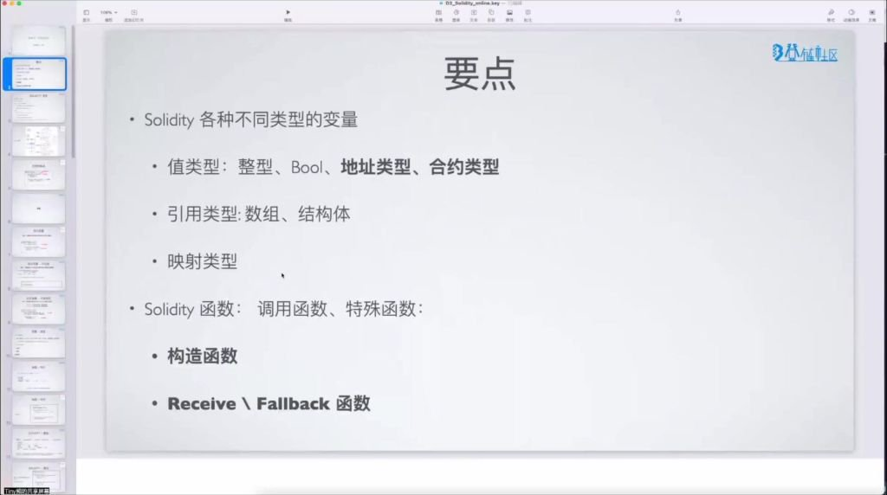

- **变量分类**：
    - **值类型**：整型、**Bool**、地址类型、合约类型。
    - **引用类型**：数组、结构体。
    - **映射类型**（**Mapping**）。
- **函数特性**：
    - 普通函数调用。
    - **特殊函数**：
        - 构造函数（**Constructor**）。
        - **Receive** / **Fallback** 回调函数。
- **学习重点**：
    - **地址类型**和**合约类型**（以太坊特有，与其他语言不同）。
    - **Receive** / **Fallback** 回调函数（区块链处理 ETH 的核心逻辑）。
    - 其他语法特性会快速带过，需要课后通过实践巩固。

---

### 2. Solidity 语言特性


- **基本特性**：
    - **静态编译型**高级语言。
    - 专为 **EVM** (以太坊虚拟机) 设计。
    - **语法融合多语言特点**：
        - **C++ 特性**：变量声明、`for` 循环、函数重载。
        - **JavaScript 特性**：`function` 关键字、`import` 语法。
- **学习资源**：
    - **中文文档**：[learnblockchain.cn/docs/solidity](https://learnblockchain.cn/docs/solidity/)
    - **英文文档**：[docs.soliditylang.org](https://docs.soliditylang.org/)
    - **实践教程**：[decert.me/tutorial/solidity/intro](https://decert.me/tutorial/solidity/intro/)
    - **示例代码**：[GitHub - solidity_sample_code](https://github.com/OpenSpace100/blockchain-tasks/tree/main/solidity_sample_code)

---

### 3. Solidity 学习指南


- **学习建议**：
    - 优先阅读**英文官方文档**（最具权威性、更新最快）。
    - 中文文档作为理解辅助。
    - 建议结合 **Decert** 教程同步进行代码实践。
- **实践资源**：
    - 课程所有示例代码均托管在 **GitHub**。
    - 强烈建议克隆仓库在本地环境进行运行与调试。
    - 重点攻克：**地址类型**与 **Receive** / **Fallback** 回调等特有概念。

---

## 二、变量与基础类型系统

### 1. 布尔类型 (Bool)

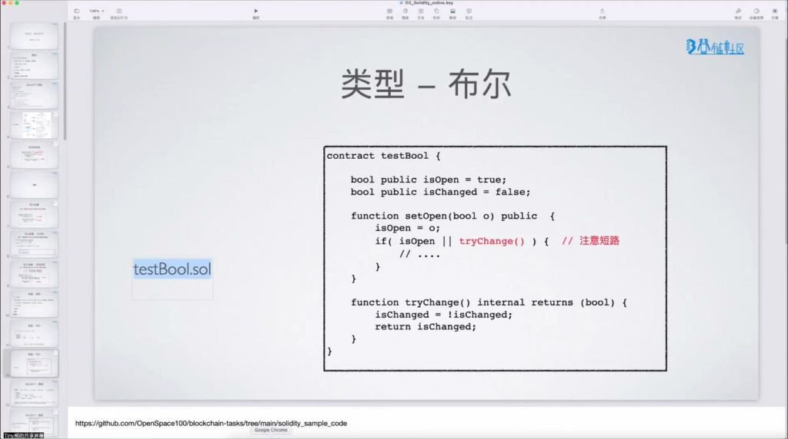

#### 1) Solidity 语言解析


- **布尔类型声明**：
    - 使用 `bool` 关键字声明变量。
    - **默认值**：`false`。
    - **语法示例**：`bool public isOpen = true;` 或 `bool public isChanged = false;`。
- **布尔运算特性**：
    - 支持比较运算 (`==`, `!=`) 与逻辑运算 (`!`, `&&`, `||`)。
    - **逻辑短路机制**：如果前一条件已能确定结果，后续表达式将不再执行。
    - **示例**：在 `isOpen || tryChange()` 中，若 `isOpen` 为 `true`，则 `tryChange()` 函数**不会**被触发。
    - **关键提醒**：这种短路特性会直接影响合约状态变更函数的执行路径，编写时需格外注意。

#### 2) 合约的基本组成


- **版本声明**：使用 `pragma solidity ^0.8.0;` 指定编译器。
- **合约定义**：使用 `contract Counter { ... }` 包装，类似于其他语言的 `class`。
- **状态变量**：如 `uint public counter;`，永久存储在区块链状态树上。
- **构造函数**：`constructor()` 在部署瞬间执行一次。
- **合约函数**：使用 `function` 关键字定义各种业务逻辑方法。

---

### 2. 变量定义、可见性与可变状态


- **定义格式**：`变量类型 [可见性] [可变性] 变量名 [= 初始值];`
- **可见性控制 (Visibility)**：
    - **public**：自动生成 **Getter** 函数，合约内外均可访问。
    - **private**：仅限当前合约内部访问，外部不可用（但数据在链上仍是公开可见的）。
    - **internal**：当前合约及继承它的子合约可以访问。
- **存储位置**：
    - **状态变量**：永久上链，开销极大。
    - **局部变量**：仅存活于函数执行期间。

#### 1) 变量的可变性修饰

- **constant**：硬编码常量，编译时固定值，完全不占用存储插槽，最省 Gas。
- **immutable**：不可变量，在部署时的 `constructor` 中动态赋值，之后不可修改。
- **普通变量 (Storage)**：可随时被函数修改，其状态变更将记录在每个区块中。

#### 2) 数据传递类型

- **值类型 (Value Types)**：包含布尔、整型、地址、枚举等，传递时进行**值拷贝**。
- **引用类型 (Reference Types)**：包含数组、结构体、映射等，传递时可能涉及引用或引用数据的克隆。

---

### 3. 整型 (Integer)

- **类型细分**：
    - 有符号 (`int`) 与无符号 (`uint`)。
    - 支持不同位宽：`uint8`, `uint16` ... 直到 `uint256`。
    - **默认值**：若未标位宽，默认为 $256$ 位 ($32$ 字节)。
- **运算符支持**：
    - 比较、算术 (`+`, `-`, `*`, `/`, `%`, `**`)、位运算及移位运算。
- **Gas 成本意识**：修改链上变量是 **EVM** 中最昂贵的操作之一，其消耗是纯运算成本的几十倍。
- **整数溢出处理**：
    - **Solidity 0.8.0+**：原生支持溢出检查，溢出交易会立即回滚 (**Revert**)。
    - **历史版本 (0.5.x)**：溢出会导致高位被直接截断（类似时钟循环，`uint8` 的 $256$ 会归零）。
    - **获取极限值**：`type(uint256).min` / `type(uint256).max`。

---

### 4. 地址类型 (Address)

- **类型细分**：
    - `address`：普通 $20$ 字节地址，可读取余额。
    - `address payable`：可支付地址，拥有转账权限。
- **显式转换**：可使用 `payable(addr)` 将普通地址转换为可支付类型。
- **成员方法**：
    - **查询余额**：`address.balance`（单位：**Wei**）。
    - **转账 (`transfer`)**：失败时回滚异常。限制消耗 **2300 Gas** 以防止重入攻击。
    - **发送 (`send`)**：失败时返回 `false`。
- (./images/c861e2b4a099b9e08b9e83b9136112c4_MD5.jpg)
- **账户属性图解**：以太坊中的所有账户（**EOA** 和合约账户）在底层均包含 **nonce**, **balance**, **storageRoot**, **codeHash** 四项。

---

### 5. 合约类型 (Contract Type)

- **类型属性**：每定义一个 `contract`，Solidity 就自动增加了一个以此命名的类型。我们可以声明变量 `Counter c;`。
- **合约创建 (`new`)**：使用 `new` 关键字可在链上实时部署一个新的合约实例。
- **合约交互与转换**：合约实例可以直接转为其地址类型 `address(this)` 来执行转账或查询操作。

---

### 6. 枚举与自定义类型

#### 1) 枚举类型 (Enum)

- **语法特征**：使用 `enum Status { Ordered, Shipped }`。成员从 $0$ 开始自动编号。
- **底层原理**：在编译后，枚举本质上是按 $8$ 位无符号整数 (`uint8`) 存储的。
- **数量限制**：最多支持 $256$ 个成员。

#### 2) 用户自定义值类型 (User-Defined Type)


- **核心价值**：为现有基础类型创建具有明确业务语义的别名。
- **定义方法**：`type Duration is uint256;`。
- **转换逻辑**：
    - `wrap(value)`：将数值转换为自定义类型。
    - `unwrap(customValue)`：取回原始数值以便进行数学运算。
- **零成本抽象**：仅作为编译时的类型约束，不引入任何额外的链上存储开销。

---
## 三、引用类型

### 1. 值类型赋值拷贝


- **拷贝机制**：值类型赋值时总是进行值拷贝，例如 `uint a = b;` 会将 `b` 的值完整复制到 `a` 的存储空间。
- **引用优化**：当变量大小超过 **32 字节** 时，采用引用方式（指针）指向同一变量以避免高开销拷贝。
- **存储位置标识**：引用类型必须用属性声明存储位置：
    - **memory**：生命周期仅限函数调用期间。
    - **storage**：状态变量存储位置（**Gas** 开销最大）。
    - **transient**：仅交易内有效的瞬态存储（仅支持值类型）。
    - **calldata**：函数参数的不可变存储区。
- **拷贝规则**：不同存储位置间赋值会触发拷贝，相同位置则共享引用。

---

### 2. 数组

#### 1) 数组的类型


- **固定长度数组**：声明格式为 `T[k]`，如 `uint[10] tens;` 定义含 **10** 个元素的定长数组。
- **动态数组**：声明格式为 `T[]`，如 `uint[] public numbers;` 支持长度动态调整。
- **特殊数组**：
    - **bytes**：原始字节序列。
    - **string**：**UTF-8** 编码字符串。
- **访问方式**：通过下标访问，索引从 **0** 开始，如 `tens[0]` 或 `numbers[1]`。

#### 2) 数组的成员

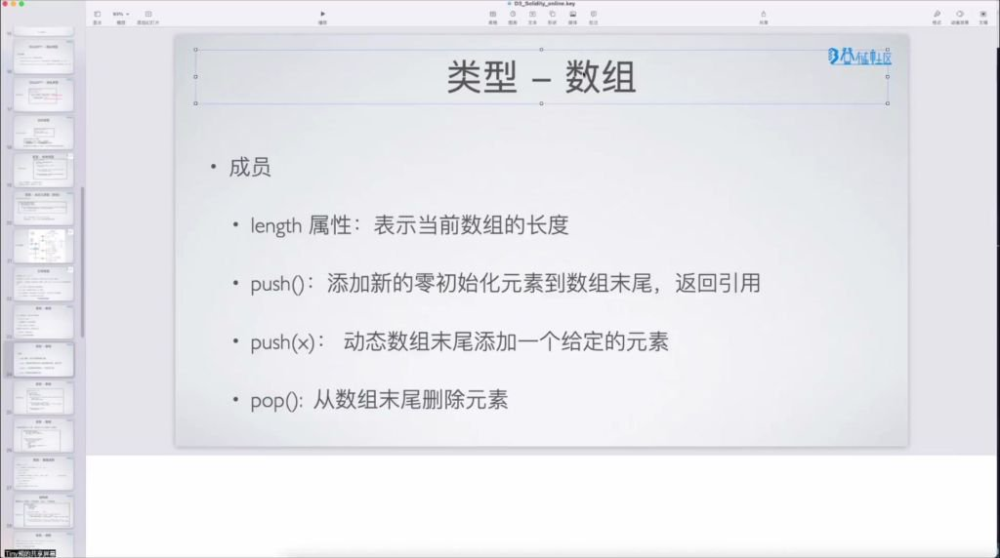
- **length 属性**：获取当前数组长度。
- **push()**：
    - 无参版本：在动态数组末尾添加零值元素并返回引用。
    - 带参版本：`push(x)` 直接添加指定值元素。
- **pop()**：删除数组末尾元素。
- **存储声明**：所有引用类型变量声明时必须指定存储位置（**memory** / **storage** / **calldata**）。

#### 3) 应用案例


- **例题：数组默认位置**
    - **合约级变量**：默认 **storage** 存储（如 `uint[10] tens;`）。
    - **函数内变量**：必须显式声明 **memory**（如 `uint[] memory c = new uint[](len);`）。
    - **引用特性**：
        - 同存储位置的引用会共享数据（修改 `y` 会影响同属 **storage** 的 `numbers`）。
        - 不同存储位置赋值会产生拷贝（如 **calldata** 传参到 **memory** 变量）。
    - **Gas 优化技巧**：
        - 避免全数组遍历（可能超出区块 **Gas** 限制）。
        - 删除元素时采用 **“末位替换法”**（将待删元素与末尾元素交换后 `pop`）。

#### 4) 数组进阶


- **多维数组声明**：使用 `uint[][] groups;` 语法，支持任意维度嵌套。
- **字节数组特性**：
    - 包含定长类型 `bytes1` 到 `bytes32`，存储单个字节到 **32** 字节数据。
    - 写入字符时会自动转换为字节形式存储。
    - 支持 `.concat` 方法进行拼接操作。
- **字符串特殊性质**：
    - 本质是数组类型但无 `char` 类型支持。
    - 不可通过下标访问单个字符。
    - 同样支持 `.concat` 拼接方法。
- **数组切片**：
    - 仅适用于 **calldata** 位置的数组。
    - 语法示例： `x[0:2]` 取前两个元素， `x[4:]` 取第 **4** 到末尾元素。
- **访问器函数**：
    - 自动生成带参数的 **getter** 函数。
    - 对 **public** 数组变量提供便捷访问方式。

### 3. 结构体

#### 1) 结构体的声明

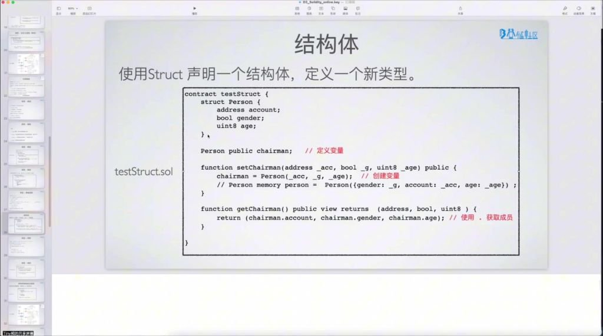
- **声明方式**：使用 `struct` 关键字定义新类型。
- **复合特性**：可包含任意基础类型组合。
- **成员定义**：示例中的 `Person` 结构体包含：
    - **address** 类型的 `account` 成员。
    - **bool** 类型的 `gender` 成员。
    - **uint8** 类型的 `age` 成员。

#### 2) 结构体的创建

- **顺序初始化**：按照成员顺序直接赋值。
- **具名参数初始化**：明确指定成员名称赋值（强烈推荐，可读性更佳）。
- **存储位置**：创建时可指定为 **memory** 或 **storage**。

#### 3) 结构体的使用

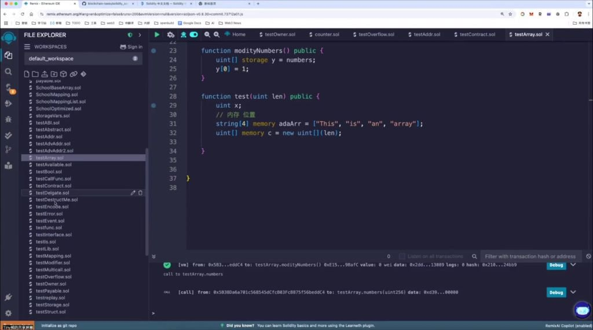
- **成员访问**：通过点运算符 (`.`) 获取成员值。
- **修改操作**：对 **storage** 位置的结构体可直接修改其成员值。
- **实践建议**：务必通过编写代码来识别不同初始化方式在 Gas 上的细微差异。

---

### 4. 映射 (Mapping)

#### 1) 映射的声明形式

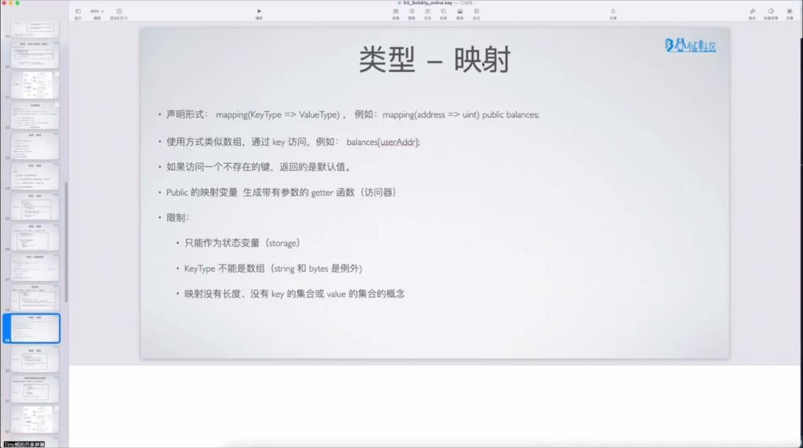
- **语法结构**：使用 `mapping(KeyType => ValueType)` 声明，例如 `mapping(address => uint) public balances;`。
- **存储位置**：映射必须且仅能指定为 **storage** 类型，只能在合约级别作为状态变量定义。
- **类型限制**：`KeyType` 不能是数组（但允许 **string** 和 **bytes** 类型作为特例）。

#### 2) 映射的使用方式

- **访问方式**：类似数组通过中括号访问，如 `balances[userAddr]`。
- **默认值机制**：访问不存在的键时总是返回该类型的默认值（如 **uint** 返回 `0`，**bool** 返回 `false`）。
- **赋值操作**：可通过命名的结构体或直接赋值，如 `funders[id] = Funder(msg.sender, msg.value);`。

#### 3) 映射的访问器

- **自动生成**：声明为 **public** 的映射变量会自动生成一个带参数的 **getter** 函数。
- **调用示例**：定义 `mapping(address => uint) public balances;` 后，可通过 `balances(key)` 进行跨合约查值。

#### 4) 映射的限制

- **不可遍历性**：原生映射无法直接获取其长度、Key 集合或 Value 集合。
- **定义位置限制**：映射不能作为局部变量并在函数内定义，其数据需永久锚定在区块链状态中。
- **内存分配**：所有映射数据均通过 Key 的哈希值索引，永久存储于区块链存储空间。

#### 5) 应用案例

- **例题：映射键值操作**
    - **实例解析**：
        - 通过 `update()` 函数使用 `msg.sender` 作为 Key 来原子化更新映射中的对应值。
        - 不同地址调用会生成完全隔离的存储空间，体现了去中心化账本的基本形态。
        - 通过 `get()` 函数能够即时调取特定地址的关联数据。
    - **存储特性**：
        - 映射从理论上提供了无限大的 Key-Value 空间。
        - 每次写入新 Key 都会导致状态树的分支增长。
        - 运维成本：由于**不可遍历**，开发者通常需要额外维护一个记录 Key 的数组以便于后续审计。

---

### 5. 结构体与映射的组合使用

#### 1) 组合模式解析

- **常见范式**：结构体和映射经常组合使用，主要表现为：
    - **映射的值是结构体**（工业界最通用的数据建模方式）。
    - **结构体中包含映射**（逻辑较为复杂，使用较少）。
- **数据库类比**：
    - **Mapping** 充当了数据库表的主键索引。
    - **Struct** 则定义了包含多种“列/字段”的一行完整记录。
- **代码示例**：
```solidity
contract testStruct {
    struct Funder {
        address addr;
        uint amount;
    }
    mapping(uint => Funder) funders; 
}
```

#### 2) 组合使用功能演示

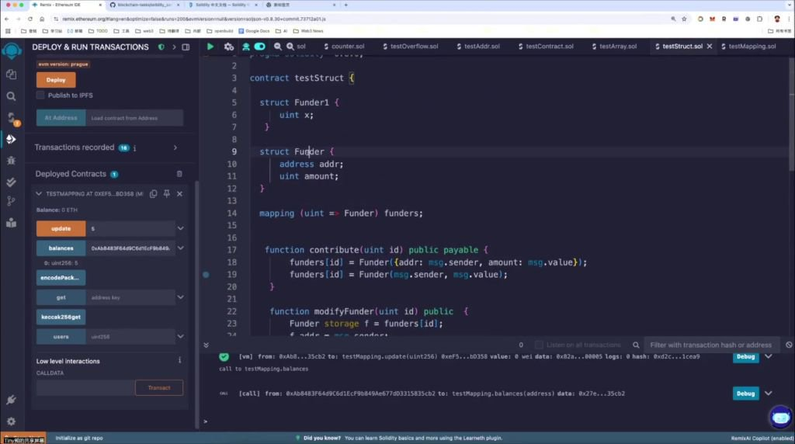
- **数据读写**：
    - 通过唯一 **ID** 定位到具体的业务记录单元。
    - 指针引用：利用 `storage` 标记可极其高效地对特定字段进行动态修改。

#### 3) 实战交易演示

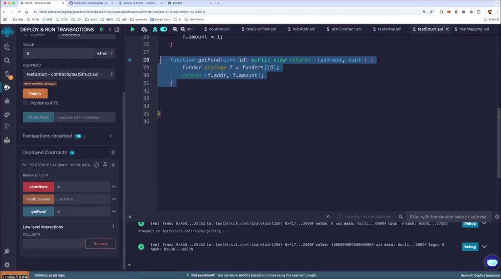
- **底层驱动变量**：
    - **msg.sender**：精确追踪当前执行契约的发起方账户。
    - **msg.value**：捕捉随本次调用发送的以太币总额（1 ETH = $10^{18}$ **Wei**）。
- **链上持久化**：所有的变量交互最终都将通过 **storage** 的状态转移原子地锚定在区块链分布式账本中，极难被篡改。

---

## 四、函数与控制流

### 1. 定义函数

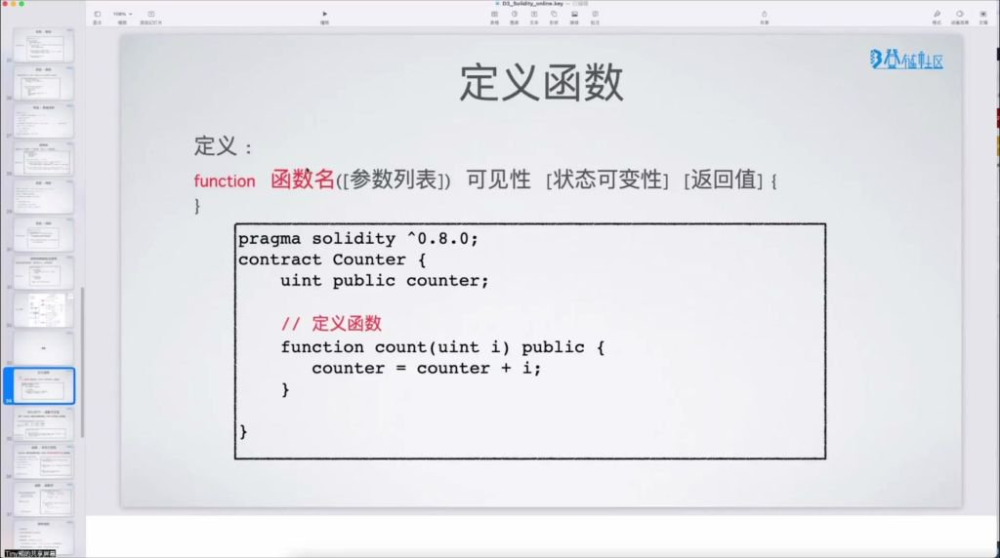

- **基本结构**：`function 函数名([参数列表]) 可见性 [状态可变性] [返回值] { }`
- **示例**：
```solidity
function count(uint i) public {
    counter = counter + i;
}
```
- **参数定义**：与变量定义方式完全相同，包含参数类型和参数名。

---

### 2. 函数可见性

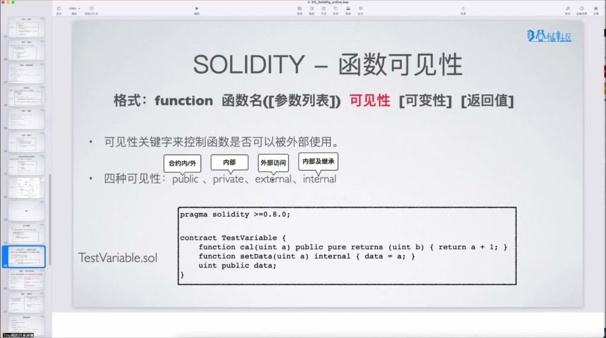

- **四种可见性**：
    - **public**：可在合约内外调用（最常见）。
    - **private**：仅限合约内部调用。
    - **internal**：合约内部及继承合约调用。
    - **external**：只能被外部调用（特殊场景使用）。
- **external 特点**：
    - 不能通过内部调用方式访问（如直接 `get()`）。
    - 必须通过 `this.get()` 或外部合约地址调用。
    - 适用于需要跨合约调用的场景。

---

### 3. 函数状态可变性

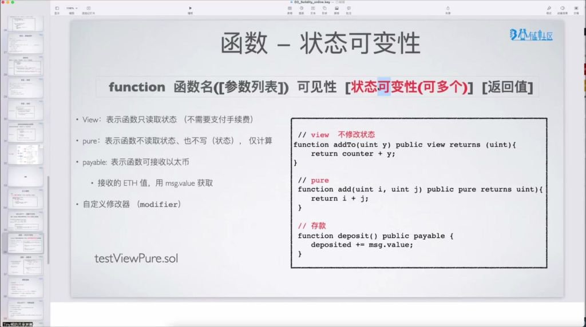

#### 1) view

- **作用**：声明函数只读取不修改链上状态。
- **特点**：
    - 不需要支付 **Gas** 费用（本地执行）。
    - 可读取状态变量但不可修改。

#### 2) pure

- **作用**：声明函数不读取也不修改链上状态。
- **特点**：
    - 仅进行纯计算操作。

#### 3) payable

- **作用**：允许函数接收 **ETH** 转账。
- **特点**：
    - 必须显式声明才能接收 **ETH**。
    - 通过 `msg.value` 获取接收的 **ETH** 数量。
- **注意事项**：
    - 未声明 **payable** 的函数无法接收 **ETH** 转账。
    - 合约余额变化通常需要通过 **payable** 函数实现。

---

### 4. 函数体


- **支持结构**：
    - 常规控制流：`for` / `if` / `else` / `while` / `do`
    - 流程控制：`break` / `continue` / `return`
- **限制**：
    - 不支持 `goto` 和 `switch` 语句。
- **示例**：
```solidity
function testFor() public pure {
    for (uint256 i = 0; i < 10; i++) {
        if (i == 3) continue;
        if (i == 5) break;
    }
}
```

---

### 5. 调用函数

#### 1) 举例演示函数调用

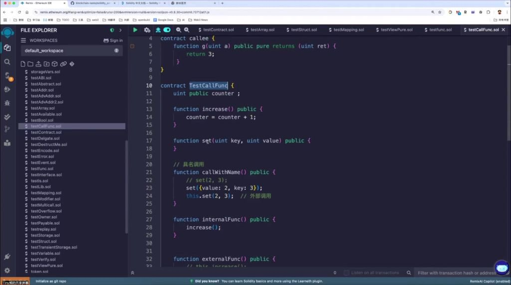

- **内部调用**：
    - 直接使用函数名：`increase()`
    - 在同一个 **EVM** 上下文中执行，效率高。
- **外部调用**：
    - 通过合约地址调用：`this.increase()` 或 `合约地址.increase()`
    - 会创建新的 **EVM** 上下文，消耗更多 **Gas**。
- **参数传递**：
    - 常规方式：`set(2, 3)`
    - 具名参数：`set({value: 2, key: 3})`（较少使用）。
- **Gas 控制**：
    - 可指定 **Gas** 限制：`c.gfunc{gas: 60000}(10)`
    - 主要用于防止第三方合约消耗过多 **Gas**。
- **Value 传递**：
    - 可附加 **ETH**：`this.increase{value: 10}()`
    - 需要函数声明为 **payable**。
---


## 五、特殊函数 (Constructor / Receive / Fallback)

### 1. 构造函数


- **执行时机**：仅在合约部署时执行一次，链上字节码不包含 **constructor** 本身。
- **初始化逻辑**：用于设置合约初始状态，如 `constructor(uint x) { counter = x; }`。
- **代码存储**：部署后链上只存储执行结果，不保留 **constructor** 代码。

### 2.  回调函数


- **receive函数**
	- **触发条件**：合约接收以太币时自动调用。
	- **调用限制**：
	    - 不能直接调用（**Remix** 左下角不可见）。
	    - 必须声明为 `receive() external payable`。
	- **Gas 限制**：普通转账操作固定消耗 **2300 Gas**。
- **fallback函数**
	- EVM没有找到用户要调用的函数时, fallback会被调用，如果是转账时，没有receive也有调用fallback
#### 1) 测试代码与交易说明

- **转账交易类型**：
    - 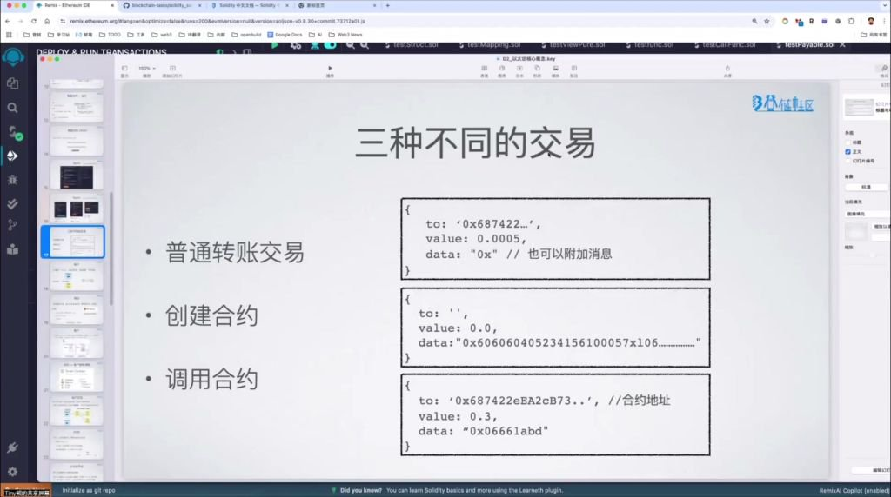
    - **普通转账**：`to` 地址 + `value`，无 `data`。
    - **合约调用**：需指定 `to`（合约地址）+ `data`（函数选择器）。
    - **合约创建**：`to` 为空，`data` 包含合约字节码。
- **转账操作演示**：
    - **接收验证**：合约必须实现 **receive** 或 **fallback** 才能接收 **ETH**。
    - **失败场景**：当接收合约未实现回调函数时，直接转账会触发 **revert**。

#### 2) 地址类型进阶

- **balance 属性**：获取地址余额，如 `address(this).balance`。
- **transfer 方法**：固定消耗 **2300 Gas**，失败时 **revert** 整个交易。
- **send 方法**：固定消耗 **2300 Gas**，失败时返回 `false` 而不 **revert**。

### 3. 发起交易逻辑

- **有 data 时**：匹配合约函数签名，无匹配时调用 **fallback**。
- **无 data 时**：优先调用 **receive**，无 **receive** 时调用 **fallback**。两者均未实现则交易失败。

### 4. 回调函数小结

- **必要实现**：合约接收 **ETH** 转账的基石。
- **执行顺序**：`无 data → receive → fallback`。
- **典型应用**：接收普通转账 (**receive**)、处理未知调用 (**fallback**)、代理合约转发。

---

## 六、Solidity 全局变量与内置 API

### 1. 全局变量及基础函数

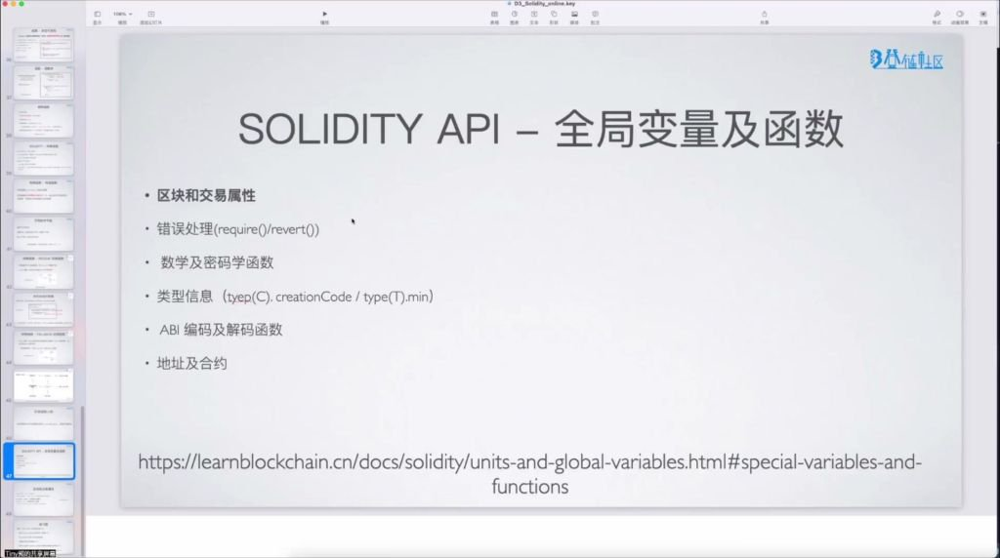

- **文档参考**：API 参考手册：[learnblockchain.cn/docs/solidity](https://learnblockchain.cn/docs/solidity/units-and-global-variables.html)
- **主要功能**：
    - 区块和交易属性。
    - 错误处理（`require()` / `revert()`）。
    - 数学与密码学函数。
    - 类型信息（如 `type(C).creationCode`）。
    - **ABI** 编码与解码。
    - 地址及合约操作。

### 2. 区块与交易属性 (msg / block / tx)

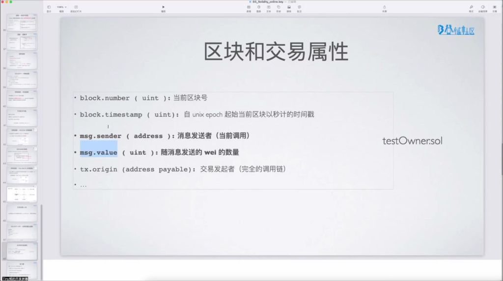

- **常用属性**：
    - `block.number`：当前区块号（**uint**）。
    - `block.timestamp`：当前区块 Unix 时间戳（**uint**）。
    - `msg.sender`：当前调用者地址。
    - `msg.value`：随交易发送的 **Wei** 数量（**uint**）。
    - `tx.origin`：交易的最原始发起者（完整调用链源头）。
- **核心区别**：
    - **msg.sender** vs **tx.origin**：当合约 A 调用合约 B 时，在 B 中 **msg.sender** 是 A 的地址，而 **tx.origin** 始终是最初发起交易的用户钱包地址。

### 3. 特殊函数详解 (Receive / Fallback)

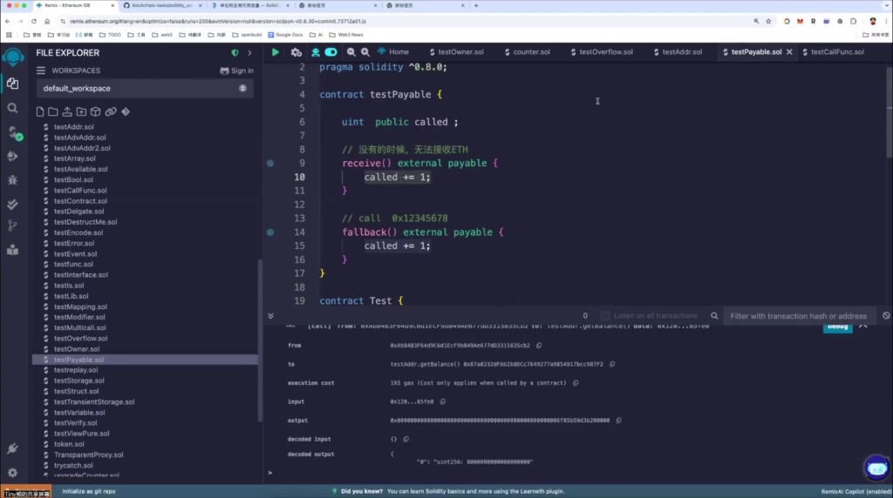

- **receive()**：接收纯 **ETH** 转账（无 `data`），必须为 `external payable`。
- **fallback()**：兜底函数，处理未知函数调用或在无 **receive** 时接收 **ETH**。
- **核心特性**：不可主动调用，仅能被动触发。

### 4. 课后实战：Bank 合约练习

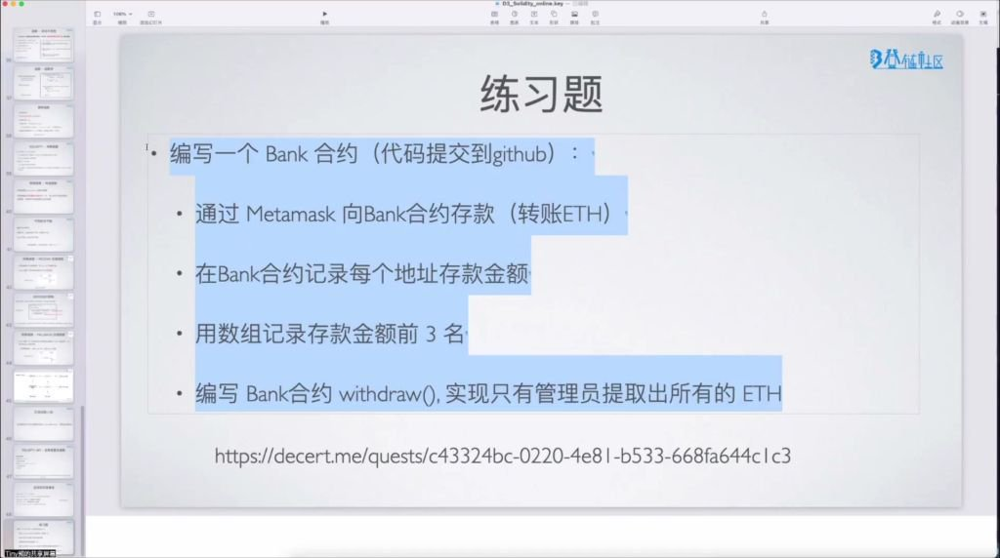
- **题目要求**：
    1. 编写 **Bank** 合约，允许通过 **Metamask** 存款并记录金额。
    2. 使用状态变量维护存款账户，并用数组记录存款金额前 **3** 名。
    3. 实现 `withdraw()` 函数，设计权限检查仅允许管理员提取。
- **实践重点**：
    - 使用 `msg.value` 捕捉金额。
    - 练习数组操作与逻辑验证。
    - 提交代码至 **GitHub** 仓库。

---


