## 一、 函数调用

### 1. 调用结果

- 
- **接口调用**与**底层调用**:
    - **接口调用**: 通过合约类型实例直接调用方法，如 `c.count()`
    - **底层调用**: 使用 `address.call()` 和 **ABI** 编码调用，如 `abi.encodeWithSignature("count()")`
    - **调用结果等价性**: 两种方式最终都会转换为对合约函数的 **ABI** 编码调用
- **ABI 编码组成**:
    - **函数选择器**: 对函数签名计算 `Keccak-256` 哈希，取前 4 个字节
    - **参数编码**: 包含函数参数的编码数据
- **安全性对比**:
    - **接口调用优势**: 自动检查合约存在性、函数返回值和参数，调用失败会直接 `revert`
    - **底层调用注意点**: 需要手动检查返回值、调用状态和返回数据

### 2. 转账

- 
- **传统转账方法**:
    - `transfer`: 固定 2300 gas 限制，合约接收容易失败
    - `send`: 同样受 2300 gas 限制，返回布尔值需手动检查
- **底层调用转账**:
    - `call` 方法优势: 无 gas 限制或可手动指定 gas 量
    - **语法示例**:
        - `addr.call{gas: 1000000}(new bytes(0))`
        - `addr.call{value: 1 ether}(new bytes(0))`
- **OpenZeppelin 实践**:
    - `sendValue` 实现: 替代 `transfer`，转发所有可用 gas，失败时 `revert`
    - **安全考虑**: 需防范**重入攻击**，建议配合 `ReentrancyGuard` 使用

### 3. 三种交易

- 
- **普通转账交易**:
    - 特征: `data` 字段为空，仅包含 `value` 转账金额
- **合约创建交易**:
    - 特征: `to` 地址为零，`data` 字段包含合约创建字节码
- **合约调用交易**:
    - 特征: 包含合约地址和 **ABI** 编码的调用数据

### 4. 应用案例

#### 1）例题：转账示例题

- 
- **题目解析**:
    - 传统 `transfer` 限制: 演示中因 2300 gas 不足导致转账失败
    - `call` 方法成功原因: 不受 gas 限制，可执行合约 `receive` 函数中的逻辑
    - **OpenZeppelin 最佳实践**: 推荐使用 `sendValue` 而非手动实现 `call` 转账

#### 2）例题：转账测试地址示例题

- 
- **题目解析**:
    - **测试环境搭建**:
        - 部署 `testAddr` 合约并预存 10 ETH
        - 部署 `testPayable` 合约作为接收方
    - **关键观察点**:
        - `transfer` 调用因 gas 限制失败
        - `call` 调用成功执行 `receive` 函数并更新状态变量
    - **gas 消耗分析**:
        - 成功交易消耗约 8 万 gas
        - 包含状态变量更新和完整函数执行

---

## 二、 底层调用

### 1. 底层函数类型

- 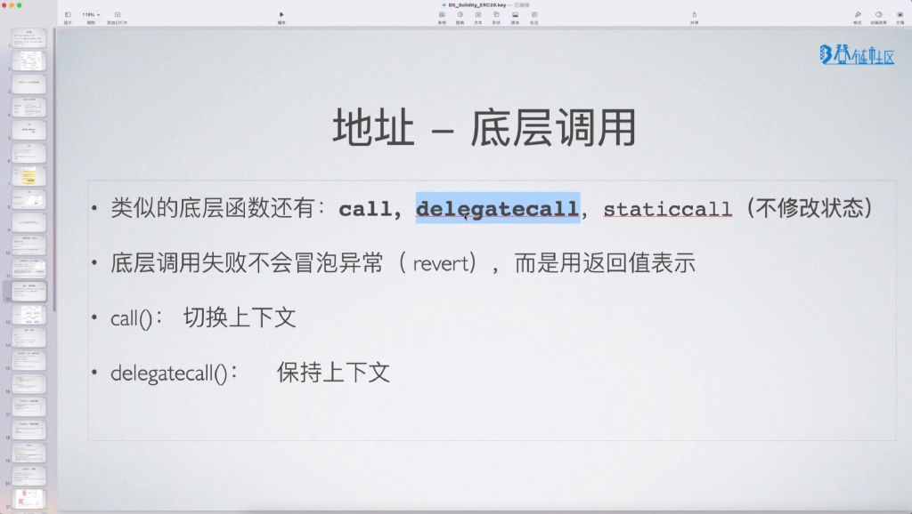
- `call` 函数:
    - **上下文切换**: 会切换执行上下文，`msg.sender` 变为调用者合约地址
    - **异常处理**: 调用失败不会抛出异常 (`revert`)，而是通过返回值表示
- `delegatecall` 函数:
    - **上下文保持**: 保持当前执行上下文，`msg.sender` 保持为原始调用者地址
    - **状态修改**: 被调用合约代码在调用者合约上下文中执行，修改的是调用者合约的状态变量
- `staticcall` 函数:
    - **只读特性**: 不修改状态，相当于模拟调用
    - **适用场景**: 主要用于查询操作

### 2. 调用上下文对比

- 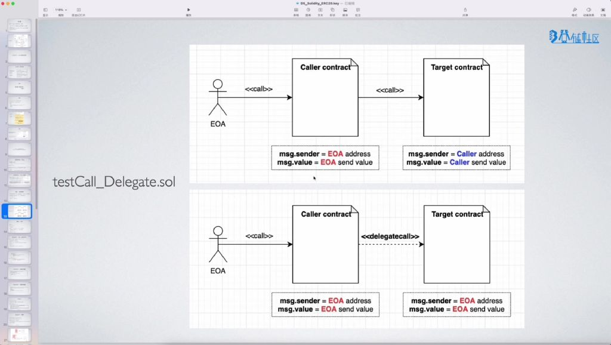
- **call 调用链**:
    - EOA → Caller 合约 → Target 合约
    - `msg.sender` 变化: EOA 地址 → Caller 合约地址
    - `msg.value` 变化: EOA 发送值 → Caller 发送值
- **delegatecall 调用链**:
    - EOA → Caller 合约 → Target 合约
    - `msg.sender` 保持: 始终为 EOA 地址
    - `msg.value` 保持: 始终为 EOA 发送值

### 3. 代码示例分析

- ![[ad362471e84ae356990eddc1079f4fab_MD5.jpg]]
- call示例:
    - 被调用合约的counter和sender状态变量会被修改
    - 调用链形成完整上下文切换
- delegatecall示例:
    - 调用者合约的counter和sender状态变量会被修改
    - 相当于"借用"目标合约代码在当前合约上下文中执行

### 4. 实际调用演示

- ![[26e0cbc44b5c260a0483b08ba9c6b19b_MD5.jpg]]
- call调用结果:
    - 被调用合约状态变量更新
    - sender显示为中间调用合约地址
- delegatecall调用结果:
    - 调用者合约状态变量更新
    - sender显示为原始EOA地址
    - 被调用合约状态保持不变

### 5. 异常处理机制

- **异常处理特点**:
    - 底层调用失败不会自动 `revert` 整个交易
    - 通过返回的 `bool` 值表示调用成功与否
    - 需要手动检查返回值处理失败情况
- **与高级调用的区别**:
    - 普通函数调用失败会冒泡异常
    - 底层调用需要显式错误处理

### 6. 地址功能小结

- 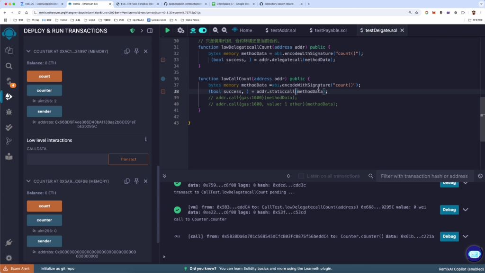
- **基本属性**:
    - `balance`: 查询地址 ETH 余额
    - `transfer()` / `send()`: ETH 转账方法
        - `transfer`: 失败会 `revert`，gas 限制 2300
        - `send`: 失败返回 `false`，gas 限制 2300
- **底层调用**:
    - `call`: 切换上下文，可附带 ETH 和价值
    - `delegatecall`: 保持上下文，常用于代理模式
    - `staticcall`: 只读调用，不修改状态
- **共同特点**:
    - 调用失败不自动 `revert`
    - 通过返回值 (`bool`) 表示调用结果
    - 需要手动处理调用失败情况

---

## 四、 库

### 1. 库的定义与使用

- 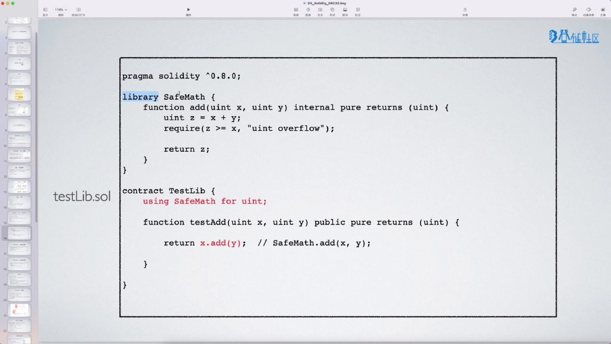

#### 1）库的基本概念

- **定义方式**：使用 `library` 关键字定义库，是 Solidity 中用于代码复用的特殊合约类型
- **功能特点**：
    - 封装常用函数实现代码复用
    - 可作为独立代码模块被多个合约引用
    - 典型示例：`SafeMath` 库提供安全的数学运算方法
- **语法示例**：

```solidity
library SafeMath {
    function add(uint x, uint y) internal pure returns (uint) {
        uint z = x + y;
        require(z >= x, "uint overflow");
        return z;
    }
}
```

#### 2）库与抽象合约的对比

- 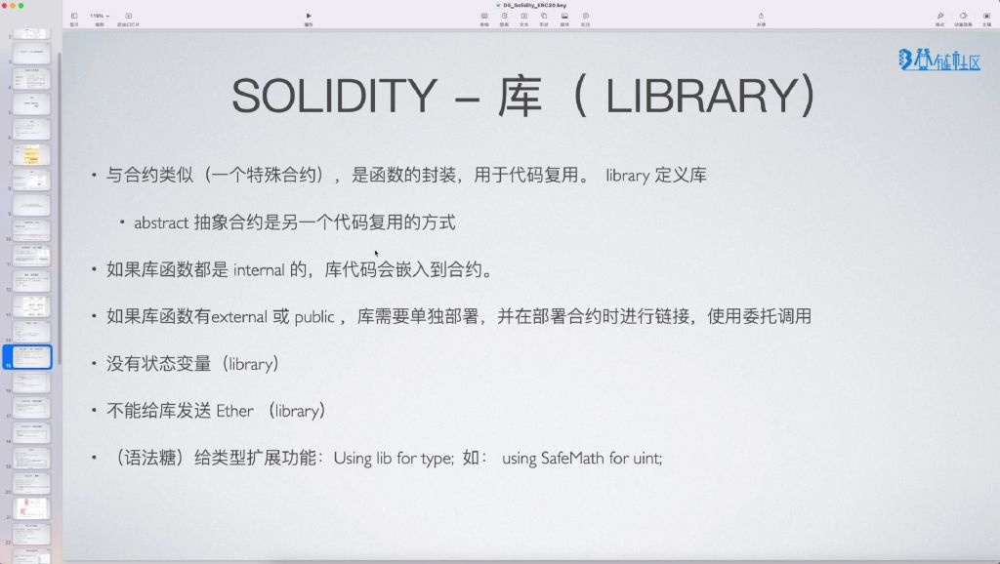
- **代码复用方式**：
    - **库**：采用组合方式（使用 `using A for B` 语法）
    - **抽象合约**：采用继承方式（使用 `is` 关键字）
- **UML 表示**：
    - 继承关系用空心箭头表示
    - 组合关系用实线箭头表示
- **适用场景**：
    - **库**：适用于通用工具函数的封装
    - **抽象合约**：适用于业务逻辑的抽象和扩展

#### 3）库的两种调用方式

- **internal 函数的处理**
    - **编译行为**：当库函数均为 `internal` 时，编译器会将库代码直接嵌入调用合约
    - **执行特点**：
        - 相当于编译器自动做了代码拷贝
        - 实际执行时是本地调用而非委托调用
    - **内存占用**：会增加调用合约的字节码大小
- **external/public 函数的处理**
    - 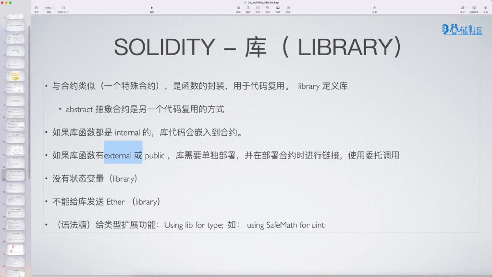
    - **部署要求**：需要单独部署库合约
    - **调用机制**：
        - 使用委托调用 (`delegatecall`) 方式
        - 在调用合约上下文执行库代码
    - **链接过程**：
        - 编译时生成桩代码 (`stub`)
        - 部署时用实际库地址替换桩信息
        - 类似于动态链接库的链接过程

#### 4）库的特殊限制

- 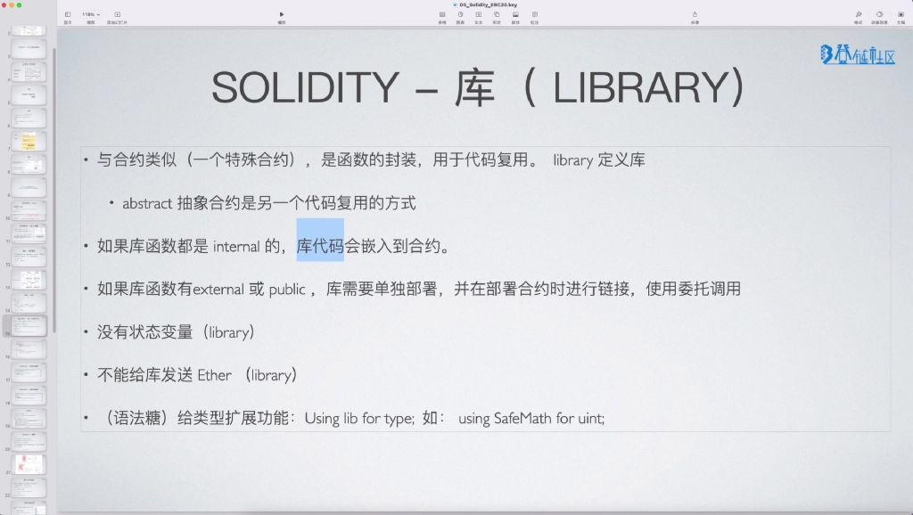
- **状态变量**：库不能定义自己的状态变量
- **以太币操作**：不能向库发送 ETH（没有 `payable` 函数）
- **类型扩展**：可通过 `using A for B` 语法为基本类型添加扩展方法
    - 示例：`using SafeMath for uint` 使 `uint` 类型获得安全计算方法

#### 5）实际开发注意事项

- 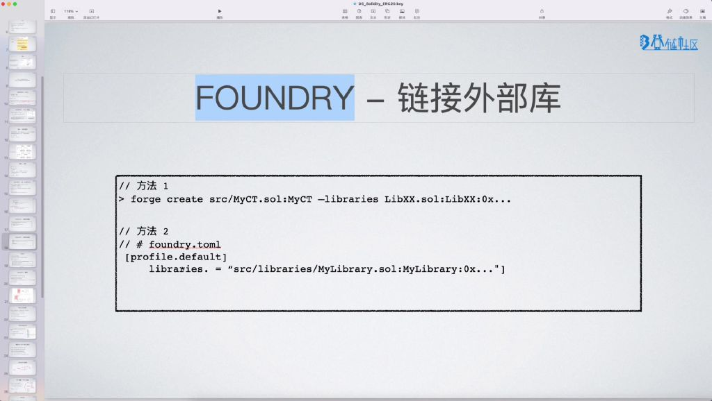
- **开发工具支持**：
    - **Foundry** 中配置库地址的两种方式：
- **实践建议**：
    - 优先使用 `internal` 函数减少部署复杂度
    - `external`/`public` 库函数实际应用较少
    - 注意 **Remix** 等 IDE 对链接过程的支持限制

### 2. 导入功能详解

#### 1）导入的基本概念

- 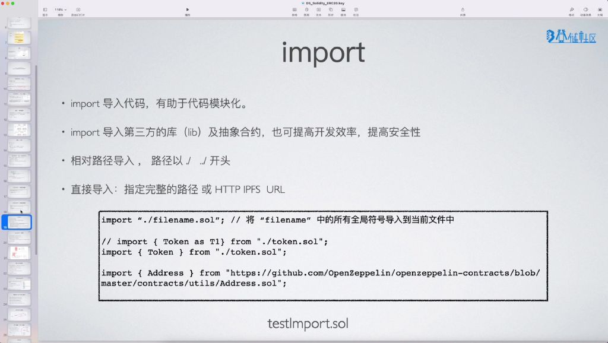
- **模块化优势**：通过 `import` 导入代码可以将功能模块封装到单独文件中，提高代码清晰度和可读性
- **开发效率**：支持导入第三方库（如 **OpenZeppelin**）和抽象合约，避免重复造轮子
- **安全性保障**：经过审计的第三方库通常具有更高的安全性保障
- **导入路径类型**：
    - **相对路径**：
        - 以 `./` 开头表示当前目录
        - 以 `../` 开头表示上级目录（与 Unix 文件路径规范一致）
    - **绝对路径**：
        - 支持完整文件路径
        - 支持 HTTP/HTTPS URL（如 **GitHub** 地址）
        - 支持 **IPFS** 协议路径
        - 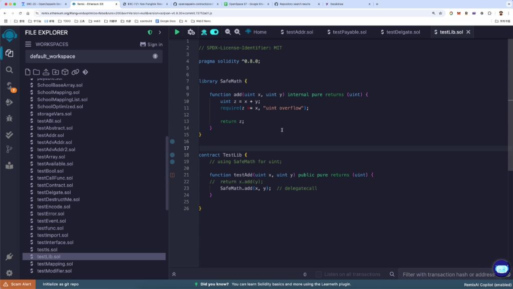

#### 2）导入语法详解

- **基本导入方式**
    - 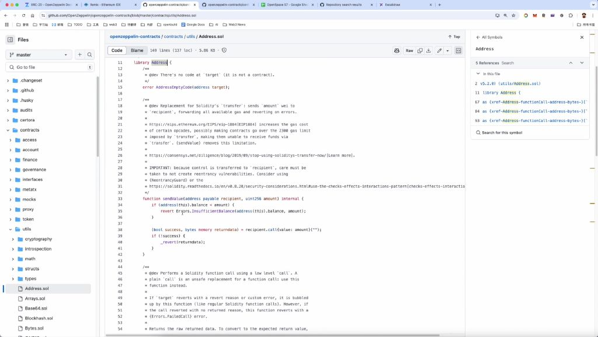
    - **全局导入**：`import "./filename.sol"` 会导入文件中所有全局符号（合约、接口、错误等）
    - **选择性导入**：`import { Token } from "./token.sol"` 仅导入指定符号
    - **别名设置**：`import { Token as T1 } from "./token.sol"` 可解决命名冲突问题
- **第三方库导入实践**
    - 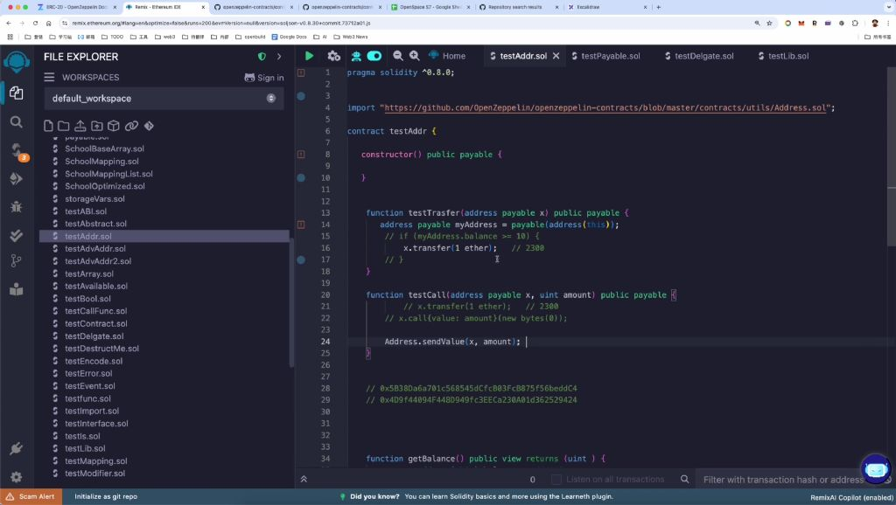
    - **实际应用**：通过 URL 导入 **OpenZeppelin** 的 `Address` 工具库
    - **调用方式**：导入后可直接使用库方法，如 `Address.sendValue()`

#### 3）导入的注意事项

- **开发环境差异**
    - **Remix IDE**：支持直接通过 URL 导入网络资源
    - **本地开发**：
        - **VSCode** 等编辑器不支持 URL 导入
        - 需将第三方库代码复制到本地或通过包管理器安装
        - 通常使用相对路径导入方式
- **符号作用域**
    - 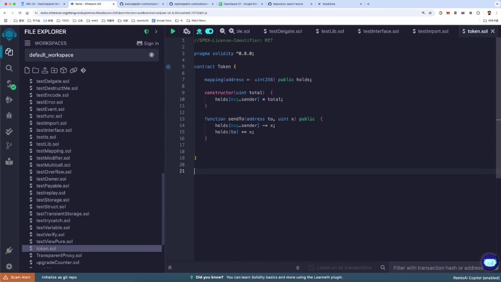
    - **全局导入**：会引入文件内所有顶层定义的符号（合约、结构体、错误等）
    - **选择性导入**：仅引入指定符号，其他符号不可见
    - **重复符号处理**：通过 `as` 关键字创建别名解决命名冲突

#### 4）例题：导入使用实践

- 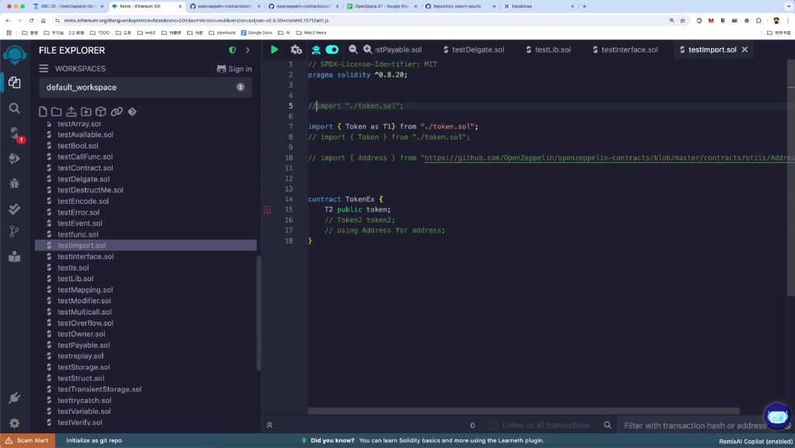
- **题目解析**：
    - 对比全局导入与选择性导入的语法差异
    - 演示别名设置的实际应用场景
    - 分析不同开发环境下的导入策略选择
- **关键考点**：
    - 路径表示方法的正确使用
    - 第三方库的安全导入方式
    - 符号作用域的控制技巧

##### 3. 事件14:59

- ![[e7be9982bf804462830a363d3dbf4efa_MD5.jpg]]
- 接口作用: 事件是智能合约与外部世界的重要接口，用于通知外部世界链上状态的变化。
- 存储功能: 事件可作为便宜的存储方式，触发时会在链上记录日志。
- 定义方式: 使用关键字event定义事件，事件不需要实现。
- 索引功能: 使用indexed修饰事件字段可建立索引（称为Topic），方便外部对该字段进行过滤查找。
- 触发方式: 使用关键字emit触发事件。

###### 1）监听外部16:59

- ![[ce5989be399beaf2247c365826d362fd_MD5.jpg]]
- 异步特性: 与Web2系统同步调用不同，EVM执行需要等待时间（以太坊主网约15秒），通过事件监听实现异步状态追踪。
- 工作流程:
    - 合约状态变化时用emit触发日志
    - 外部程序监听日志变化
    - 日志出现即表示状态已完成修改
- 事件的定义17:24
    - ![[578d0d3fb8a4c79dca18e68bc3e6bd0c_MD5.jpg]]
    - 语法结构:
    - 索引参数: indexed修饰的参数会建立索引，类似数据库索引，提高过滤查询效率。
    - 实现特点: 事件只需声明不需实现，以分号结尾。
- 事件的触发20:22
    - ![[feaab83b3771173d28ca920b09703404_MD5.jpg]]
    - 触发方式:
    - 日志内容: 包含事件名、参数值、交易哈希等结构化信息
    - 实际案例:
        - 带emit的函数调用会产生包含状态变更记录的日志
        - 不带emit的函数调用仅修改状态但无日志记录
        - 外部程序只能通过日志间接获取状态变更信息
        - ![[515104a27b17e98b5a5b301d6f11653f_MD5.jpg]]
    - 日志组成:
        - topics: 包含事件签名和索引参数
        - data: 非索引参数的值
        - address: 触发事件的合约地址
    - 过滤依据: 可通过索引参数值快速定位特定事件

#### 二、第三方代码库20:44

##### 1. OpenZeppelin21:43

- ![[23d9795c8a6f6e00bf0977cbc3e1cb6b_MD5.jpg]]
- 核心优势：
    - 采用率高：在智能合约开发中被广泛采用，特别是Token相关实现
    - 功能丰富：包含权限控制、代币标准、升级代理等完整功能模块
    - 安全性保障：经过社区反复审计与验证，遵循最佳实践
- 主要模块：
    - Utils工具库：包含地址判断、数学函数等实用工具
    - Access权限控制：提供合约函数访问控制功能
    - Token实现：完整支持ERC20、ERC721、ERC1155等代币标准
    - Proxy升级代理：支持智能合约的可升级模式
- 使用建议：
    - 通过import方式复用已有实现
    - 特别适合Token开发场景
    - 代码库地址：https://github.com/OpenZeppelin/openzeppelin-contracts

##### 2. Solady22:55

- 核心特点：
    - 高度Gas优化：相比OpenZeppelin具有更好的Gas效率
    - 历史沿革：前身为Solmate项目，后更名为Solady
    - 功能覆盖：实现了多种常用功能模块
- 项目对比：
    - 与OpenZeppelin：牺牲部分安全性换取Gas优化
    - 与Solmate：是Solmate的继承和发展版本
- 使用场景：
    - 适用于对Gas成本敏感的项目
    - 代码库地址：https://github.com/vectorized/Solady
- 注意事项：
    - 当前市场采用率低于OpenZeppelin
    - 需要开发者自行评估安全风险

#### 三、推荐Solidity学习资料24:34

- ![[bba08010b20419ed336c9b40c5f51385_MD5.jpg]]
- 实践平台：
    - Ethernaut：https://ethernaut.openzeppelin.com/
    - CryptoZombies：https://cryptozombies.io/en/course/
- 教程资源：
    - Solidity-by-Example：https://solidity-by-example.org/
    - 深入浅出区块链：https://learnblockchain.cn/column/1
    - Decert教程：https://decert.me/tutorial/solidity/intro/
- 学习建议：
    - 通过实际编码练习掌握语法
    - 遇到问题时通过解决问题来深化理解
    - 参考优质开源项目代码实践

#### 四、知识小结

|   |   |   |   |
|---|---|---|---|
|知识点|核心内容|易混淆点/注意事项|难度系数|
|Solidity库（Library）|用于代码复用和封装函数，通过library关键字定义；类似合约但通常不单独部署，支持internal（代码嵌入）和external/public（需部署并委托调用）函数|internal库函数编译时直接嵌入合约，external需单独部署并链接|⭐⭐|
|库 vs 抽象合约|库通过组合复用代码，抽象合约通过继承复用；库适用于通用工具函数，抽象合约定义接口或基础逻辑|继承（abstract）用空心箭头表示，组合（库）无特定UML符号|⭐⭐⭐|
|库的调用方式|internal函数：编译器拷贝代码到合约；external/public函数：需部署库合约并使用delegatecall|external库需配置地址链接，Remix可能无法模拟此过程|⭐⭐⭐|
|Import语法|导入外部代码：import "./file.sol"（相对路径）或import "https://..."（URL）；支持别名（as）和选择性导入（import {A} from "./file.sol"）|全局符号（合约、变量等）默认全部导入，选择性导入需明确声明|⭐⭐|
|事件（Event）|通过event定义日志，emit触发；用于异步通知链外系统状态变更，参数可索引（indexed）提高过滤效率|未触发事件的合约状态变更外部无法直接追踪|⭐⭐|
|第三方库（OpenZeppelin）|提供安全、可复用的模块（权限、Token、工具等），如Address.sendValue；优于自行实现，但Gas效率可能较低|OpenZeppelin与Solmate对比：前者重安全，后者重Gas优化|⭐⭐⭐|
|动态链接与部署|库部署后需在合约编译时链接地址（类似动态链接库），配置文件需指定库地址|Remix可能不支持完整链接流程，需本地开发工具（如Foundry）|⭐⭐⭐⭐|

