## 一、 函数调用

### 1. 调用结果

- 
- **接口调用**与**底层调用**:
    - **接口调用**: 通过合约类型实例直接调用方法，如 `c.count()`
    - **底层调用**: 使用 `address.call()` 和 **ABI** 编码调用，如 `abi.encodeWithSignature("count()")`
    - **调用结果等价性**: 两种方式最终都会转换为对合约函数的 **ABI** 编码调用
- **ABI 编码组成**:
    - **函数选择器**: 对函数签名计算 `Keccak-256` 哈希，取前 4 个字节
    - **参数编码**: 包含函数参数的编码数据
- **安全性对比**:
    - **接口调用优势**: 自动检查合约存在性、函数返回值和参数，调用失败会直接 `revert`
    - **底层调用注意点**: 需要手动检查返回值、调用状态和返回数据

### 2. 转账

- 
- **传统转账方法**:
    - `transfer`: 固定 2300 gas 限制，合约接收容易失败
    - `send`: 同样受 2300 gas 限制，返回布尔值需手动检查
- **底层调用转账**:
    - `call` 方法优势: 无 gas 限制或可手动指定 gas 量
    - **语法示例**:
        - `addr.call{gas: 1000000}(new bytes(0))`
        - `addr.call{value: 1 ether}(new bytes(0))`
- **OpenZeppelin 实践**:
    - `sendValue` 实现: 替代 `transfer`，转发所有可用 gas，失败时 `revert`
    - **安全考虑**: 需防范**重入攻击**，建议配合 `ReentrancyGuard` 使用

### 3. 三种交易

- 
- **普通转账交易**:
    - 特征: `data` 字段为空，仅包含 `value` 转账金额
- **合约创建交易**:
    - 特征: `to` 地址为零，`data` 字段包含合约创建字节码
- **合约调用交易**:
    - 特征: 包含合约地址和 **ABI** 编码的调用数据

### 4. 应用案例

#### 1）例题：转账示例题

- 
- **题目解析**:
    - 传统 `transfer` 限制: 演示中因 2300 gas 不足导致转账失败
    - `call` 方法成功原因: 不受 gas 限制，可执行合约 `receive` 函数中的逻辑
    - **OpenZeppelin 最佳实践**: 推荐使用 `sendValue` 而非手动实现 `call` 转账

#### 2）例题：转账测试地址示例题

- 
- **题目解析**:
    - **测试环境搭建**:
        - 部署 `testAddr` 合约并预存 10 ETH
        - 部署 `testPayable` 合约作为接收方
    - **关键观察点**:
        - `transfer` 调用因 gas 限制失败
        - `call` 调用成功执行 `receive` 函数并更新状态变量
    - **gas 消耗分析**:
        - 成功交易消耗约 8 万 gas
        - 包含状态变量更新和完整函数执行

---

## 二、 底层调用

### 1. 底层函数类型

- 
- `call` 函数:
    - **上下文切换**: 会切换执行上下文，`msg.sender` 变为调用者合约地址
    - **异常处理**: 调用失败不会抛出异常 (`revert`)，而是通过返回值表示
- `delegatecall` 函数:
    - **上下文保持**: 保持当前执行上下文，`msg.sender` 保持为原始调用者地址
    - **状态修改**: 被调用合约代码在调用者合约上下文中执行，修改的是调用者合约的状态变量
- `staticcall` 函数:
    - **只读特性**: 不修改状态，相当于模拟调用
    - **适用场景**: 主要用于查询操作

### 2. 调用上下文对比

- 
- **call 调用链**:
    - EOA → Caller 合约 → Target 合约
    - `msg.sender` 变化: EOA 地址 → Caller 合约地址
    - `msg.value` 变化: EOA 发送值 → Caller 发送值
- **delegatecall 调用链**:
    - EOA → Caller 合约 → Target 合约
    - `msg.sender` 保持: 始终为 EOA 地址
    - `msg.value` 保持: 始终为 EOA 发送值

### 3. 代码示例分析

- ![[ad362471e84ae356990eddc1079f4fab_MD5.jpg]]
- call示例:
    - 被调用合约的counter和sender状态变量会被修改
    - 调用链形成完整上下文切换
- delegatecall示例:
    - 调用者合约的counter和sender状态变量会被修改
    - 相当于"借用"目标合约代码在当前合约上下文中执行

### 4. 实际调用演示

- ![[26e0cbc44b5c260a0483b08ba9c6b19b_MD5.jpg]]
- call调用结果:
    - 被调用合约状态变量更新
    - sender显示为中间调用合约地址
- delegatecall调用结果:
    - 调用者合约状态变量更新
    - sender显示为原始EOA地址
    - 被调用合约状态保持不变

### 5. 异常处理机制

- **异常处理特点**:
    - 底层调用失败不会自动 `revert` 整个交易
    - 通过返回的 `bool` 值表示调用成功与否
    - 需要手动检查返回值处理失败情况
- **与高级调用的区别**:
    - 普通函数调用失败会冒泡异常
    - 底层调用需要显式错误处理

### 6. 地址功能小结

- 
- **基本属性**:
    - `balance`: 查询地址 ETH 余额
    - `transfer()` / `send()`: ETH 转账方法
        - `transfer`: 失败会 `revert`，gas 限制 2300
        - `send`: 失败返回 `false`，gas 限制 2300
- **底层调用**:
    - `call`: 切换上下文，可附带 ETH 和价值
    - `delegatecall`: 保持上下文，常用于代理模式
    - `staticcall`: 只读调用，不修改状态
- **共同特点**:
    - 调用失败不自动 `revert`
    - 通过返回值 (`bool`) 表示调用结果
    - 需要手动处理调用失败情况

---

## 三、 库

### 1. 库的定义与使用

- 

#### 1）库的基本概念

- **定义方式**：使用 `library` 关键字定义库，是 Solidity 中用于代码复用的特殊合约类型
- **功能特点**：
    - 封装常用函数实现代码复用
    - 可作为独立代码模块被多个合约引用
    - 典型示例：`SafeMath` 库提供安全的数学运算方法
- **语法示例**：

```solidity
library SafeMath {
    function add(uint x, uint y) internal pure returns (uint) {
        uint z = x + y;
        require(z >= x, "uint overflow");
        return z;
    }
}
```

#### 2）库与抽象合约的对比

- 
- **代码复用方式**：
    - **库**：采用组合方式（使用 `using A for B` 语法）
    - **抽象合约**：采用继承方式（使用 `is` 关键字）
- **UML 表示**：
    - 继承关系用空心箭头表示
    - 组合关系用实线箭头表示
- **适用场景**：
    - **库**：适用于通用工具函数的封装
    - **抽象合约**：适用于业务逻辑的抽象和扩展

#### 3）库的两种调用方式

- **internal 函数的处理**
    - **编译行为**：当库函数均为 `internal` 时，编译器会将库代码直接嵌入调用合约
    - **执行特点**：
        - 相当于编译器自动做了代码拷贝
        - 实际执行时是本地调用而非委托调用
    - **内存占用**：会增加调用合约的字节码大小
- **external/public 函数的处理**
    - 
    - **部署要求**：需要单独部署库合约
    - **调用机制**：
        - 使用委托调用 (`delegatecall`) 方式
        - 在调用合约上下文执行库代码
    - **链接过程**：
        - 编译时生成桩代码 (`stub`)
        - 部署时用实际库地址替换桩信息
        - 类似于动态链接库的链接过程

#### 4）库的特殊限制

- 
- **状态变量**：库不能定义自己的状态变量
- **以太币操作**：不能向库发送 ETH（没有 `payable` 函数）
- **类型扩展**：可通过 `using A for B` 语法为基本类型添加扩展方法
    - 示例：`using SafeMath for uint` 使 `uint` 类型获得安全计算方法

#### 5）实际开发注意事项

- 
- **开发工具支持**：
    - **Foundry** 中配置库地址的两种方式：
- **实践建议**：
    - 优先使用 `internal` 函数减少部署复杂度
    - `external`/`public` 库函数实际应用较少
    - 注意 **Remix** 等 IDE 对链接过程的支持限制

### 2. 导入功能详解

#### 1）导入的基本概念

- 
- **模块化优势**：通过 `import` 导入代码可以将功能模块封装到单独文件中，提高代码清晰度和可读性
- **开发效率**：支持导入第三方库（如 **OpenZeppelin**）和抽象合约，避免重复造轮子
- **安全性保障**：经过审计的第三方库通常具有更高的安全性保障
- **导入路径类型**：
    - **相对路径**：
        - 以 `./` 开头表示当前目录
        - 以 `../` 开头表示上级目录（与 Unix 文件路径规范一致）
    - **绝对路径**：
        - 支持完整文件路径
        - 支持 HTTP/HTTPS URL（如 **GitHub** 地址）
        - 支持 **IPFS** 协议路径
        - 

#### 2）导入语法详解

- **基本导入方式**
    - 
    - **全局导入**：`import "./filename.sol"` 会导入文件中所有全局符号（合约、接口、错误等）
    - **选择性导入**：`import { Token } from "./token.sol"` 仅导入指定符号
    - **别名设置**：`import { Token as T1 } from "./token.sol"` 可解决命名冲突问题
- **第三方库导入实践**
    - 
    - **实际应用**：通过 URL 导入 **OpenZeppelin** 的 `Address` 工具库
    - **调用方式**：导入后可直接使用库方法，如 `Address.sendValue()`

#### 3）导入的注意事项

- **开发环境差异**
    - **Remix IDE**：支持直接通过 URL 导入网络资源
    - **本地开发**：
        - **VSCode** 等编辑器不支持 URL 导入
        - 需将第三方库代码复制到本地或通过包管理器安装
        - 通常使用相对路径导入方式
- **符号作用域**
    - 
    - **全局导入**：会引入文件内所有顶层定义的符号（合约、结构体、错误等）
    - **选择性导入**：仅引入指定符号，其他符号不可见
    - **重复符号处理**：通过 `as` 关键字创建别名解决命名冲突

#### 4）例题：导入使用实践

- 
- **题目解析**：
    - 对比全局导入与选择性导入的语法差异
    - 演示别名设置的实际应用场景
    - 分析不同开发环境下的导入策略选择
- **关键考点**：
    - 路径表示方法的正确使用
    - 第三方库的安全导入方式
    - 符号作用域的控制技巧

### 3. 事件

- 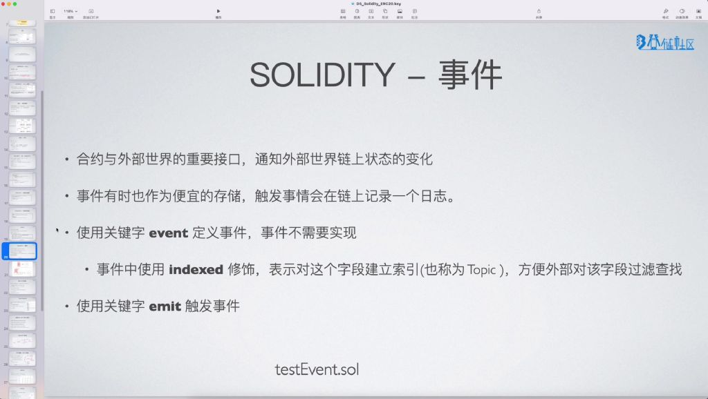
- **接口作用**：事件是智能合约与外部世界的重要接口，用于通知外部世界链上状态的变化。
- **存储功能**：事件可作为便宜的存储方式，触发时会在链上记录日志。
- **定义方式**：使用关键字 `event` 定义事件，事件不需要实现。
- **索引功能**：使用 `indexed` 修饰事件字段可建立索引（称为 **Topic**），方便外部对该字段进行过滤查找。
- **触发方式**：使用关键字 `emit` 触发事件。

#### 1）监听外部

- 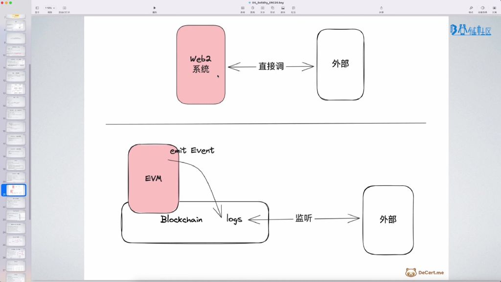
- **异步特性**：与 Web2 系统同步调用不同，EVM 执行需要等待时间（以太坊主网约 15 秒），通过事件监听实现异步状态追踪。
- **工作流程**：
    - 合约状态变化时用 `emit` 触发日志
    - 外部程序监听日志变化
    - 日志出现即表示状态已完成修改
#### 2）事件的定义

- 
- **语法结构**：
- **索引参数**：`indexed` 修饰的参数会建立索引，类似数据库索引，提高过滤查询效率。
- **实现特点**：事件只需声明不需实现，以分号结尾。
#### 3）事件的触发

- 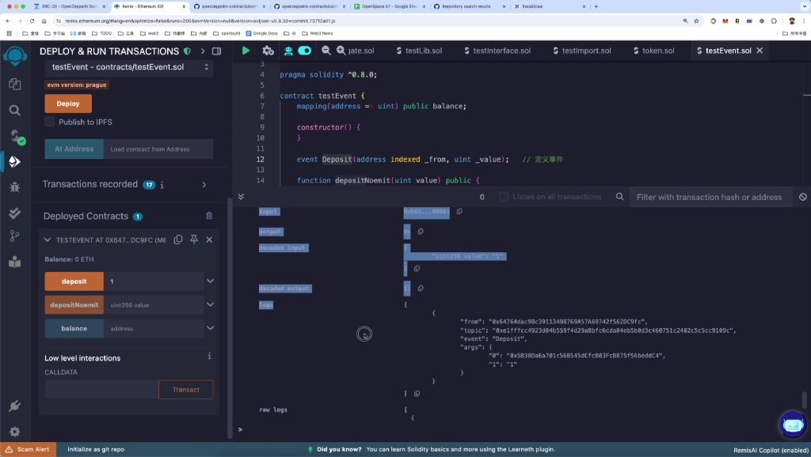
- **触发方式**：使用关键字 `emit` 触发事件。
- **日志内容**：包含事件名、参数值、交易哈希等结构化信息
- **实际案例**：
    - 带 `emit` 的函数调用会产生包含状态变更记录的日志
    - 不带 `emit` 的函数调用仅修改状态但无日志记录
    - 外部程序只能通过日志间接获取状态变更信息
    - 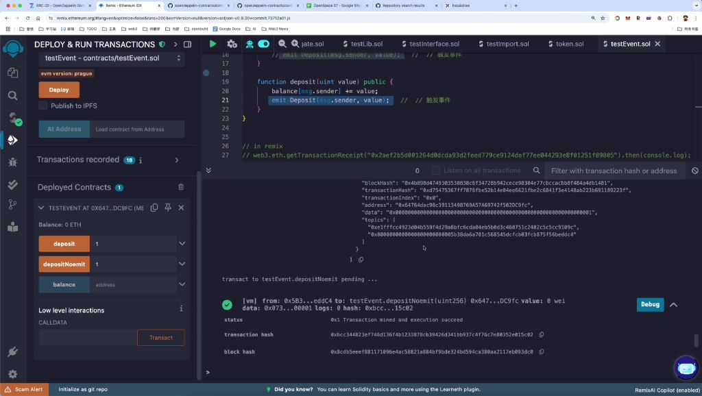
- **日志组成**：
    - **topics**：包含事件签名和索引参数
    - **data**：非索引参数的值
    - **address**：触发事件的合约地址
- **过滤依据**：可通过索引参数值快速定位特定事件

## 四、 第三方代码库

### 1. OpenZeppelin

- 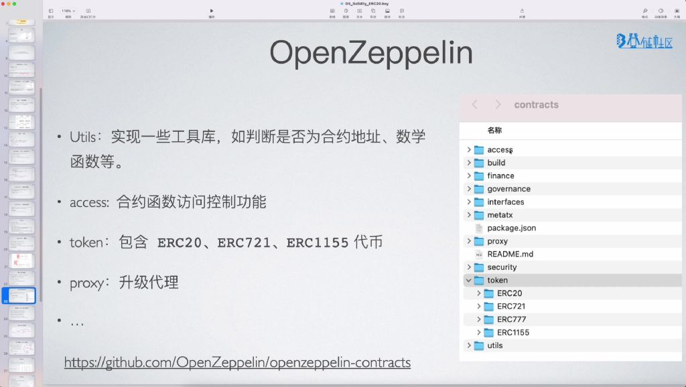
- **核心优势**：
    - **采用率高**：在智能合约开发中被广泛采用，特别是 **Token** 相关实现
    - **功能丰富**：包含权限控制、代币标准、升级代理等完整功能模块
    - **安全性保障**：经过社区反复审计与验证，遵循最佳实践
- **主要模块**：
    - **Utils 工具库**：包含地址判断、数学函数等实用工具
    - **Access 权限控制**：提供合约函数访问控制功能
    - **Token 实现**：完整支持 ERC20、ERC721、ERC1155 等代币标准
    - **Proxy 升级代理**：支持智能合约的可升级模式
- **使用建议**：
    - 通过 `import` 方式复用已有实现
    - 特别适合 **Token** 开发场景
    - 代码库地址：[OpenZeppelin Contracts](https://github.com/OpenZeppelin/openzeppelin-contracts)

### 2. Solady

- **核心特点**：
    - **高度 Gas 优化**：相比 **OpenZeppelin** 具有更好的 **Gas** 效率
    - **历史沿革**：前身为 **Solmate** 项目，后更名为 **Solady**
    - **功能覆盖**：实现了多种常用功能模块
- **项目对比**：
    - **与 OpenZeppelin**：牺牲部分安全性换取 **Gas** 优化
    - **与 Solmate**：是 **Solmate** 的继承和发展版本
- **使用场景**：
    - 适用于对 `Gas` 成本敏感的项目
    - 代码库地址：[Solady](https://github.com/vectorized/Solady)
- **注意事项**：
    - 当前市场采用率低于 `OpenZeppelin`
    - 需要开发者自行评估安全风险

## 五、 推荐 Solidity 学习资料

- 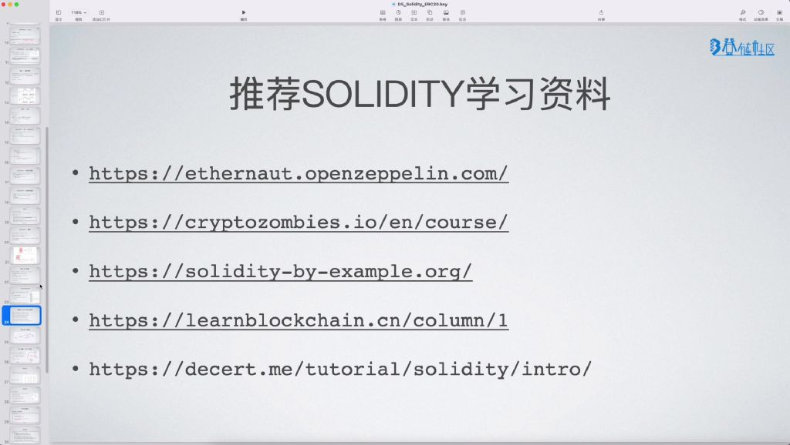
- **实践平台**：
    - **Ethernaut**：[ethernaut.openzeppelin.com](https://ethernaut.openzeppelin.com/)
    - **CryptoZombies**：[cryptozombies.io](https://cryptozombies.io/en/course/)
- **教程资源**：
    - **Solidity-by-Example**：[solidity-by-example.org](https://solidity-by-example.org/)
    - **深入浅出区块链**：[learnblockchain.cn](https://learnblockchain.cn/column/1)
    - **Decert 教程**：[decert.me/tutorial/solidity/intro/](https://decert.me/tutorial/solidity/intro/)
- **学习建议**：
    - 通过实际编码练习掌握语法
    - 遇到问题时通过解决问题来深化理解
    - 参考优质开源项目代码实践

---

## 六、 ERC20

### 1. EIP 提案与 ERC 标准

- 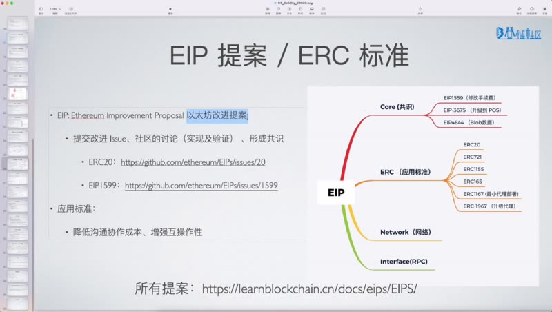
- **定义**：**EIP** 全称 **Ethereum Improvement Proposal**（以太坊改进提案），是用于以太坊网络升级和应用标准化的提案机制。
- **分类**：
    - **Core 类**：涉及以太坊协议层升级（如 `EIP-1559` 修改手续费机制、`EIP-3675` 升级 **POS** 共识）。
    - **ERC 类**：应用层标准（如 `ERC20` 代币标准、`ERC721` NFT 标准）。
- **作用**：
    - 降低开发者沟通协作成本
    - 增强不同合约间的互操作性
    - 标准化接口规范（如代币转账必须包含 `balanceOf()` 和 `transfer()` 方法）

#### 1）EIP 编号

- 
- **早期规则**：直接使用 **GitHub** issue 编号（如 `EIP-20` 对应 `issue#20`）。
- **现行规则**：编号与 issue 不再严格对应（如 `EIP-1559` 并非 `issue#1559`）。
- **典型示例**：
    - `EIP-20`：代币标准基础提案
    - `EIP-1559`：**Gas** 费改革提案
    - `EIP-4844`：**Blob** 数据存储方案

#### 2）EIP-1

- 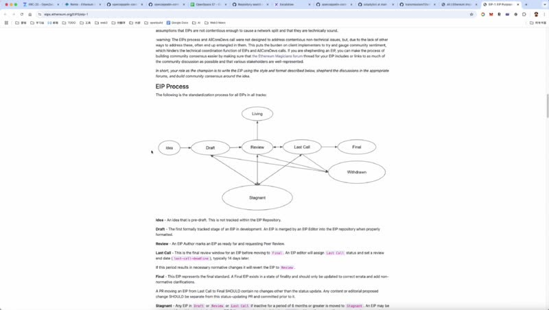
- **EIP 过程**：
    - **阶段流程**：
        - `Draft`（草案）：初步形成规范文档
        - `Review`（评审）：社区技术讨论（每周定期会议）
        - `Last Call`（最终确认）：14 天公示期
        - `Final`（终版）：主网部署后状态
        - `Stagnant`（停滞）：6 个月无进展的提案
    - **实施要求**：
        - **Core 类**：需所有客户端节点升级实现
        - **ERC 类**：只需合约遵循接口规范

#### 3）EIP-1559

- 
- **核心改进**：
    - 引入**基础费** (`Base Fee`) 动态调整机制：
        - 区块 **Gas** 使用量 > 目标值时上调
        - 区块 **Gas** 使用量 < 目标值时下调
    - **费用分配**：
        - 基础费销毁（**ETH** 通缩）
        - **优先费** (`Priority Fee`) 奖励矿工
- **实现效果**：
    - 缓解网络拥堵时 **Gas** 费剧烈波动
    - 用户可设置最大费用上限（`Fee Cap`）

#### 4）ERC20 概览

- 
- **强制方法**：
    - `totalSupply()`：代币总供应量
    - `balanceOf()`：查询地址余额
    - `transfer()`：代币转账
- **设计原则**：
    - 仅定义接口规范，不限制具体实现
    - 通过 **ABI** 编码保证调用一致性
- **应用价值**：
    - 钱包/dApp 可统一处理所有 `ERC20` 代币
    - 避免各项目自定义接口造成的兼容性问题

#### 5）EIP 状态术语

- 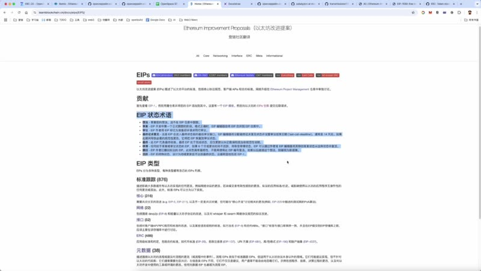
- **核心状态**：
    - `Active`：正式提案开发中
    - `Accepted`：社区达成共识
    - `Final`：已完成主网部署
    - `Withdrawn`：作者主动撤回
- **类型划分**：
    - **Standards Track**（标准追踪）：影响协议核心功能
    - **Meta**（元数据）：流程规范改进
    - **Informational**（信息类）：非强制性建议
- **中文资源**：
    - 以太坊中文社区翻译全部提案：[learnblockchain.cn/docs/eips](https://learnblockchain.cn/docs/eips/)

### 2. 什么是 ERC20 代币

- 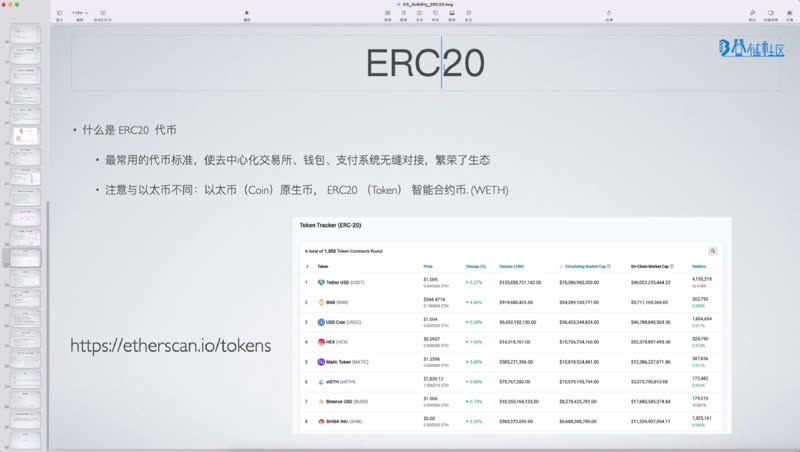
- **标准地位**：最常用的代币标准，使去中心化交易所、钱包、支付系统无缝对接，繁荣了生态。
- **与以太币区别**：
    - **以太币** (`Coin`) 是原生币
    - `ERC20` (`Token`) 是智能合约币
- **常见实例**：`USDT`、`USDC` 等稳定币都是 `ERC20` 代币的实现。
- **技术本质**：在链上实现的智能合约，合约实现了 `ERC20` 定义的接口标准。

### 3. ERC20 接口

#### 1）接口定义

- 
- **核心方法**：
    - `totalSupply()`：返回代币总供应量
    - `balanceOf()`：查询账户余额
    - `transfer()`：转账功能
    - `approve()`：授权功能
    - `allowance()`：查询授权额度
- **事件定义**：
    - `Transfer`：转账时触发
    - `Approval`：授权时触发
- **实现要求**：合约必须实现这些方法才能称为 `ERC20` 代币。

#### 2）标准规范

- 
- **方法分类**：
    - **必选方法**：必须实现的核心功能方法。
    - **可选方法**：如 `name()`、`symbol()`、`decimals()` 等提升用户体验的方法。
- **规范来源**：**Ethereum Improvement Proposals** (EIP) 中的 `EIP-20` 标准。
- **兼容性**：任何实现这些接口的代币都可以被钱包、交易所等应用识别和使用。

#### 3）实际应用

- 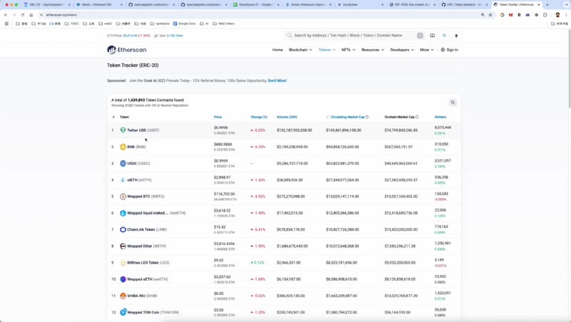
- **主流代币**：`USDT`、`USDC`、`BNB`、`LINK`。
- **合约特性**：每个 `ERC20` 代币都是独立的智能合约。
- **扩展性**：在满足标准接口基础上可以添加额外功能。

### 4. ERC20 与以太币的区别

- 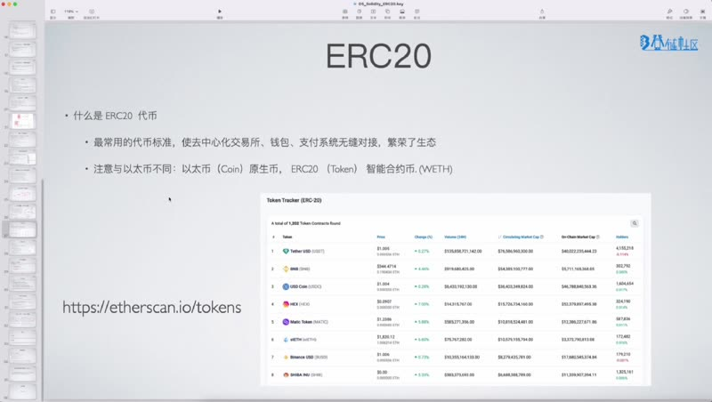
- **本质区别**：
    - **以太币** (`ETH`) 是原生币，直接存储在账户地址空间下。
    - `ERC20` 是智能合约实现的代币标准，通过合约管理余额。
- **技术实现**：
    - 原生币余额直接记录在区块链账户系统中。
    - `ERC20` 代币余额通过合约状态变量存储。
- **生态定位**：
    - **以太币**用于支付 **Gas** 费等基础网络操作。
    - `ERC20` 代币用于构建去中心化应用生态。

### 5. ERC20 标准包含哪些内容

- 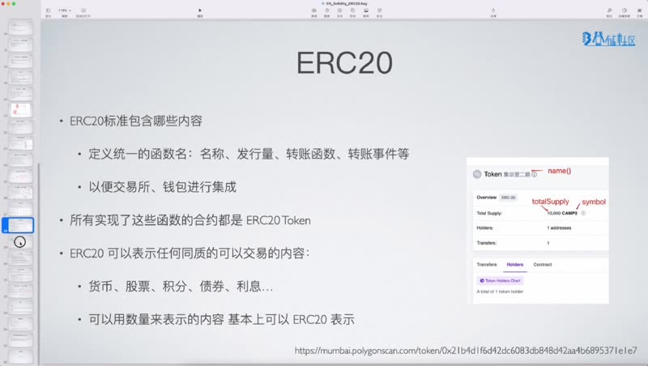
- **核心功能**：
    - **定义统一接口**：名称 (`name`)、符号 (`symbol`)、小数位 (`decimals`)
    - **必须实现的函数**：转账 (`transfer`)、授权转账 (`transferFrom`)、余额查询 (`balanceOf`)
    - **必须触发的事件**：转账事件 (`Transfer`)
- **应用场景**：
    - 可表示同质化资产：货币、股票、积分等。
    - 支持交易所/钱包标准化集成。
    - **示例**：`USDT` 稳定币支付系统。

#### 1）例题：代币信息查询

- 
- 
- 
- **查询原理**：
    - 通过合约中定义的 `name()` 方法获取代币全称
    - 通过 `symbol()` 方法获取代币代码（类似股票代码）
    - 通过 `totalSupply()` 查询总发行量（如 `USDT` 显示 $7.1 亿+）
- **标准优势**：
    - 统一接口使区块链浏览器能自动解析代币信息
    - 交易所无需单独适配每种代币的查询方式
- **技术细节**：
    - 代币精度通过 `decimals()` 方法定义（如 18 位小数）
    - 转账金额需转换为最小单位（如 1 `ETH` = 10^{18} `wei`）

### 6. 代币关键点

- 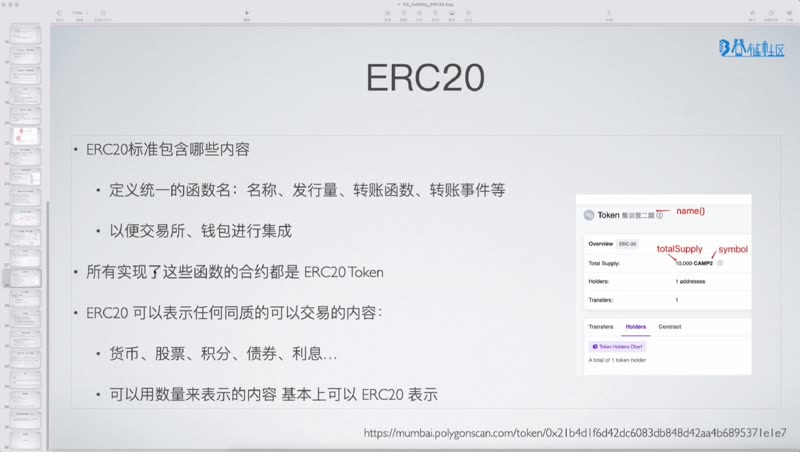
- **统一接口规范**：定义标准函数名包括 `name`（名称）、`symbol`（代币符号）、`totalSupply`（总发行量）、`transfer`（转账函数）和 `Transfer` 事件等，确保交易所和钱包能统一集成。
- **适用范围**：可表示任何同质化可交易内容，包括货币、股票、积分、债券、利息等所有能用数量表示的价值载体。
- **实现标准**：所有包含标准函数的智能合约都视为 `ERC20 Token`，通过接口规范实现互操作性。

#### 1）代币核心逻辑

- 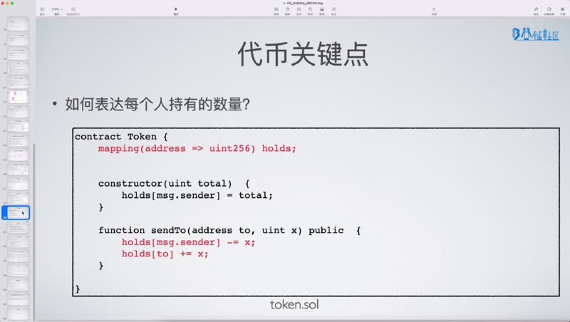
- **余额存储机制**：使用 `mapping(address => uint256)` 数据结构记录每个地址的持有量，键为地址，值为无符号整数余额。
- **转账原理**：转账函数 `sendTo` 执行时，发送方余额减少 `x`，接收方余额增加 `x`，通过简单的加减运算完成价值转移。
- **初始化方式**：构造函数 `constructor` 初始化时将总供应量 `total` 分配给合约创建者 (`msg.sender`) 的地址。

### 7. 归纳方法

- 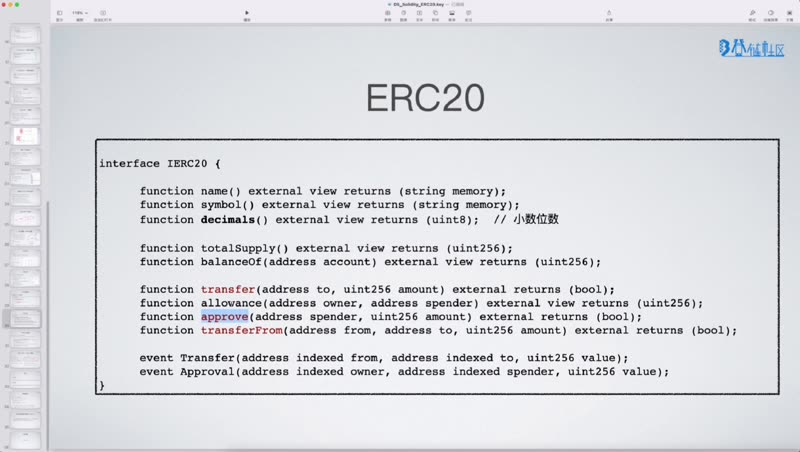
- **接口强制规范**：必须实现 9 个核心函数和 2 个事件，包括：
    - **元数据函数**：`name()`、`symbol()`、`decimals()`
    - **供应量查询**：`totalSupply()`
    - **余额操作**：`balanceOf()`、`transfer()`
    - **授权机制**：`allowance()`、`approve()`、`transferFrom()`
    - **事件通知**：`Transfer`、`Approval`
- **标准化意义**：避免各项目使用不同函数名实现相同功能，确保所有 `ERC20` 代币具有统一的交互接口。
- **余额查询规范**：无论 `USDT` 或自定义代币，都必须通过 `balanceOf(address)` 查询余额。
- **转账方式**：提供两种标准转账途径：直接 `transfer` 或 `approve` + `transferFrom` 组合（需后续讲解）。

#### 1）非标准实现对比

- 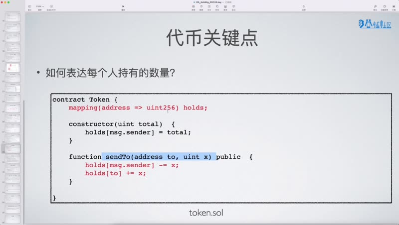
- **核心差异**：非标准实现只需包含余额映射和基础转账逻辑，而 `ERC20` 需要完整实现接口规范。
- **设计目的**：标准化的核心价值在于统一交互方式，使钱包/交易所等第三方无需为每个代币定制集成方案。
- **实现要求**：任何声称符合 `ERC20` 的合约必须严格实现 `IERC20` 接口定义的全部方法签名。

### 8. ERC20 实现

#### 1）基本实现方法

- 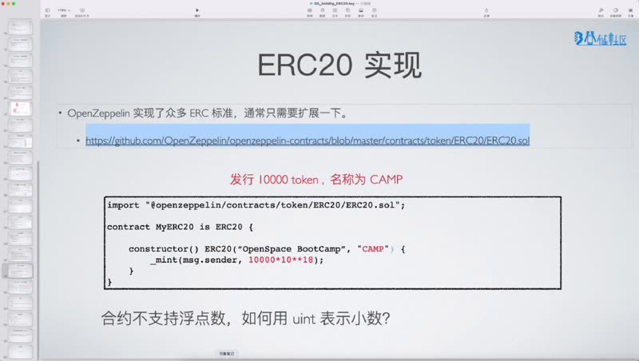
- **扩展实现**：**OpenZeppelin** 已经实现了众多 **ERC** 标准，通常只需要通过 `is` 关键字进行扩展即可使用。
- **代码示例**：

```solidity
import "@openzeppelin/contracts/token/ERC20/ERC20.sol";

contract MyERC20 is ERC20 {
    constructor() ERC20("OpenSpace BootCamp", "CAMP") {
        _mint(msg.sender, 10000 * 10 ** 18);
    }
}
```

#### 2）转账机制解析

- 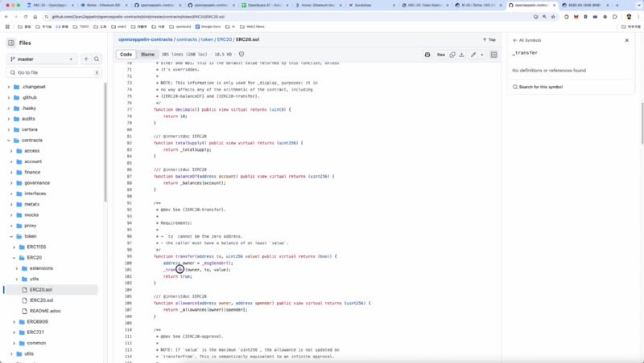
- **转账流程**：
    - 调用 `transfer` 函数后会调用内部 `_transfer` 函数
    - 进行地址有效性检查（不能为零地址）
    - 更新余额映射：发送方做减法，接收方做加法
- **余额存储**：所有账户余额保存在 `mapping(address => uint256)` 类型的 `_balances` 映射中。
- **授权机制**：`allowance` 函数通过 `_allowances` 映射记录授权额度。

#### 3）数值表示方法

- **浮点数处理**：
    - 合约不支持浮点数，所有小数都需要用整数表示。
    - 通常采用乘以 10^{18} 的方式表示小数（18 位精度）。
    - 例如：1 个代币实际存储为 1 * 10^{18}
- **精度差异**：
    - 大部分 `ERC20` 代币采用 18 位精度。
    - 特殊案例：`USDT` 采用 6 位精度。

#### 4）例题：部署合约转账

- 
- **部署演示**：
    - 部署 100 个代币，实际存储为 100 * 10^{18}
    - 转账 1 个代币需要传入 1 * 10^{18}
- **实际转账**：
    - 在区块链浏览器中显示为 `1000000000000000000`
    - 前端显示时会自动除以 10^{18} 转换为小数形式
- **注意事项**：
    - 不同精度的代币需要特别处理转换系数。
    - 浮点数运算可能导致精度损失，必须使用整数运算。

### 9. 转账 ETH 与 Token 区别

- 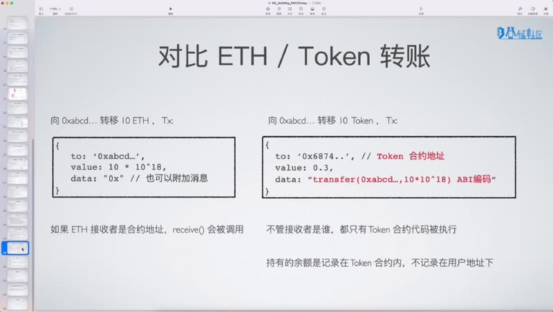
- **ETH 转账机制**：
    - **接收地址**：直接转账给用户地址（如 `0xabcd...`）
    - **交易结构**：`to` 字段为目标地址，`value` 为转账金额（如 10 * 10^{18} `wei`），`data` 字段通常为空或附加消息。
    - **合约交互**：若接收者是合约地址，会自动触发合约的 `receive()` 或 `fallback()` 函数。
- **Token 转账机制**：
    - **接收地址**：交易对象是 **Token** 合约地址（如 `0x6874...`），而非最终接收者。
    - **交易结构**：`value` 字段必须为 0，`data` 字段包含 **ABI** 编码的 `transfer(接收地址, 金额)` 函数调用。
    - **执行逻辑**：仅执行 **Token** 合约代码，余额记录在合约的 `mapping` 结构中，与用户地址无直接关联。
- **核心差异**：
    - **余额存储**：**ETH** 余额直接记录在用户地址下，**Token** 余额由合约内部 `balanceOf` 映射维护。
    - **合约触发**：**ETH** 转账可能触发接收合约逻辑，**Token** 转账仅触发 **Token** 合约逻辑。
    - **金额单位**：两者均需转换为最小单位（**ETH** 用 `wei`，**Token** 按 `decimals` 换算）。

### 10. 应用案例

#### 1）例题：写 Token 并部署 TokenBank

- 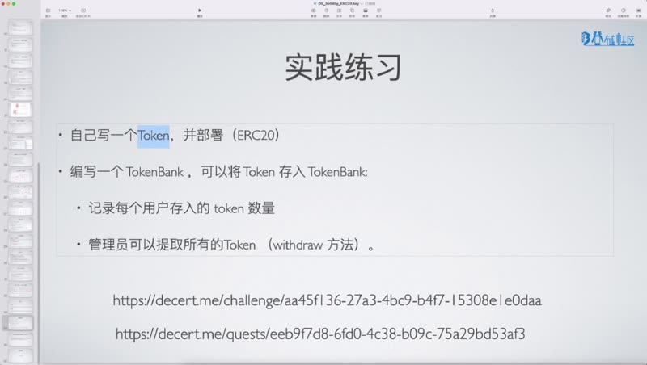
- **功能要求**：
    - 实现 `ERC20` 标准 **Token** 合约
    - 开发 `TokenBank` 合约需包含：
        - 用户存款记录功能（记录每个地址的 **Token** 数量）
        - 管理员提取全部 **Token** 的 `withdraw` 方法
- **关键问题**：
    - **存款识别**：当用户向 `TokenBank` 转账时，合约无法自动执行代码记录存款（需通过 `approve` + `transferFrom` 组合实现）。
    - **余额管理**：**Token** 余额存储在 **Token** 合约中，`TokenBank` 需主动查询用户余额。

### 11. 练习

- 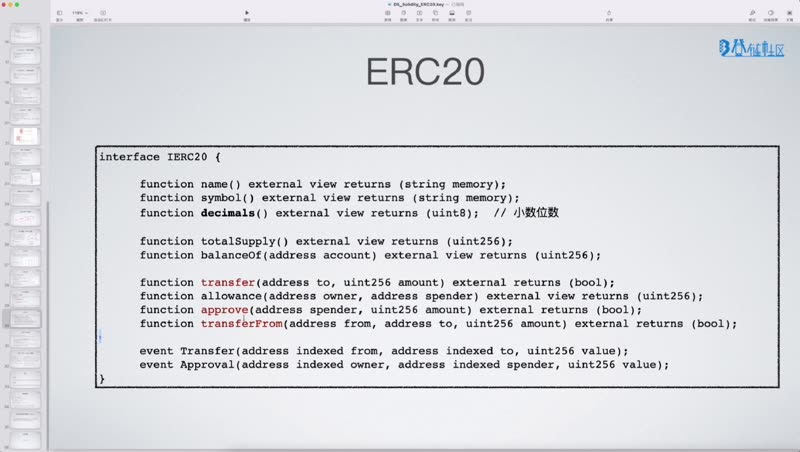
- **重点接口**：
    - `approve(spender, amount)`：授权其他地址操作自己 **Token**
    - `transferFrom(from, to, amount)`：被授权地址执行转账
    - **应用场景**：解决合约地址无法自动响应 **Token** 转账的问题。
- **实践任务**：
    - **ABI 编码练习**：掌握 `transfer` 函数调用的数据编码。
    - **底层调用实践**：理解合约间调用的实现原理。
    - `TokenBank` 实现：通过 `approve` + `transferFrom` 模式完成存款记录功能。

### 12. 地址小结

- 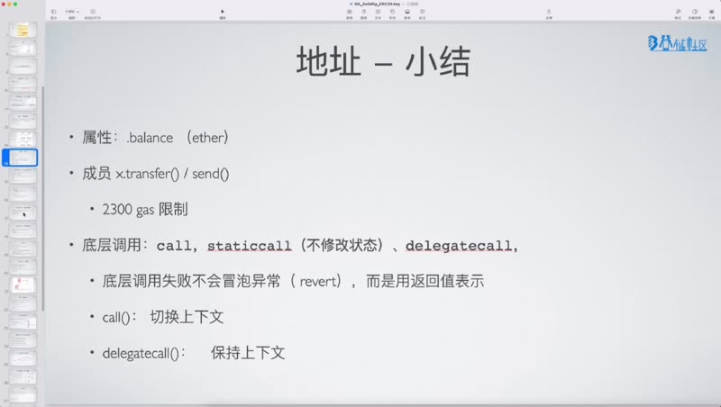
- **基础属性**：
    - `balance`：表示地址持有的以太币余额，单位为 `wei`
    - `transfer()` / `send()`：发送以太币的方法，有 2300 **gas** 限制
- **底层调用**：
    - `call` / `staticcall`：`staticcall` 用于不修改状态的调用
    - `delegatecall`：保持调用上下文
    - **特点**：底层调用失败不会抛出异常 (`revert`)，而是通过返回值表示。
- **上下文切换**：
    - `call`：会切换执行上下文
    - `delegatecall`：保持原合约的上下文

### 13. Solidity 库 (Library)

- 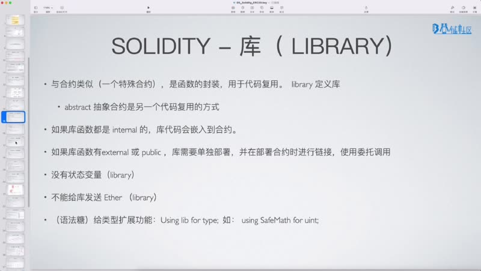
- **基本概念**：
    - **定义**：使用 `library` 关键字定义，是函数的封装，用于代码复用。
    - **与合约区别**：没有状态变量，不能接收以太币。
- **部署方式**：
    - `internal` 函数：会直接嵌入到调用合约中。
    - `external` / `public` 函数：需要单独部署并通过委托调用链接。
- **语法糖**：
    - `using...for`：为类型扩展功能，如 `using SafeMath for uint`
- **使用限制**：
    - `private` 方法：在库中没有意义，因为库的目的是提供可复用函数。
    - `internal` 方法：当库包含 `external` / `public` 函数时，`internal` 方法也不能直接调用。

### 14. OpenZeppelin 工具库

- 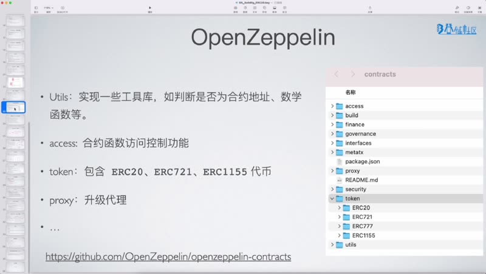
- **主要模块**：
    - `access`：合约函数访问控制功能
    - `token`：包含 `ERC20`、`ERC721`、`ERC1155` 等代币标准
    - `proxy`：升级代理功能
    - `utils`：工具库，如地址判断、数学函数等
- **实践建议**：
    - `internal` 使用：**OpenZeppelin** 库中大多使用 `internal` 函数。
    - **替代方案**：对于需要外部调用的功能，通常使用接口或完整合约替代。

### 15. Solidity 事件

- 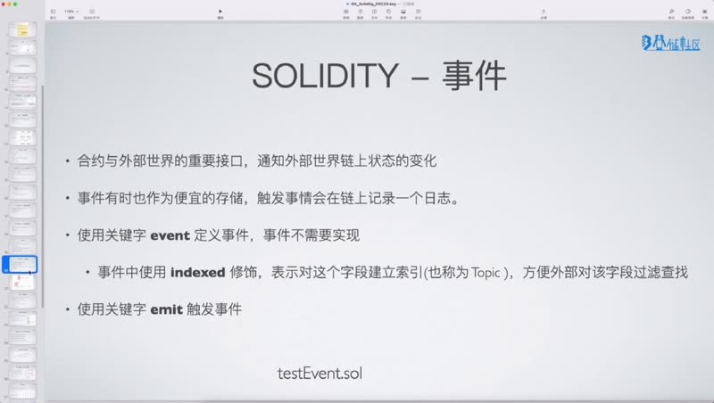
- **基本概念**：
    - **作用**：合约与外部世界的重要接口，用于通知链上状态变化。
    - **存储功能**：可作为便宜的存储方式，日志会永久记录在链上。
- **定义与触发**：
    - **定义**：使用 `event` 关键字，不需要实现。
    - **触发**：使用 `emit` 关键字。
- **索引功能**：
    - `indexed` 修饰符：对字段建立索引 (**Topic**)，方便外部过滤查找。
    - **应用场景**：交易所和钱包常用此功能跟踪特定交易。

## 七、 知识小结

| 知识点 | 核心内容 | 易混淆点/重点 | 难度系数 |
| :--- | :--- | :--- | :--- |
| **ERC20 标准** | 定义同质化代币的智能合约接口规范，包含转账、余额查询等基础功能 | 与原生 **ETH** 转账的本质区别（合约调用 vs 原生交易） | ★★★☆☆ |
| **同质化代币特点** | 表示可互换资产（如股票、货币），任意单位价值相等 | 需注意 `USDT` 等代币采用 6 位小数而非标准 18 位 | ★★☆☆☆ |
| **非同质化代币 (NFT)** | 表示独一无二的资产（艺术品、域名等），通过 `ERC721`/`ERC1155` 标准实现 | 与 `ERC20` 在数据结构（`mapping` vs `tokenID`）的根本差异 | ★★★☆☆ |
| **EIP 与 ERC 关系** | **EIP** 是以太坊改进提案总称，**ERC** 是其应用层子类（如 `ERC20`） | 协议层 **EIP**（如 `1559`）需全网升级，应用层 **ERC** 只需合约实现 | ★★★★☆ |
| **代币精度处理** | 合约内用整数存储（1 代币 = 10^18 单位），规避浮点数精度问题 | 实际转账需换算单位（1 代币 = 1,000,000,000,000,000,000） | ★★★★☆ |
| **代币转账机制** | 通过调用合约的 `transfer` 函数修改 `mapping` 余额记录 | 关键区别：**ETH** 转账目标地址是用户，代币转账目标地址是合约 | ★★★★☆ |
| **代币银行设计** | 需记录用户存款映射，通过 `approve` + `transferFrom` 实现托管 | 理解合约间调用的授权机制 (`allowance`) | ★★★★☆ |
| **代币信息标准化** | `name`/`symbol`/`decimals` 等字段供钱包/交易所识别 | **Logo** 等元数据需主动向 **CoinMarketCap** 等平台提交 | ★★☆☆☆ |
