## 一、 ERC20

### 1. 理解 ERC20 的授权

- 
- **转账返回值问题**: 某些 **ERC20** 代币（如 **USDT**）转账失败时不会回退交易，而是返回 `false`，这可能导致合约误判转账状态。
- **典型案例**:
    - **USDT** 合约地址：`0xdac17f958d2ee523a2206206994597c13d83lec7`
    - **ZRX** 合约地址：`0xe41d2489571d322189246dafa5ebde1f4699f498`
- **解决方案**: 应始终使用 **OpenZeppelin** 的 **SafeERC20** 库中的 `safeTransfer` 方法进行转账操作。
    - 源码参考：[SafeERC20.sol](https://github.com/OpenZeppelin/openzeppelin-contracts/blob/master/contracts/token/ERC20/utils/SafeERC20.sol)
    - 技术文章：[learnblockchain.cn](https://learnblockchain.cn/article/3074)
    - 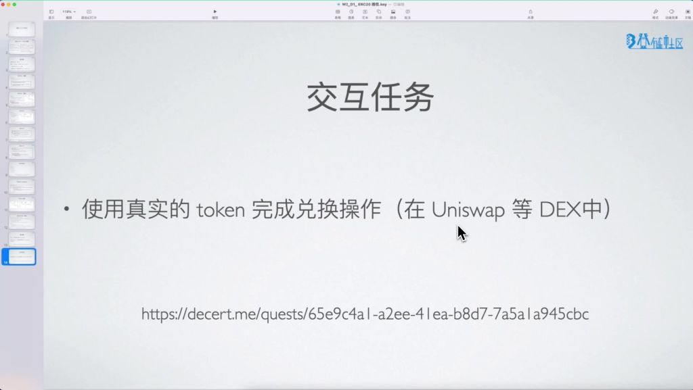
- **实践建议**: 在 **Uniswap** 等 **DEX** 中使用真实代币完成兑换操作，体验完整的授权和交易流程。
    - 任务链接：[Decert.me Quests](https://decert.me/quests/65e9c4al-a2ee-4lea-b8d7-7a5ala945cbc)
- **操作要点**:
    - **DEX** 交互需要先进行授权操作。
    - 建议新手通过实际操作加深理解。
    - 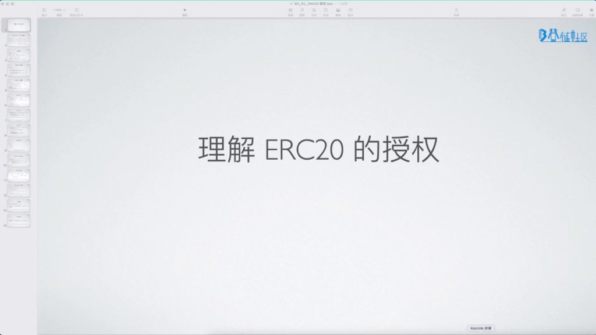
- **主要代币类型**:
    - **ERC20**：同质化代币标准。
    - **ERC721**：非同质化代币 (**NFT**) 标准。
- **应用场景**:
    - 大多数链上合约主要与这两种代币标准交互。
    - **ERC721** 是最常用的 **NFT** 标准。


## 二、 ERC721(NFT)

### 1. ERC721 介绍

- 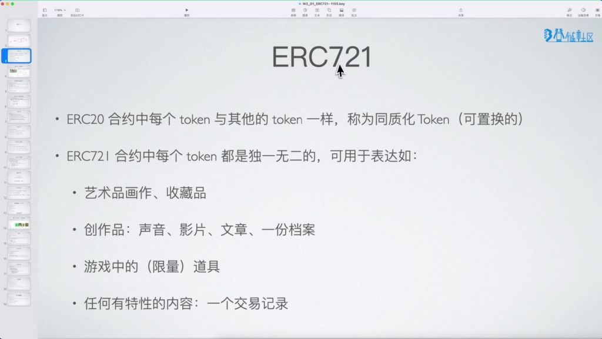
- **同质化 Token**: **ERC20** 合约中每个 **Token** 与其他 **Token** 完全一样，具有可置换性。
- **非同质化 Token**:
    - **ERC721** 合约中每个 **Token** 都是独一无二的。
    - **应用场景**: 艺术品画作、收藏品、创作品(声音/影片/文章/档案)、游戏限量道具、**ENS** 域名、交易记录等具有独特属性的内容。
    - **核心特征**: 通过唯一编号标识每个 **Token**，并附加元数据描述其特性。

### 2. ERC721 长啥样

- 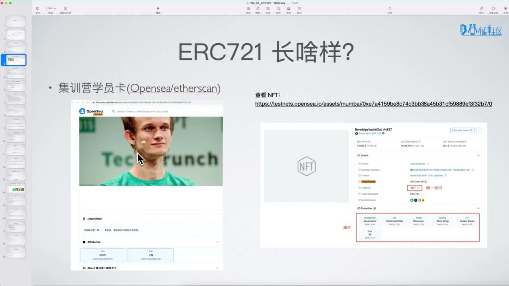
- 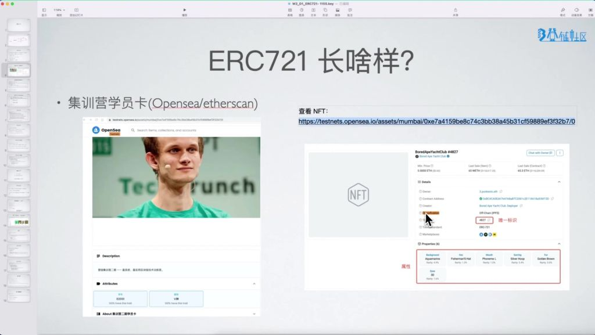
- **可视化表现**:
    - 通常包含一张展示图片(非必需)。
    - 包含唯一标识符和属性列表。
    - 在 **OpenSea** 等平台会结构化展示名称、描述、图片和属性。
- **链上存储**:
    - 通过智能合约记录每个 **Token** 的所有者。
    - 属性数据通常存储在链下(如 **IPFS**)，通过 **URI** 引用。

### 3. 如何表达独特性

#### 1）ERC721 合约中每个 Token 有一个 ID

- 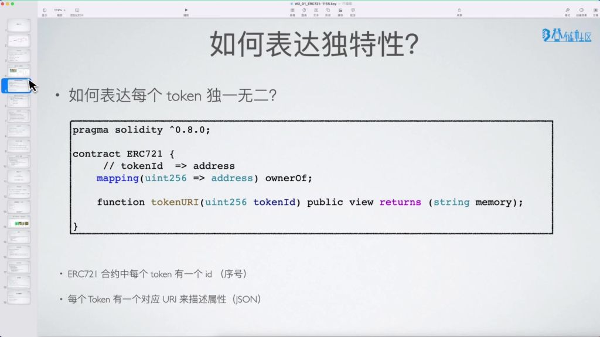
- **唯一标识机制**:
    - 为每个 **Token** 分配不重复的编号 (`tokenId`)。
    - 通过 `mapping(uint256 => address) ownerOf` 记录 **Token** 所有权。
    - **实现原理**: 只要保证编号不重复，编号本身就代表特定物品。

#### 2）每个 Token 有一个对应 URI 来描述属性

- **元数据存储**:
    - 通过 `tokenURI(uint256 tokenId)` 函数返回描述该 **Token** 的 **URI**。
    - **URI** 通常指向 **JSON** 格式的元数据文件。
    - **灵活性**: **URI** 可以是任何字符串，但推荐使用标准化格式。

#### 3）ERC721 MetaData

- 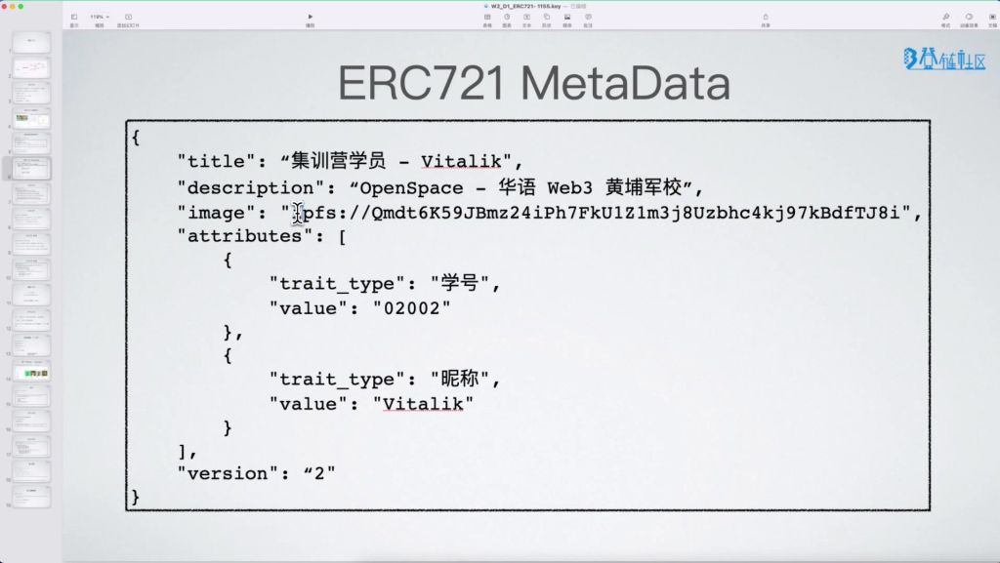
- 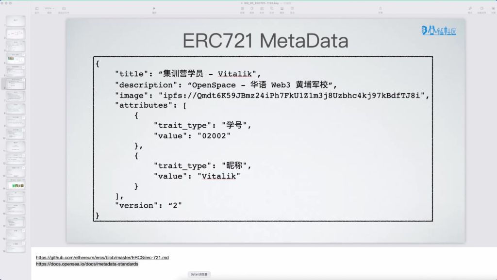
- **标准结构**:
- **行业实践**:
    - **OpenSea** 提出的标准被广泛采用。
    - 包含名称、描述、图片和属性数组。
    - 属性可包含各种类型(数值、文本、百分比等)。
- **实现注意**:
    - 标准仅定义接口，具体 **Metadata** 格式由开发者决定。
    - 遵循 **OpenSea** 标准可确保在主流平台正确显示。
    - 图片推荐使用 3000×3000 像素以下，文件大小建议小于 40MB。

### 4. ERC721 接口规范

- 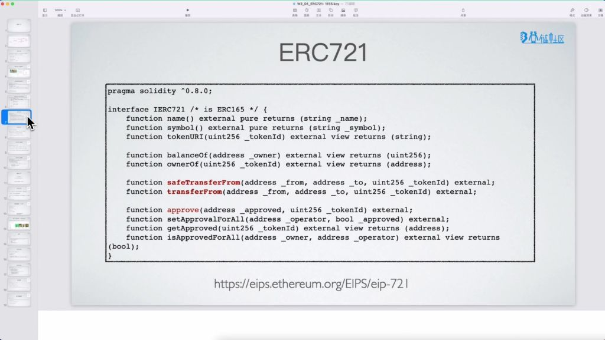
- **核心方法**：
    - `name()`：返回代币名称。
    - `symbol()`：返回代币符号。
    - `tokenURI(uint256 tokenId)`：返回代币元数据 **URI**。
    - `balanceOf(address owner)`：查询账户余额。
    - `ownerOf(uint256 tokenId)`：查询代币所有者。
    - `safeTransferFrom` / `transferFrom`：代币转账方法。
    - `approve` / `setApprovalForAll`：授权相关方法。

#### 1）标准里引入 safeTransferFrom

- 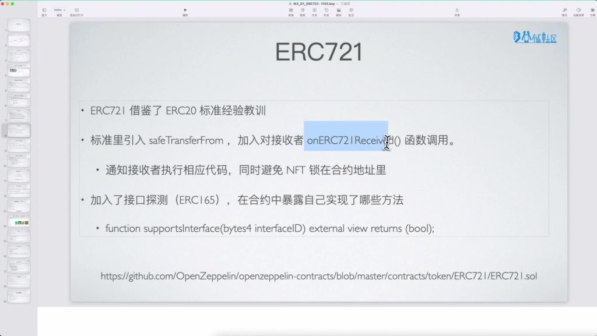
- **改进背景**：吸取 **ERC20** 标准经验教训，解决 **NFT** 可能被锁在合约地址的问题。
- **回调机制**：
    - 新增 `safeTransferFrom` 方法会在转账时调用接收者的 `onERC721Received()` 函数。
    - **作用**：通知接收者执行相应代码，避免 **NFT** 锁死。
    - **实现要求**：接收合约必须实现 `onERC721Received` 才能成功接收。
- **操作对比**：
    - **ERC20** 需要至少两次交易完成存款操作。
    - **ERC721** 通过一次安全转账即可完成，效率更高。

#### 2）接口探测机制 (ERC165)

- 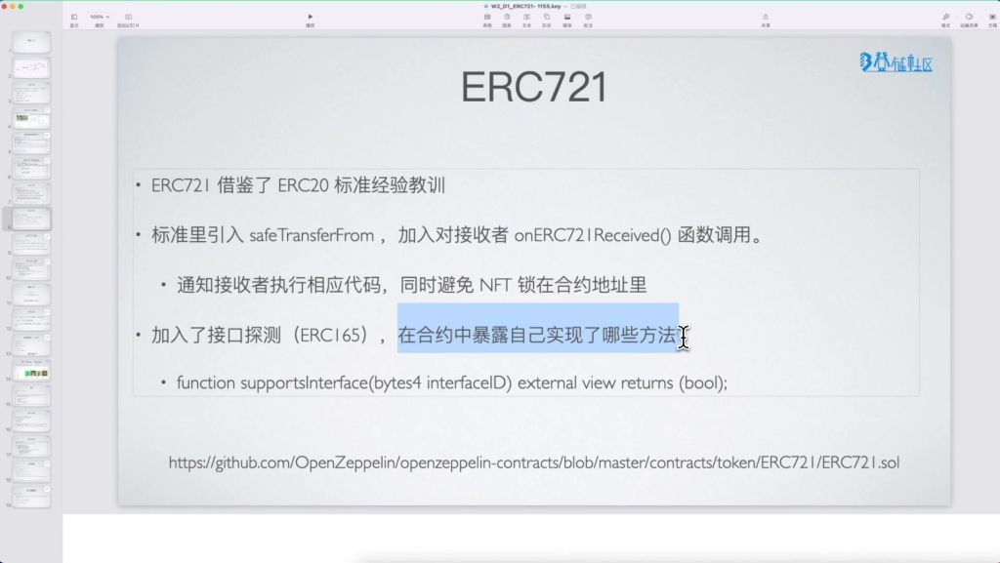
- **实现方式**：
    - 通过 `supportsInterface(bytes4 interfaceId)` 方法暴露合约实现的接口。
    - 传入函数选择器(4字节)，返回 `bool` 值表示是否实现。
- **优势**：
    - 解决了 **ERC20** 合约类型难以确认的问题。
    - 调用前即可知合约支持哪些方法，避免调用失败。
    - 特别适用于未开源合约的接口探测。
- **技术细节**：
    - 继承自 **ERC165** 标准。
    - 典型接口ID示例：`type(IERC721).interfaceId`。

#### 3）元数据标准

- 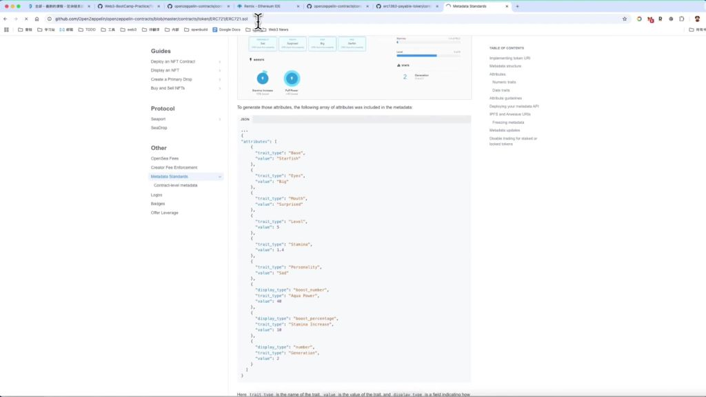
- **灵活性**：
    - 标准不强制规定具体字段。
    - 开发者可自定义任意属性（如 `trait_type` 和 `value`）。
- **常见属性**：
    - **基础信息**：名称、描述、图片。
    - **特征属性**：通过 `trait_type` 定义各类特征。
    - **显示类型**：通过 `display_type` 指定数值展示形式。
- **推荐标准**：
    - 参考 **OpenSea** 等平台的元数据规范。
    - 建议包含必要的基础信息和可视化属性。


### 5. OpenZeppelin 包含了 ERC721 实现

- 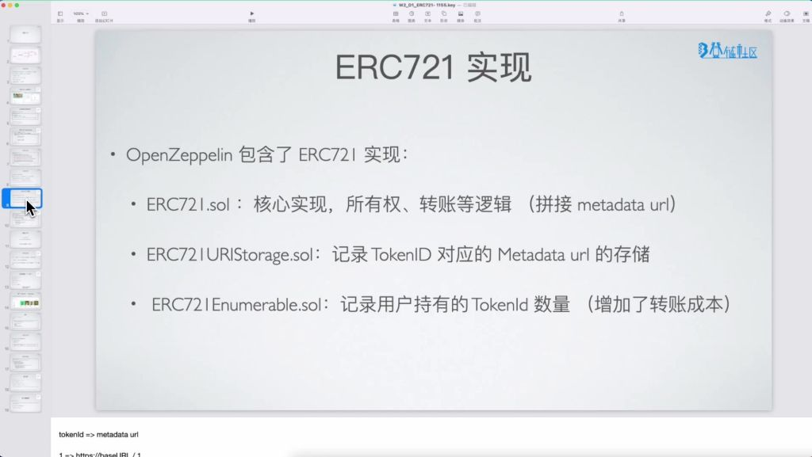
- **核心实现**：`ERC721.sol` 处理所有权和转账逻辑，并实现基本的 **Metadata URL** 拼接功能。
- **URI 存储**：`ERC721URIStorage.sol` 专门记录每个 `TokenID` 对应的 **Metadata URL** 存储。
- **枚举功能**：`ERC721Enumerable.sol` 记录用户持有的 `TokenID` 数量，但会增加转账成本。

#### 1）ERC721URIStorage.sol

- 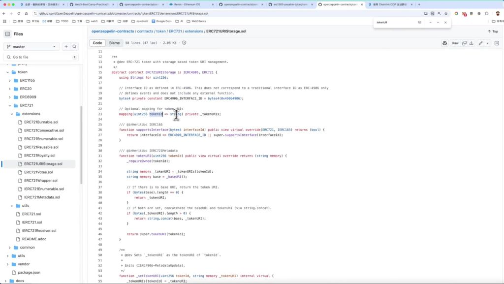
- **映射机制**：使用 `mapping(uint256 => string)` 存储每个 `TokenID` 对应的 **Metadata URL**。
- **灵活性**：适合每个 **Token** 都有独立无关联的 **Metadata** 情况。
- **存储方式**：相比基础实现需要额外存储每个 **Token** 的完整 **URL**。

#### 2）ERC721Enumerable.sol

- 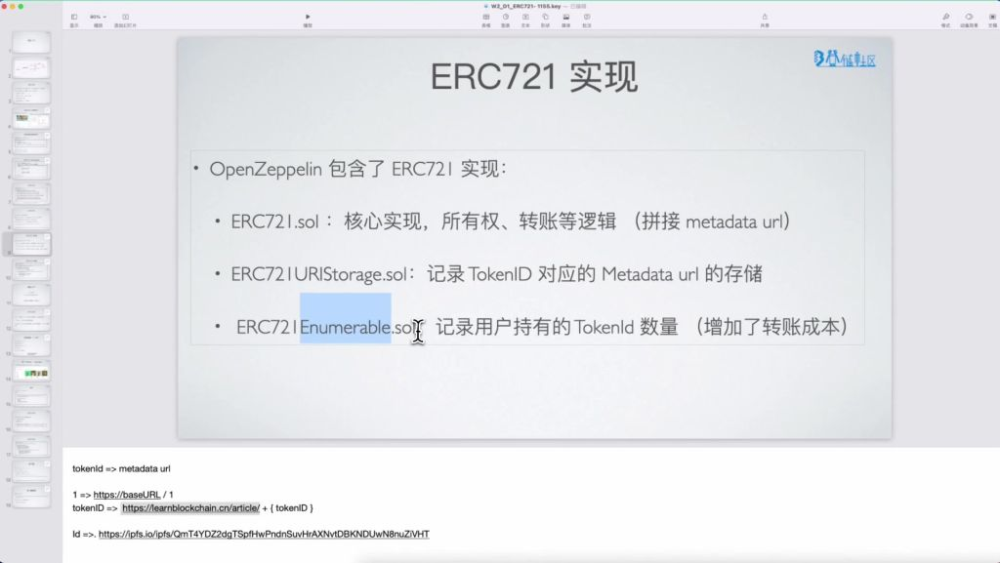
- **功能补充**：在基础实现上增加用户持有 **Token** 数量的查询功能。
- **实现方式**：存储用户持有的 `TokenID` 列表及其索引。
- **成本考量**：会显著增加转账的 **Gas** 成本，非必要不建议使用。

### 6. ERC721 实现

- 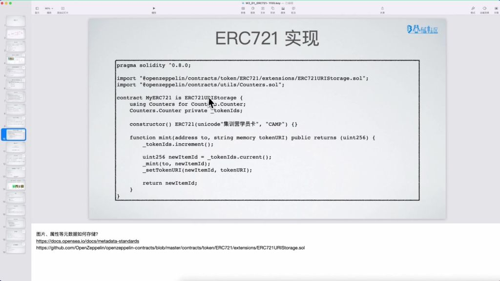
- **继承选择**：可根据需求选择基础实现、URI存储或枚举功能扩展。
- **ID 生成**：常规做法是从 1 开始递增，但规范只要求唯一性。
- **mint 方法**：**NFT** 通常需要逐个铸造，不同于 **ERC20** 可批量发行。

#### 1）问题

- **存储方案**：可选择中心化服务器或 **IPFS** 等去中心化存储。
- **可靠性**：需考虑文件永久存储和防篡改问题。
- **标准规范**：遵循 **OpenSea** 等平台的 **Metadata** 标准格式。

#### 2）铸造 NFT

- 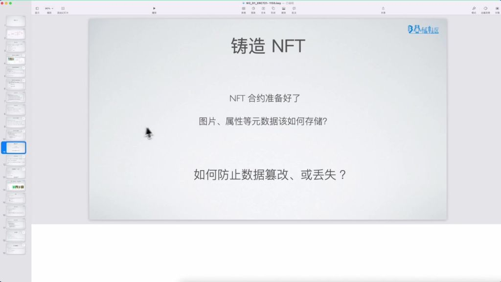
- **准备工作**：需要同时准备智能合约和对应的元数据文件。
- **存储选择**：服务器存储存在单点故障风险，**IPFS** 更可靠但复杂。
- **防篡改**：需要考虑元数据完整性验证机制。

### 7. IPFS / AR weave

- 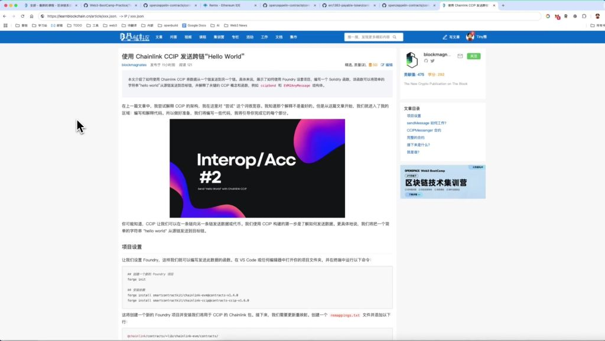
- **核心概念**: **IPFS** (InterPlanetary File System) 是一种去中心化存储协议，旨在取代 **HTTP** 协议。
- **寻址方式**:
    - **HTTP** 采用 **IP** 地址寻址，通过域名解析到特定服务器获取内容。
    - **IPFS** 采用内容寻址，通过文件哈希值获取内容。
- **去中心化特性**:
    - 传统 **HTTP** 访问必然中心化，依赖单一服务器。
    - **IPFS** 网络由多个节点组成，内容分布在多个节点上。
- **内容验证**:
    - 文件哈希值唯一对应文件内容。
    - 内容不变则哈希值不变，确保内容不被篡改。

#### 1）Filecoin

- 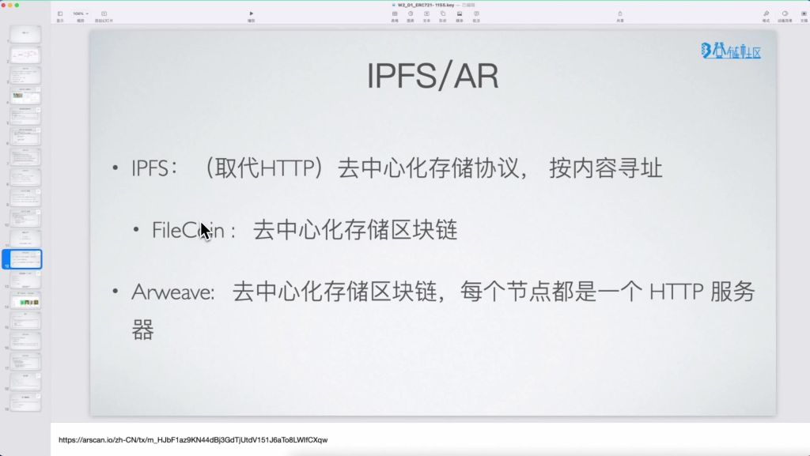
- **与 IPFS 关系**:
    - **Filecoin** 是建立在 **IPFS** 上的去中心化存储区块链。
    - 提供经济激励确保文件持久存储。
- **存储机制**:
    - 存储矿工提供存储空间获得代币奖励。
    - 用户支付代币存储文件。
- **数据可靠性**:
    - 文件可能丢失(如果无人存储)。
    - 可通过备份服务提高可靠性。
- **使用场景**:
    - 适合需要长期存储但访问频率不高的数据。
    - 常用于 **NFT** 元数据存储。

#### 2）Arweave

- **核心特点**:
    - 每个节点都是 **HTTP** 服务器。
    - 采用区块链技术确保数据永久存储。
- **共识机制**:
    - 使用区块纺 (**Blockweave**) 数据结构。
    - 采用访问证明 (**PoA**) 共识算法。
- **数据永久性**:
    - 文件一旦上链即永久保存。
    - 多节点冗余存储防止数据丢失。
- **与 IPFS 对比**:
    - **IPFS** 是协议层，**Arweave** 是应用层。
    - **Arweave** 内置经济模型确保存储持久性。
    - **IPFS** 需要额外机制(如 **Filecoin**)保证持久性。
- **典型应用**:
    - 永久网页存档。
    - 重要文档存证。
    - **NFT** 元数据存储。
    - 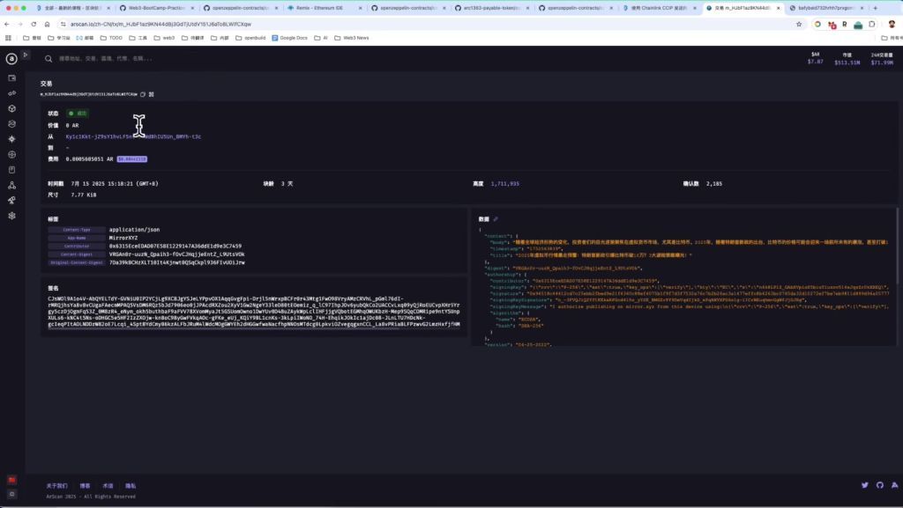
- **交易结构**:
    - 包含数据哈希、存储证明等信息。
    - 交易费与数据大小相关。
- **数据验证**:
    - 通过区块链浏览器可验证存储内容。
    - 哈希值确保内容不可篡改。
- **开发接口**:
    - 提供 **RESTful API** 进行数据存取。
    - 支持多种编程语言 **SDK**。


### 8. 如何铸造一个 NFT

- 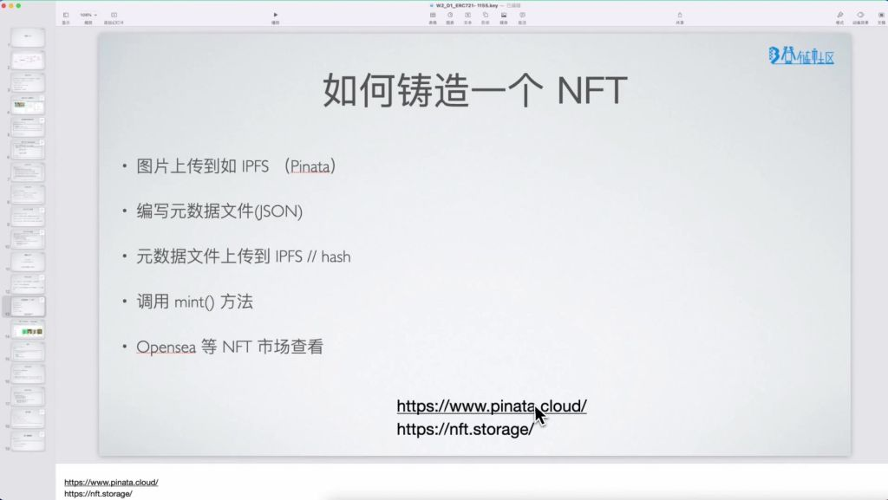
- **核心步骤**：包含图片上传、元数据编写、智能合约调用和市场展示四个关键环节。
- **工具推荐**：推荐使用 **Pinata** 和 **NFT.storage** 作为 **IPFS** 存储服务。

#### 1）图片上传到 IPFS (Pinata)

- 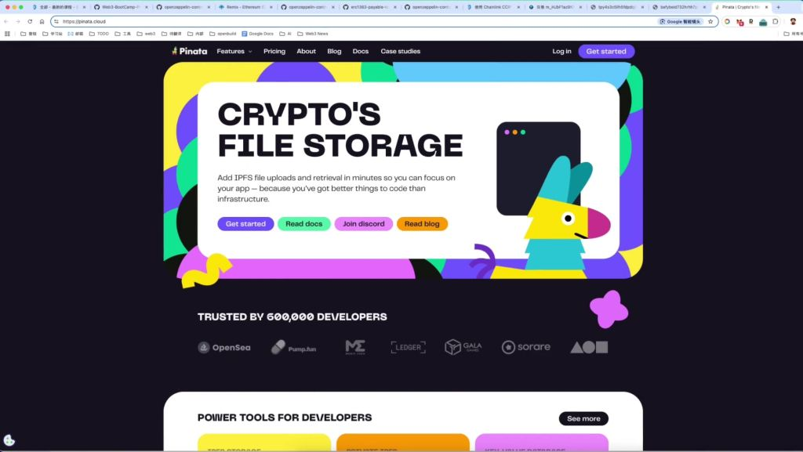
- **服务选择**：**Pinata** 和 **NFT.storage** 都提供文件存储服务，可将文件上传至 **IPFS** 网络。
- **操作流程**：
    1. 选择要上传的图片文件。
    2. 通过服务商平台上传文件。
    3. 获取文件对应的 **CID**（内容标识符）。
- **注意事项**：上传后会返回文件的 **IPFS** 哈希值，这是后续步骤的重要凭证。

#### 2）编写元数据文件 (JSON)

- 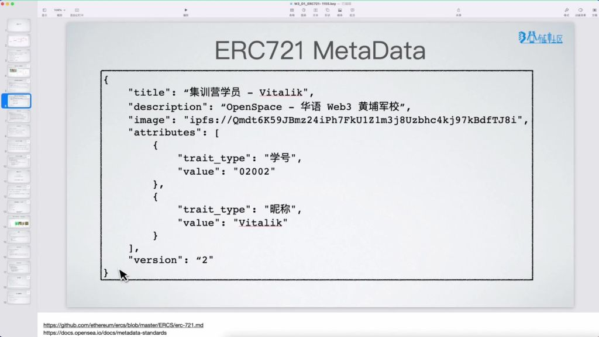
- **标准格式**：遵循 **ERC-721** 元数据标准，包含以下关键字段：
    - `title`：**NFT** 名称
    - `description`：描述信息
    - `image`：**IPFS** 链接（格式为 `ipfs://<CID>`）
    - `attributes`：特征属性数组
- **示例模板**：

```json
{
    "title":"集训营学员-Vitalik",
    "description":"OpenSpace-华语Web3黄埔军校",
    "image":"ipfs://Qmdt6K59JBmz24iPh7FkU1Zlm3j8Uzbhc4kj97kBdfTJ8i",
    "attributes":[
        {"trait_type":"学号","value":"02002"},
        {"trait_type":"昵称","value":"Vitalik"}
    ],
    "version":"2"
}
```

#### 3）元数据文件上传到 IPFS

- **二次上传**：将编写好的 **JSON** 文件再次上传到 **IPFS**。
- **哈希获取**：获得元数据文件的 **CID**，该哈希将作为智能合约中 `tokenURI` 的参数。
- **链下存储**：通过这种方式实现 **NFT** 数据的链下存储，降低链上存储成本。

#### 4）调用 mint() 方法

- 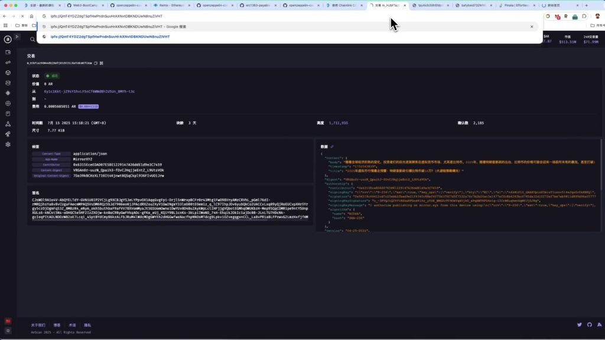
- **合约实现**：通过继承 **OpenZeppelin** 的 `ERC721URIStorage` 实现 **NFT** 合约。
- **关键方法**：

```solidity
function mint(address student, string memory tokenURI) public returns(uint256){
    uint256 newItemId = _tokenIds.current();
    _mint(student, newItemId);
    _setTokenURI(newItemId, tokenURI);
    _tokenIds.increment();
    return newItemId;
}
```

- **调用参数**：
    - `student`：接收者地址
    - `tokenURI`：元数据文件的 **IPFS** 链接

#### 5）在 Opensea 等 NFT 市场查看

- 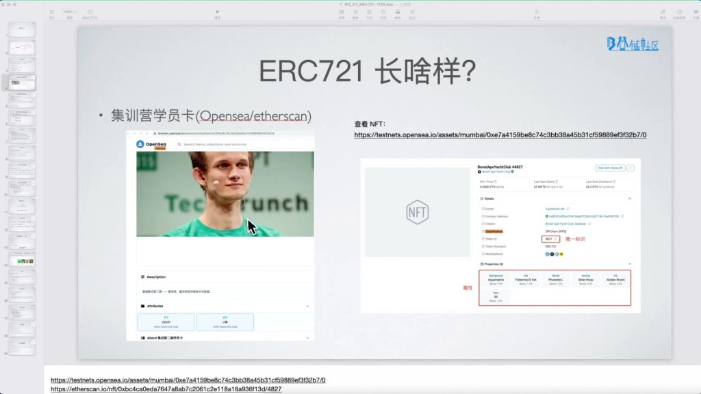
- **自动索引**：**NFT** 交易市场会自动索引链上所有符合标准的 **NFT**。
- **查看方式**：
    1. 通过合约地址查看集合。
    2. 通过 `tokenID` 查看具体 **NFT**。
- **测试网问题**：测试网络可能出现显示延迟或异常，主网通常更稳定。
- **属性展示**：市场会解析元数据中的属性并可视化展示，包括：
    - 基础信息（名称、描述）
    - 特征属性
    - 交易历史

## 三、 无法转让的 NFT（SBT）

- 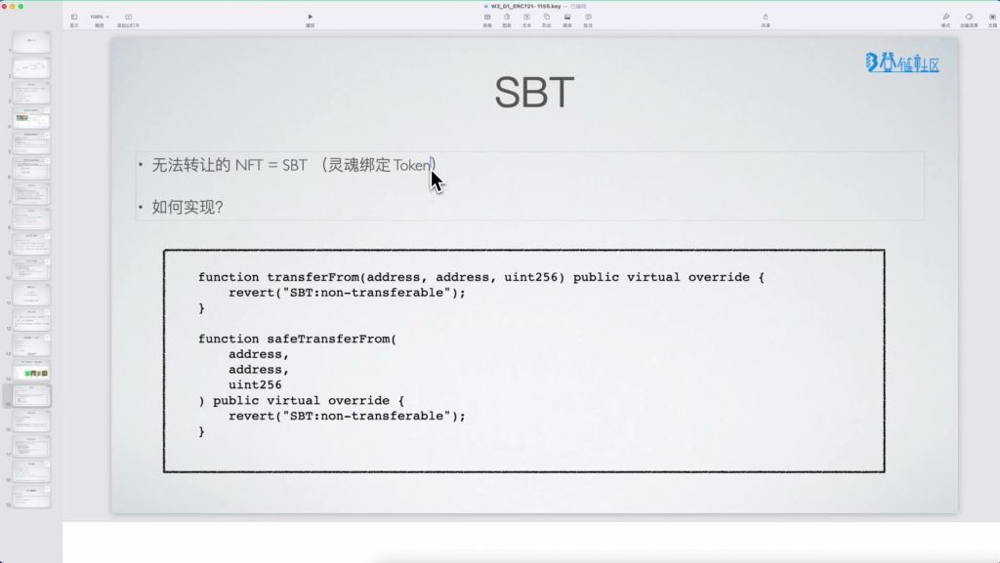
- **定义**: **SBT** (Soulbound Token) 是一种不可转让的 **NFT**，具有身份绑定特性。
- **应用场景**:
    - 身份认证信息（如个人身份凭证）。
    - 学历/技能证书（如课程练习认证）。
    - 其他需要永久绑定所有者的数字资产。
- **实现方法**:
    - 通过重写 `transferFrom` 和 `safeTransferFrom` 函数。
    - 在函数体内直接执行 `revert("SBT: non-transferable")`。
- **特性**:
    - 铸造后永久绑定原始地址。
    - 禁止任何转账操作。
    - 代表持有者的专属身份信息。

## 四、 ERC1155 标准

- 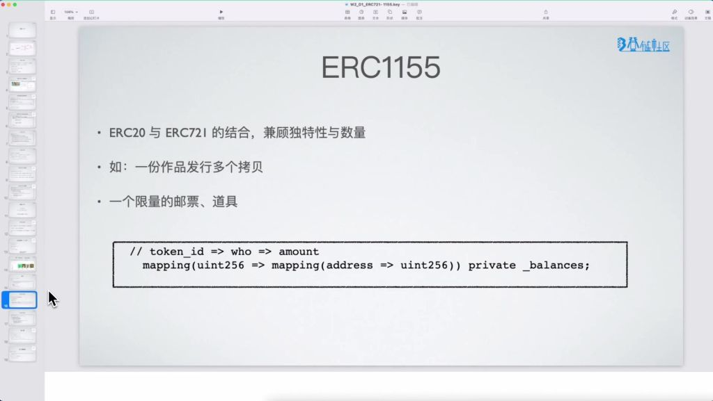
- **设计理念**:
    - 结合 `ERC20` (可替代性) 和 `ERC721` (独特性)。
    - 支持同一 `token ID` 的多份拷贝。
- **数据结构**:
    - 使用嵌套 `mapping` 存储所有权关系。
    - 结构为：`tokenID => owner => amount`
    - 代码表示：`mapping(uint256 => mapping(address => uint256)) private _balances;`
- **典型应用**:
    - 限量版收藏品（如邮票）。
    - 游戏道具（不同稀有度的装备）。
    - 数字艺术作品的多份复制品。

### 1. 例题：一份作品发行多个拷贝

- 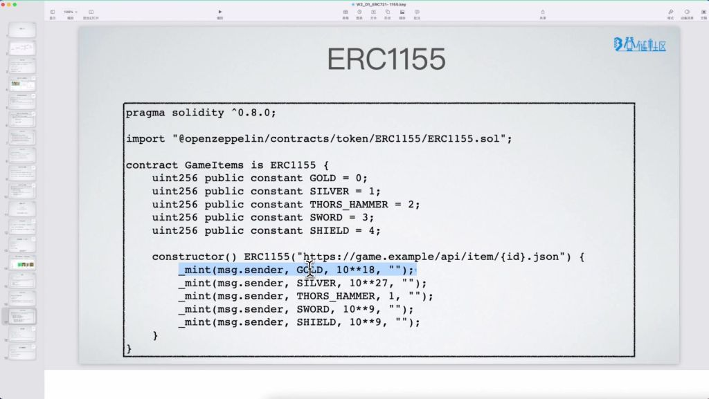
- **实现要点**:
    - 继承 **OpenZeppelin** 的 `ERC1155` 合约。
    - 定义不同物品的常量 **ID**（如 `GOLD = 0`, `SILVER = 1`）。
    - 在构造函数中初始化物品数量和属性。
- **代码特征**:
    - 支持批量 `mint` 不同物品。
    - 每种物品可设置独立发行量。
    - 示例中金（`GOLD`）发行 $10^{18}$ 个，银（`SILVER`）发行 $10^{27}$ 个。
- **转账机制**：
    - 保留类似 `ERC20` 的 `transfer` / `transferFrom` 方法。
    - 但操作对象是特定 `token ID` 的数量。
    - 支持部分数量转移（区别于 `ERC721` 的全量转移）。
## 五、 练习题

### 1. ERC721 NFT 合约练习

- 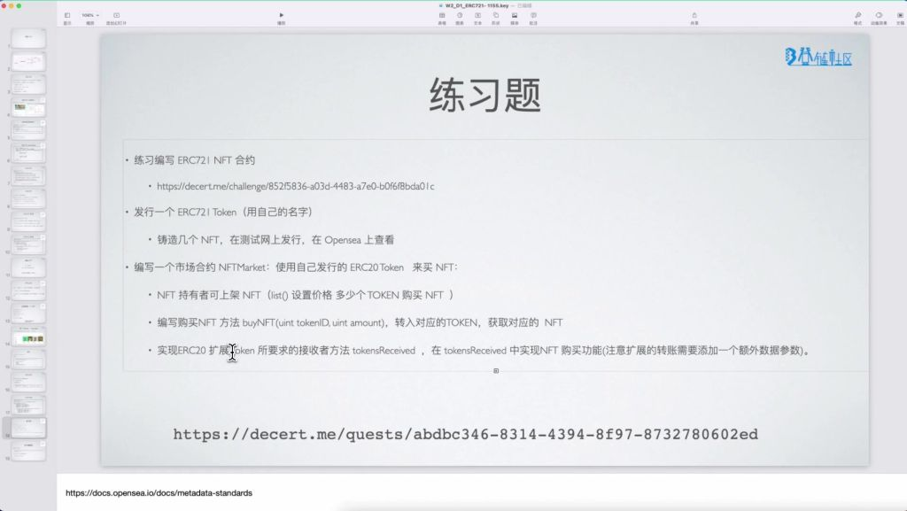
- **练习目标**：编写一个简单的 **NFT** 市场合约，实现用自定义 `ERC20` 代币购买 **NFT** 的功能。
- **具体任务**：
    - 发行一个以自己名字命名的 `ERC721 Token`。
    - 铸造几个 **NFT** 并在测试网上发行，在 **OpenSea** 上查看。
    - 编写市场合约 `NFTMarket`，功能包括：
        - **NFT** 持有者可上架 **NFT**（`list` 方法），设置价格（用自定义 `ERC20` 代币计价）。
        - 编写购买 **NFT** 方法：`buyNFT(uint tokenID, uint amount)`。
        - 实现 `ERC20` 扩展 **Token** 要求的接收者方法 `tokensReceived`。
- **参考资源**：
    - **OpenZeppelin** 的 `ERC721` 实现：[openzeppelin-contracts](https://github.com/OpenZeppelin/openzeppelin-contracts)
    - **OpenSea** 元数据标准：[metadata-standards](https://docs.opensea.io/docs/metadata-standards)

### 2. 市场合约功能详解

- **核心流程**：
    - **上架流程**：用户通过 `list` 方法标明想要出售 **NFT** 的价格（用自定义 **Token** 计价）。
    - **购买流程**：
        1. 买家转入指定数量的 **Token** 到合约。
        2. 合约将上架的 **NFT** 转给买家。
        3. 合约将 **Token** 转给卖家。
- **回调功能**：
    - 通过实现 `onERC721Received` 回调方法，可以简化购买流程。
    - 否则需要两笔操作：先授权，再真实购买。
- **参考实现**：在社区代码库中有相关实现可供参考（`Web3-BootCamp-Practice/NFTMarket_V1`）。

---

## 六、 练习题解答

### 1. 实现要点

- **关键方法**：
    - `safeTransferFrom`：需要合约实现 `onERC721Received` 方法才能接收 **NFT**。
    - `tokensReceived`：在 `ERC20` 扩展 **Token** 中实现，用于在转账时自动完成 **NFT** 购买。
- **额外参数**：扩展的转账需要添加一个额外数据参数。
- **测试要点**：
    - 在测试网发行 **NFT**。
    - 在 **OpenSea** 上验证 **NFT** 元数据显示。

### 2. 练习提交

- **提交方式**：通过指定链接提交代码。
- **注意事项**：
    - 虽然可以参考社区实现，但建议理解后自己编写。
    - 可以使用 AI 辅助，但最终要确保理解代码逻辑。
    - 练习重点是掌握 **NFT** 与 **Token** 的交互机制。

---

## 七、 进阶内容与总结（AI 图文笔记）

### 1. ERC20 授权与回调

#### 1）回顾转账机制差异

- 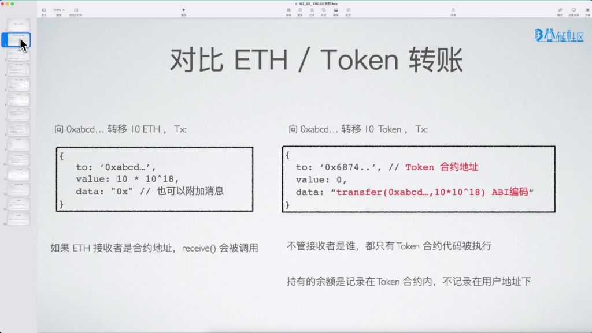
- **转账机制差异**:
    - **ETH 转账**: 直接与目标地址交互，`value` 为转账金额，$10 \times 10^{18}$ `wei`，`data` 为空。
    - **ERC20 转账**: 交互对象是 **Token** 合约地址，`value` 为 0，`data` 包含 `transfer` 方法的 **ABI** 编码。
    - **合约响应**: **ETH** 转账到合约地址会触发 `receive()` 方法，而 **ERC20** 转账只有 **Token** 合约代码执行，目标合约无法自动响应。

#### 2）ERC20 授权机制

- 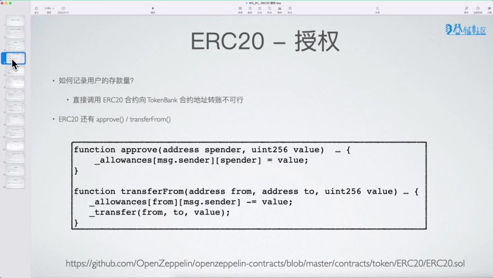
- **授权流程**:
    - `approve` 方法：用户调用 `approve(spender, value)` 授权特定地址使用自己的 **Token**。
    - `transferFrom` 方法：被授权合约调用 `transferFrom(from, to, value)` 执行转账。
    - **两步操作**: 用户需先 `approve` 再调用合约的 `deposit` 方法。
- **实现原理**:
    - `approve` 会在 `allowances` 映射中记录授权额度。
    - `transferFrom` 会检查并扣除授权额度，再执行内部 `_transfer`。

#### 3）可支付 Token 方案

- **ERC777 介绍**:
    - 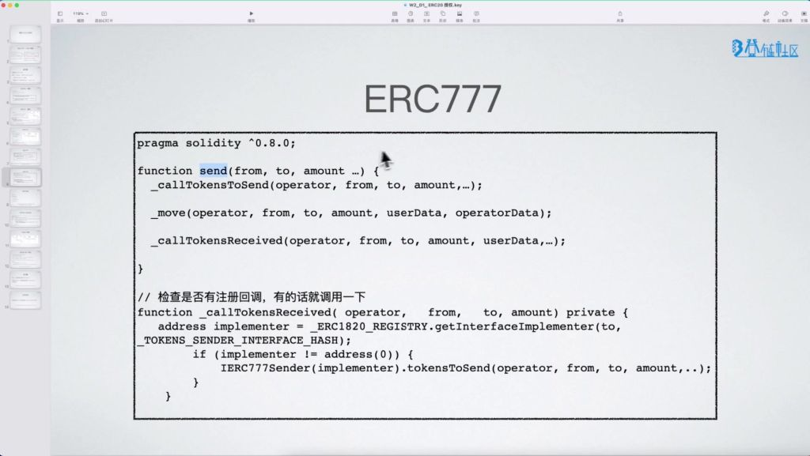
    - **主要改进**: 支持携带额外数据的 `send` 方法，通过 `ERC1820` 注册表实现回调机制。
    - **缺点**: 实现复杂，**gas** 费用高，**OpenZeppelin** 已在 v5.0 中移除该实现。
- **带回调的 Transfer (ERC1363 思想)**:
    - 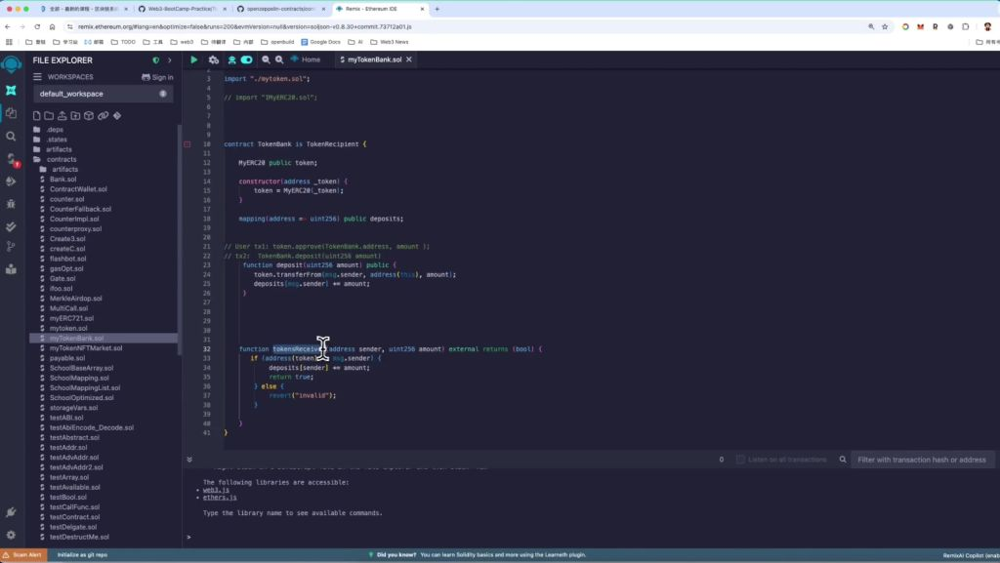
    - **实现原理**: 转账后检查接收者是否为合约，如果是则调用其 `tokensReceived` 方法。
    - **优势**: 将两步操作简化为一步，避免资金锁定风险。

#### 4）Token 用法总结

- 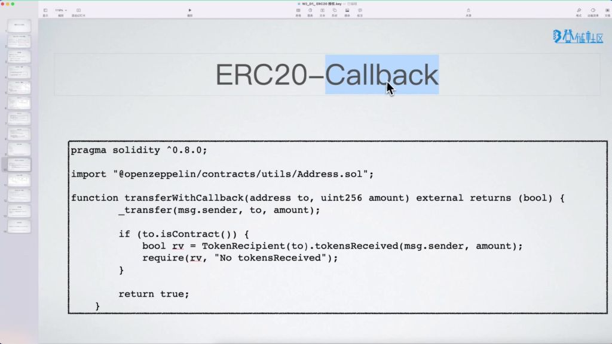
- **传统方式**：需要 `approve` + `deposit` 两笔交易。
- **回调方式**：只需 `transferWithCallback` 一笔交易。
- **注意事项**：回调实现需确保安全性和正确性。

#### 5）ERC20 的常见陷阱

- **SafeERC20 库的重要性**:
    - 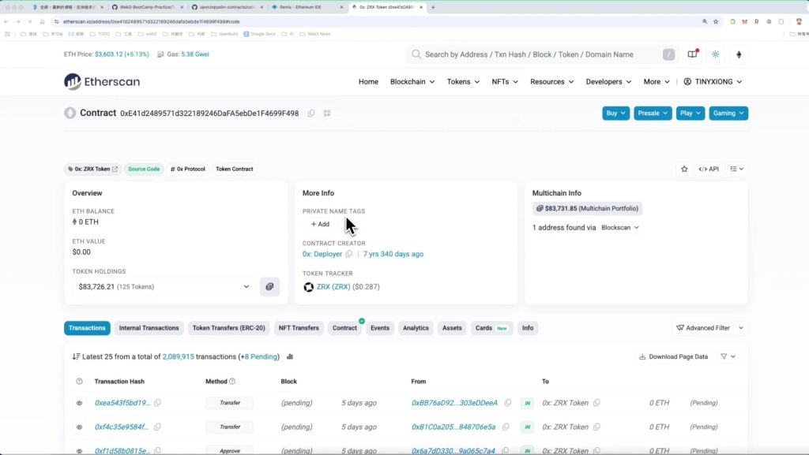
    - **常见问题**:
        - 部分 **Token**（如 `USDT`）转账无返回值（不符合 `ERC20` 接口定义的 `bool` 返回）。
        - 部分 **Token**（如 `ZRX`）失败时返回 `false` 而非回退。
    - **解决方案**: 使用 **OpenZeppelin** 的 `SafeERC20` 库，调用 `safeTransfer` / `safeTransferFrom` 方法，它能兼容这些非标准实现并处理返回值。

### 2. 例题：具有回调功能的 ERC20 Token

- 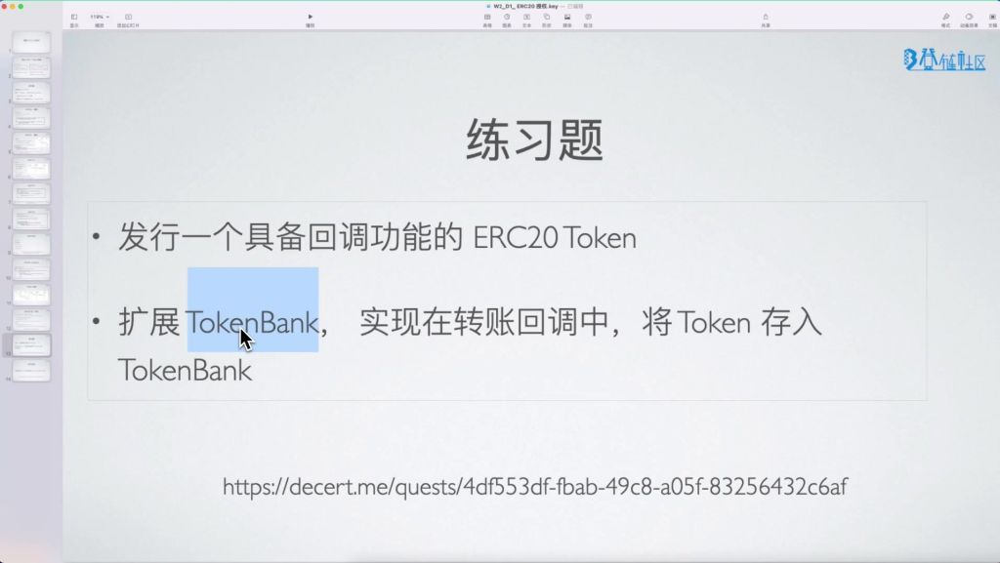
- **题目解析**:
    - 需要实现 `tokensReceived` 回调接口。
    - 在转账时自动记录存款金额。
    - 避免用户需要两步（`approve` + `deposit`）的繁琐操作。

## 八、 知识小结

| 知识点 | 核心内容 | 考试重点/易混淆点 | 难度系数 |
| :--- | :--- | :--- | :--- |
| **ETH vs ERC20 转账** | **ETH** 直接转账到目标地址，**ERC20** 通过合约 `transfer` | **ETH** 转账触发 `receive`，**ERC20** 无法直接触发接收逻辑 | ⭐⭐ |
| **Token Bank 存款难点** | 直接 `transfer` 无法记录存款，需 `approve` + `transferFrom` | 用户需先授权（`approve`）再存款，否则资金会锁定 | ⭐⭐⭐ |
| **授权机制安全风险** | 为减少交易量一次性授权大额度，存在合约漏洞被盗风险 | 大额授权 vs 分次小额授权的安全权衡 | ⭐⭐⭐⭐ |
| **ERC20 的局限性** | 无法携带附加信息，误转至无回调合约会导致资金锁死 | 主流标准不支持原生回调，导致大量错转资金丢失 | ⭐⭐ |
| **ERC777 改进方案** | 通过 `send` 支持回调（`tokensReceived`），自动处理逻辑 | 需全网注册表，实现复杂且 **Gas** 成本较高 | ⭐⭐⭐ |
| **ERC1363 改进方案** | 提供 `transferAndCall`，合并转账与回调，简化用户操作 | 需要接收合约实现特定回调接口 | ⭐⭐⭐ |
| **非标准 ERC20 兼容性** | 早期 Token（如 `USDT`）未实现标准返回值，易导致逻辑错误 | 建议使用 `SafeERC20` 库进行安全转账操作 | ⭐⭐⭐⭐ |
| **回调函数核心逻辑** | 在转账中嵌入逻辑（如 `deposit`），实现自动记账 | 需确保接口与转账方法参数严格匹配 | ⭐⭐⭐ |