## 一、开发工具

### 1. 开发工具与 Foundry 入门

#### 1）开发工具对比

- **Remix IDE** 特点：
    - 即开即用：无需安装环境，通过网页即可使用
    - 适合场景：新手学习和小型项目快速原型开发
    - 局限性：缺乏工程化管理能力，测试流程难以复现
- 本地 **IDE** 优势：
    - 版本控制：完美集成 **Git** 等版本管理工具
    - 智能开发：支持代码补全、语法高亮、**AI** 插件等增强功能
    - 工程化支持：适合中大型项目开发和自动化测试流程

#### 2）Foundry 核心功能

- 全流程支持：
    - 项目生命周期：从初始化到部署的一站式解决方案
    - 典型工作流：包含编译、测试、部署等标准开发环节
- **ERC20** 开发示例：
    - 依赖管理：支持导入 **Openzeppelin** 等标准库
    - 账号交互：通过 `cast` 工具实现账户管理和合约交互
    - 代码开源：内置支持智能合约开源验证流程

#### 3）工程化实践要点

- 环境优势：
    - 可重复性：测试用例可自动化执行，避免手动操作
    - 版本追溯：所有修改通过版本控制系统记录
- 开发建议：
    - 推荐使用 **VS Code** 等现代 **IDE** 配合 **AI** 插件
    - 测试环节需要单独设计可重复执行的测试案例

### 2. Foundry 入门

#### 1）IDE 及插件

- **Cursory** 演示
    - 
    - 推荐工具：**Cursor**、**Claude Code**、**Gemini Code** 等 **AI** 编辑器
    - 交互方式：
        - 通过快捷键调出 **AI** 聊天框（如 `Command+L`）
        - 用自然语言描述需求（如“实现一个 **Bank** 合约的存款功能”）
        - **AI** 会生成完整代码（包括 `deposit` 方法、事件记录等）
    - 使用技巧：
        - 业务描述：需提供具体业务需求而非笼统指令
        - 代码审查：通过 `git diff` 工具检查 **AI** 修改内容
        - 迭代开发：可要求 **AI** 补充功能（如 `withdraw` 方法）
        - 测试支持：可让 **AI** 编写测试用例
        - 
    - 版本管理：
        - 必须使用 `git` 跟踪 **AI** 生成的代码变更
        - 通过 `diff` 工具确认修改范围（如新增 `receive` 方法）
        - 可随时回退不需要的代码修改
- **VS Code** 插件
    - 
    - 必备插件：
        - **Solidity Visual Developer**：提供代码高亮、函数签名提示
        - **Solidity Contract Flattener**：合约扁平化工具
    - 插件功能：
        - 可视化继承关系图
        - 智能合约审计辅助
        - 语法错误实时检查

#### 2）开发框架

- 框架演进：
    - **Truffle**：最早框架（已淘汰）
    - **Hardhat**：插件丰富，适合 **JS** 开发者
    - **Foundry**：当前主流，**Rust** 开发，支持：
        - 原生 **Solidity** 测试
        - 作弊码 (`cheatcodes`)
        - **Fuzz** 测试
    - **ApeWorX**：**Python** 系框架（**Brownie** 继任者）
- 选择建议：
    - 新项目推荐 **Foundry**
    - 可与 **Hardhat** 共存于同一项目
    - 测试功能特别强大

#### 3）Foundry

- **Foundry** 中文文档介绍
    - 
    - 工具组成：
        - `forge`：管理依赖、编译、运行、测试、部署合约
        - `cast`：命令行工具，用于链交互
        - `anvil`：启动本地节点
        - `chisel`：运行 **Solidity** 代码片段
    - 文档资源：
        - 官网：https://getfoundry.sh
        - 英文文档：https://book.getfoundry.sh/
        - 中文文档：https://learnblockchain.cn/docs/foundry/i18n/zh/
- 安装与使用
    - 安装
        - 
        - 安装命令：
    - 更新方法：运行 `foundryup` 可升级到最新版本
    - **Windows** 限制：不支持 **Powershell** 和 **Cmd**，需通过 **WSL** 或 **Git Bash** 安装
    - 安装程序：**Foundryup** 是工具链的安装程序，包含 `forge`、`cast`、`anvil` 和 `chisel`
- `forge` 初始化项目
    - 
    - 基本命令：
    - 模板初始化：
    - 默认模板：包含计数器合约示例代码 (`Counter.sol`) 和测试用例
- **Foundry** 项目组织结构
    - 
    - 核心目录：
        - `cache`：`forge` 缓存信息，在 `forge build` 后生成
        - `lib`：存放依赖库（默认安装 `forge-std`）
        - `out`：存放编译输出文件（**ABI**、字节码等）
        - `script`：合约部署脚本
        - `src`：合约源代码
        - `test`：测试合约代码
    - 配置文件：`foundry.toml` 用于配置项目参数
- 合约编译
    - 
    - 编译命令：
    - 输出内容：
        - 在 `out` 目录生成 **ABI**、字节码及编译元信息
        - 可使用 `forge inspect` 查看编译产物详细信息
    - 编译产物用途：
        - 字节码用于合约部署
        - **ABI** 用于合约交互
- 合约测试
    - 测试文件命名：默认以 `.t.sol` 结尾（如 `CounterTest.sol`）
    - 测试框架：
        - 导入 **Test** 合约：`import "forge-std/Test.sol"`
        - 继承 **Test** 合约获取断言功能
    - 测试结构：
        - `setUp()`：每个测试用例运行前的初始化函数（可选）
        - `test` 前缀函数：作为测试用例运行
        - `testFuzz`：模糊测试，参数值由 `foundry` 随机抽样
    - 测试命令：
- 合约部署
    - 本地节点准备
        - 
        - 启动命令：
    - **Fork** 主网：
    - 默认账号：提供 10 个测试账号及对应私钥
    - 部署方式
        - 
        - 方式 1：`forge create`
    - 方式 2：`forge script`
    - 脚本优势：适合复杂部署场景，可包含初始化逻辑
- 内容小结
    - 完整工作流：
        - `forge init`：创建工程
        - `forge build`：编译合约
        - `forge test`：运行测试
        - `anvil`：启动本地节点
        - `forge create/script`：部署合约
    - 工具链特点：全流程覆盖，支持模糊测试和主网状态 **fork**

## 二、课前回顾

- 开发工具选择：使用 **Foundry** 进行智能合约开发，以发行 **ERC20** 代币为例
- 安全注意事项：避免在代码中直接使用明文私钥，存在安全隐患

## 三、Forge 管理依赖库

### 1. 安装依赖

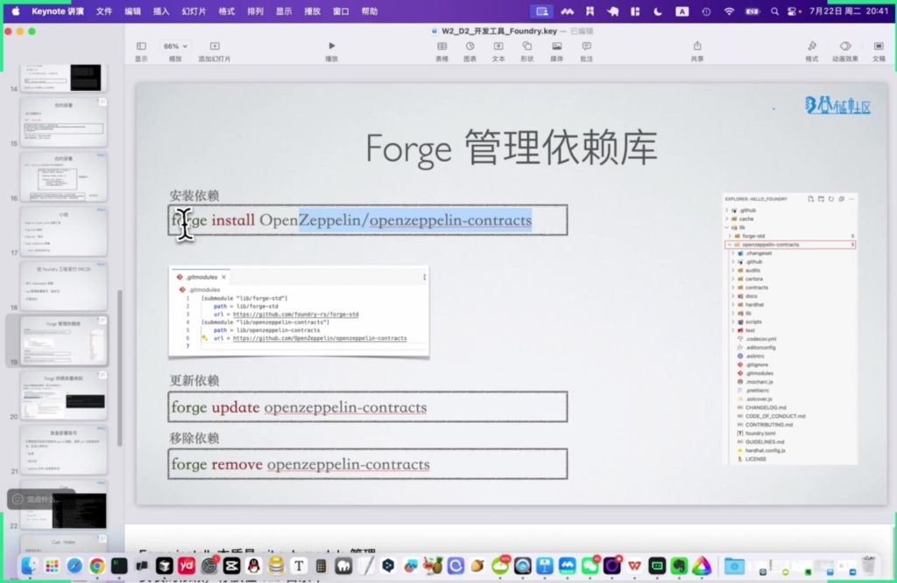
- 安装方法：使用命令 `forge install OpenZeppelin/openzeppelin-contracts` 安装 **OpenZeppelin** 合约库
- 安装过程：
    - 从 **GitHub** 仓库完整克隆到本地 `lib` 目录
    - 网络状况会影响安装速度
    - 安装后会在项目目录下创建 `git` 子模块
- 目录结构：安装后的库文件结构与原 **GitHub** 仓库完全一致
- 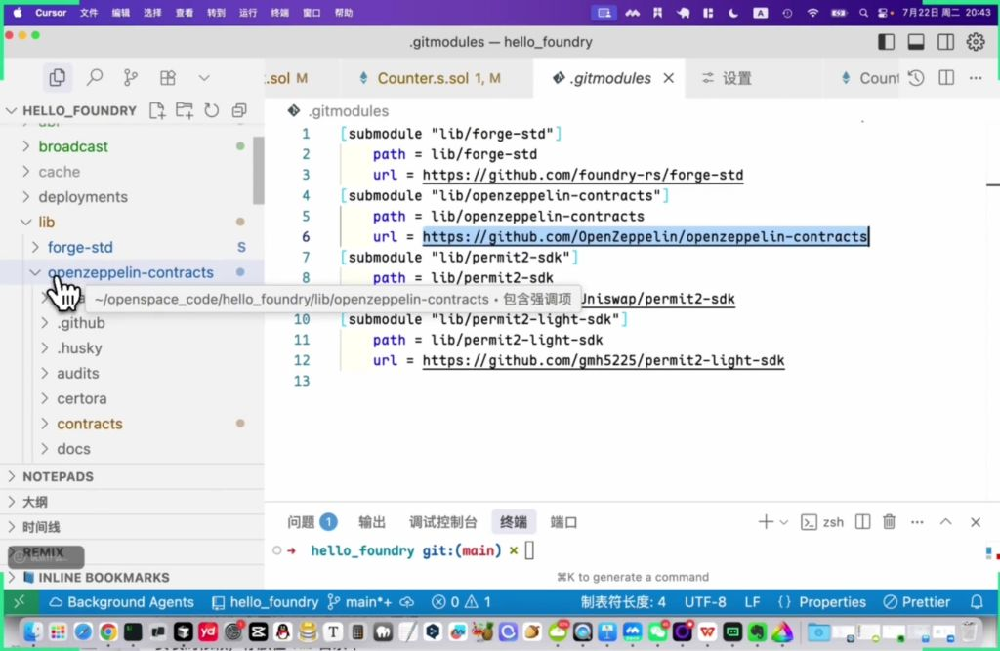
- 依赖管理文件：
    - `.gitmodules` 文件记录所有子模块信息
    - `remappings.txt` 用于简化导入路径

### 2. 移除依赖

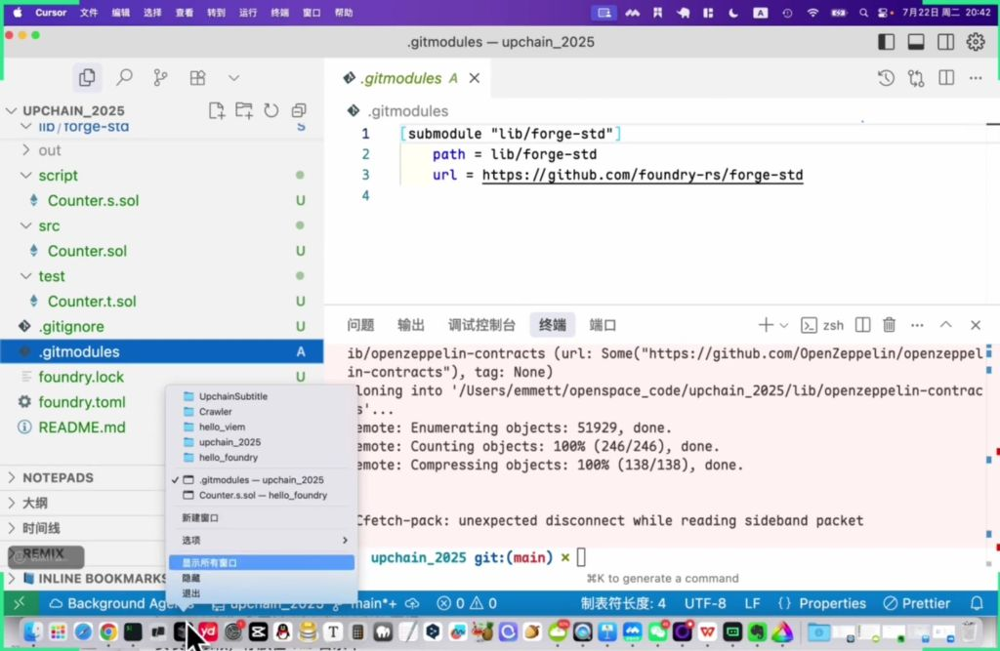
- 更新依赖：使用 `forge update openzeppelin-contracts` 命令
- 移除依赖：使用 `forge remove openzeppelin-contracts` 命令
- 更新注意事项：
    - 已部署合约的依赖库不建议更新
    - 更新可能导致本地字节码与链上合约不匹配
    - 影响后续合约开源验证

### 3. 引入库

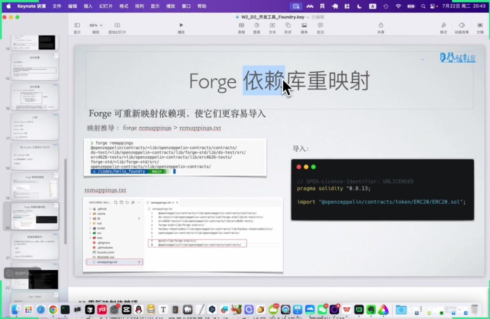
- 路径重映射：
    - 使用 `forge remappings` 命令生成路径映射
    - 将长路径映射为短别名，如 `@openzeppelin/contracts/`
    - 映射关系保存在 `remappings.txt` 文件中
    - 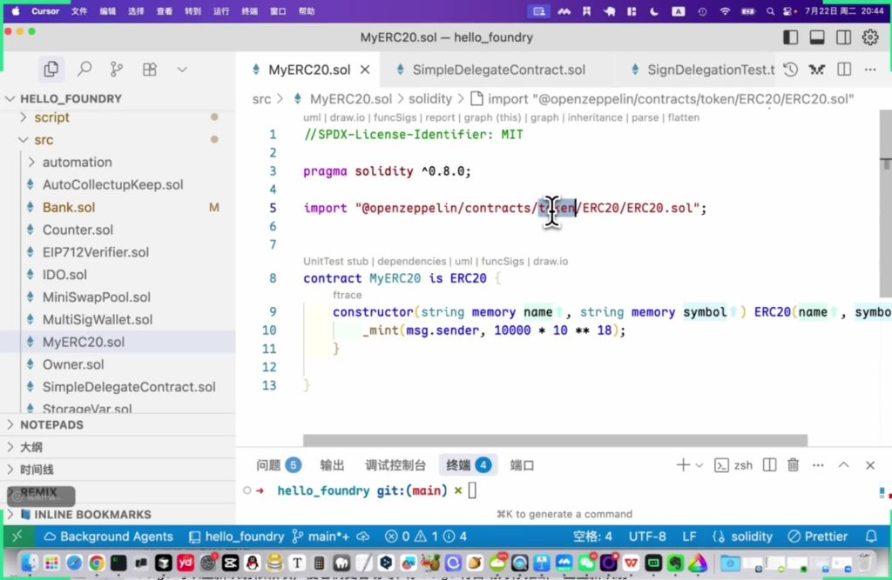
- 导入方式：
    - 使用映射后的短路径导入：`import "@openzeppelin/contracts/token/ERC20/ERC20.sol"`
    - 也可以使用完整相对路径导入
- 开发实践：
    - 本地开发推荐使用路径映射方式
    - 直接引入 **URL** 的方式通常不被 **IDE** 支持
    - 继承 **OpenZeppelin** 标准合约时可减少额外测试

## 四、链区

### 1. Cast

#### 1）Wallet

- 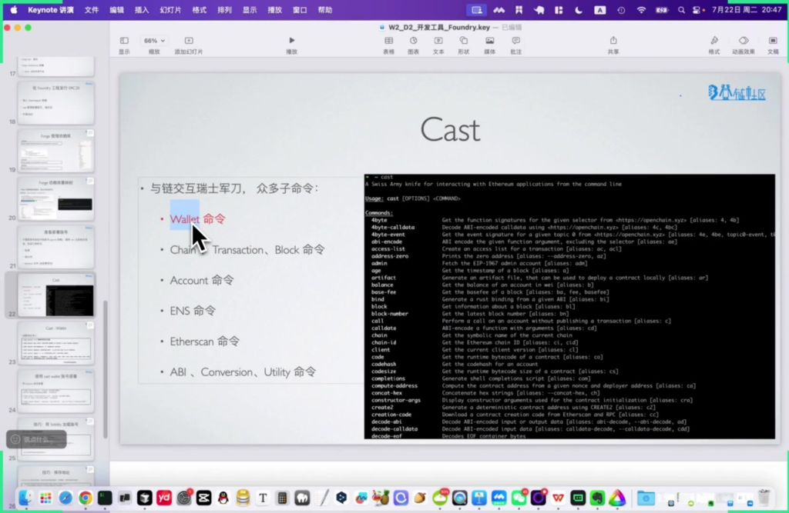
- 三种私钥形式：
    - 原始私钥（直接可见）
    - 助记词（`mnemonic phrase`）
    - **Keystore** 文件（加密存储更安全）
- 安全存储：私钥不应放在代码库中，建议使用 `.env` 文件记录并通过 `.gitignore` 忽略
- 创建钱包/导入
    - 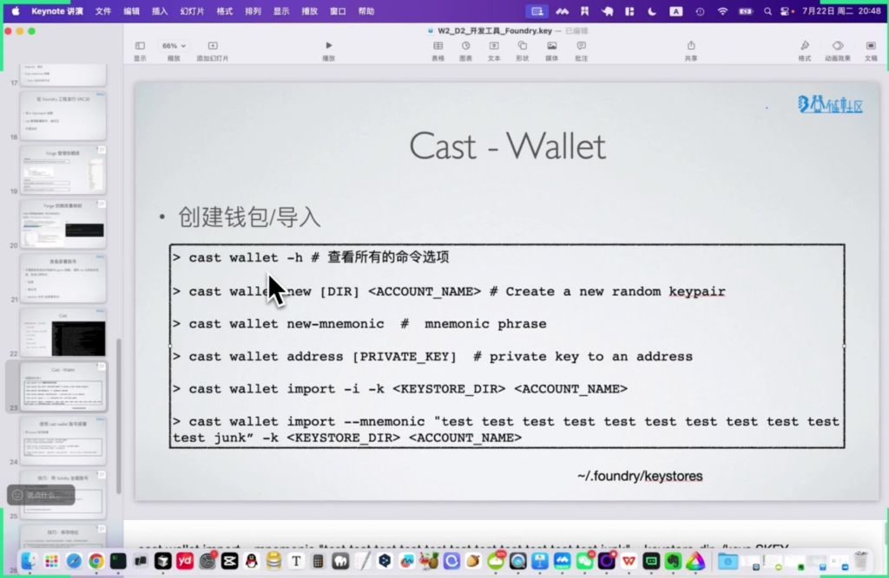
    - 新建随机密钥对：
    - 生成助记词：
    - 私钥转地址：
    - 导入 **keystore**：
    - 导入助记词：
- 使用 `cast wallet` 账号部署
    - 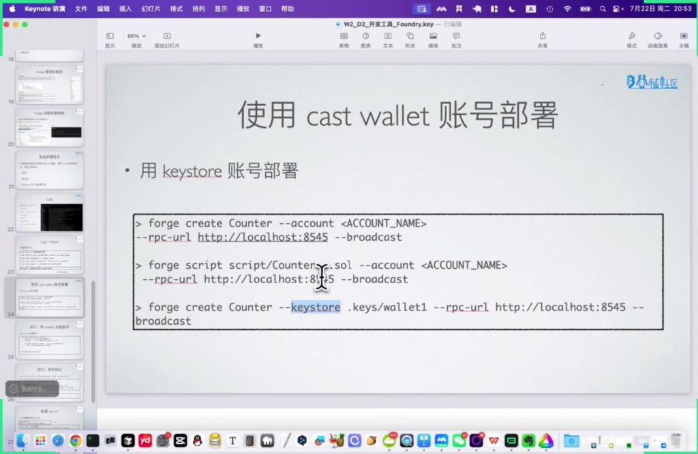
    - 基础部署命令：
    - 脚本部署：
- 用 **keystore** 账号部署
    - 直接指定 **keystore** 路径：
    - 默认存储位置：生成的 **keystore** 默认存放在 `~/.foundry/keystores` 目录
- 技巧
    - 用 **Solidity** 加载账号
        - 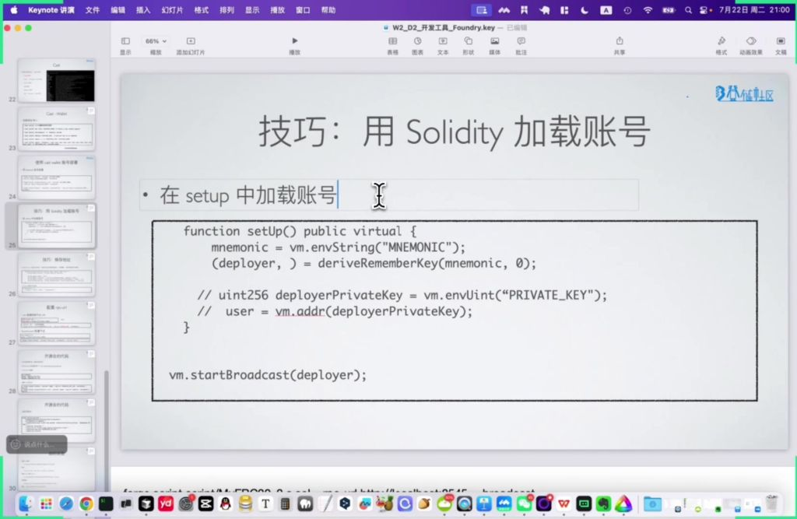
        - 环境变量加载：
    - 私钥加载：
    - 广播设置：
    - 技巧
        - 环境变量配置：在 `.env` 文件中定义：
    - 保存地址
        - 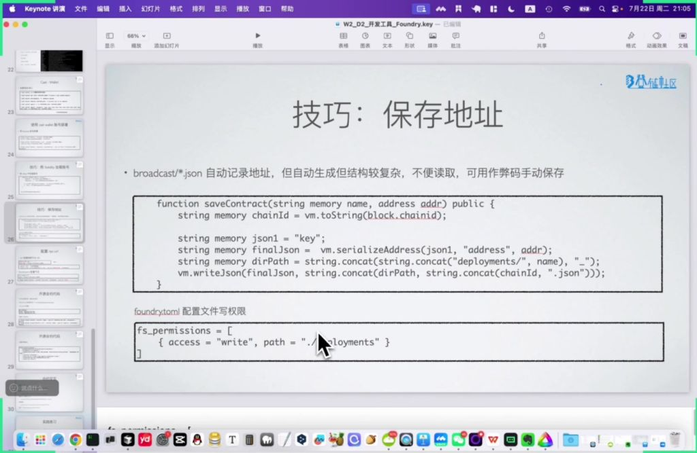
        - 自动记录问题：`broadcast/.json` 自动生成但结构复杂
        - 手动保存方法：
    - 文件权限配置：在 `foundry.toml` 中添加：

### 2. 开源合约代码

- 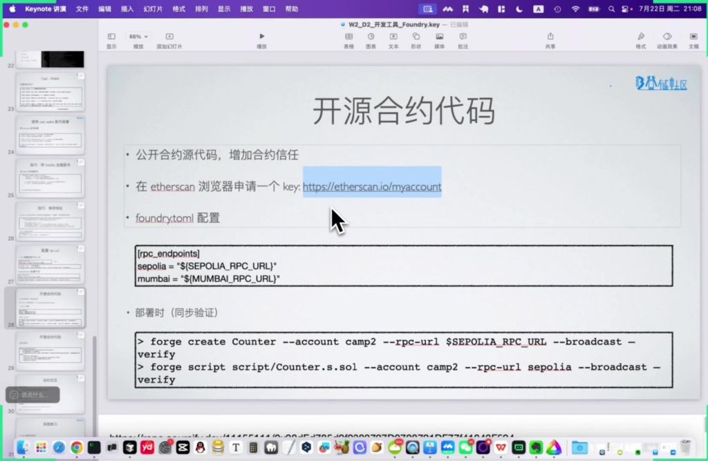
- 验证原理：将源代码与链上字节码进行匹配验证
- **Etherscan API Key** 申请：https://etherscan.io/myaccount

#### 1）配置方法

- `foundry.toml` 配置：

#### 2）部署时验证

- 直接验证：
- 脚本验证：

#### 3）后期验证

- 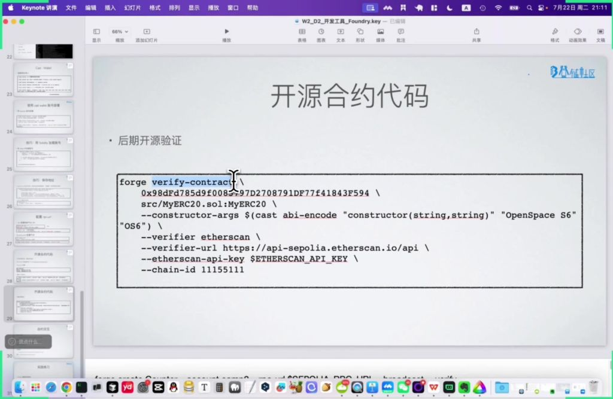
- 验证命令：
- 注意事项：验证时代码必须与部署时完全一致

#### 4）替代验证服务

- **Sourcify**：https://sourcify.dev 提供另一种合约验证方式

## 五、合约交互

- 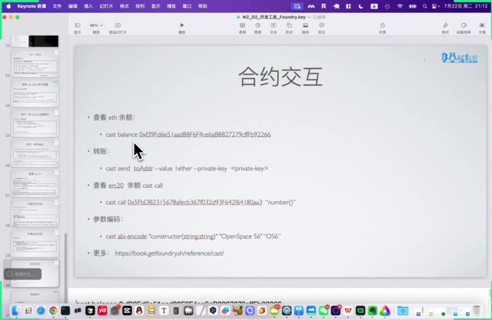
- 余额查询：
    - 使用 `cast balance <address>` 命令查看 **ETH** 余额，默认连接本地节点 (`http://localhost:8545`)
    - 示例：`cast balance 0xf39Fd6e51aad88F6F4ce6aB8827279cffFb92266`
    - 连接其他节点需通过 `--rpc-url` 参数指定，如：`-r https://mainnet.infura.io/v3/your-key`
- 转账操作：
    - 使用 `cast send` 命令发送交易，需指定接收地址、金额和私钥
    - 示例：`cast send 0xa0Ee7... --value 1000000000000000000 --private-key 0xac097...`
    - 金额单位默认是 `wei`，1 **ETH** = $10^{18}$ `wei`，可通过 `--ether` 参数直接使用 **ETH** 单位
- 合约调用：
    - 查询合约状态：`cast call <合约地址> "函数名()"`
    - 示例：`cast call 0x5FbDB... "number()"` 返回值为 `0x000...000`（默认零值）
    - 参数编码：`cast abi-encode "函数签名" 参数1 参数2`
    - 完整文档参考：**Foundry Cast** 文档
    - 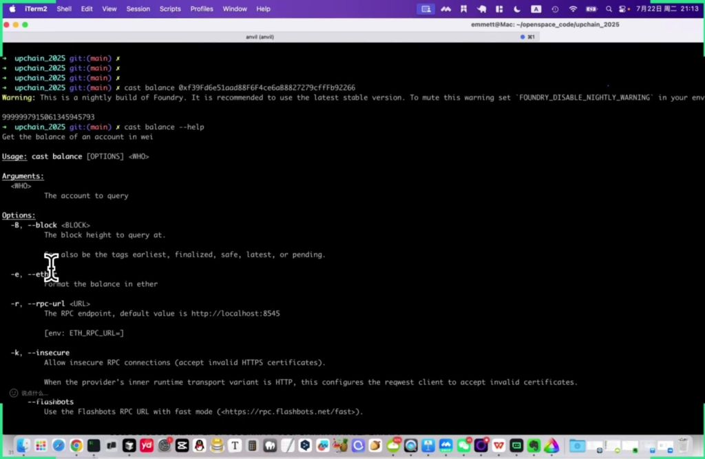
- 高级参数：
    - `--block`：指定查询的区块高度或标签 (`earliest`/`latest`/`pending` 等)
    - `--insecure`：允许不安全的 **HTTPS** 连接
    - `--flashbots`：使用 **Flashbots RPC** 加速交易
    - `--jwt-secret`：用于特定 **RPC** 调用的 **JWT** 密钥

## 六、Forge 管理依赖库小结

- 依赖操作：
    - 安装：`forge install OpenZeppelin/openzeppelin-contracts`
    - 更新：`forge update openzeppelin-contracts`
    - 移除：`forge remove openzeppelin-contracts`
    - 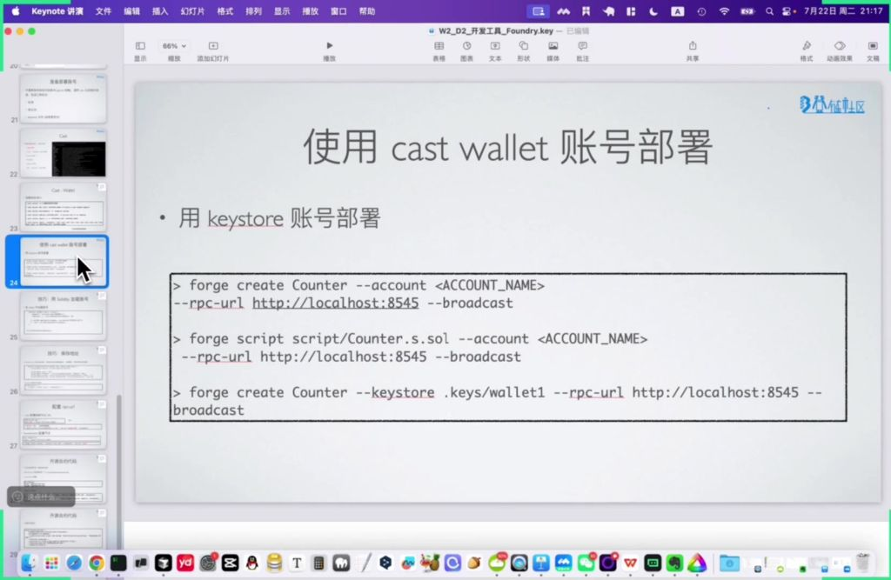
- 账号部署：
    - 普通账号：`forge create Counter --account <ACCOUNT_NAME> --rpc-url http://localhost:8545 --broadcast`
    - **Keystore** 账号：`forge create Counter --keystore .keys/wallet1 --rpc-url http://localhost:8545 --broadcast`
    - 脚本部署：`forge script script/Counter.s.sol --account <ACCOUNT_NAME> --rpc-url http://localhost:8545 --broadcast`

## 七、知识小结

|   |   |   |   |
|---|---|---|---|
|知识点|核心内容|易混淆点/注意事项|难度系数|
|外部依赖库引入|以 **OpenZeppelin** 为例，通过 `forge install` 安装，依赖库会以 **Git** 子模块形式存储在 `lib` 目录|安装后需配置 `remapping` 简化路径引用，避免直接使用冗长路径|⭐⭐|
|账号安全管理|避免明文私钥，推荐使用 **keystore** 加密存储（通过 `cast wallet` 管理）或环境变量（`.env` 文件）|测试环境可临时用助记词/私钥，但需注意历史记录泄露风险|⭐⭐⭐|
|合约部署与账号绑定|部署时指定 **keystore** 账号（需输入密码）或通过脚本加载助记词（`base script` 抽象类）|**keystore** 路径需显式指定，默认目录可能因系统权限失败|⭐⭐⭐|
|合约开源验证|通过 `--verify` 参数或 `forge verify-contract` 命令，需匹配字节码与源代码|修改代码后需重新部署，否则链上字节码不匹配|⭐⭐⭐⭐|
|链上交互工具 (**cast**)|支持查询余额、转账、调用合约函数等，需指定 **RPC** 节点（默认本地）|转账单位需用 18 位小数（如 1 **ether** = $10^{18}$ **wei**）|⭐⭐|
|测试脚本优化|通过 `base script` 预加载账号，避免重复输入私钥/密码|需配置 `.env` 存储助记词，并注意文件权限问题|⭐⭐⭐|
|依赖库更新风险|已部署合约的依赖库更新可能导致链上字节码与本地不匹配|生产环境避免频繁更新依赖，优先冻结版本|⭐⭐⭐⭐|

