## 一、Foundry 测试

### 1. 调试

#### 1）console.log

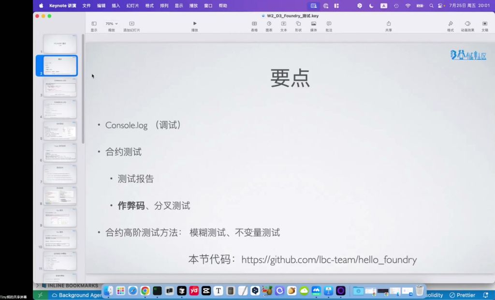
- 主要用途：用于智能合约调试时打印变量值，类似于 **JavaScript** 中的 `console.log` 功能
- 使用限制：
    - 仅在本地测试环境（如 **Anvil**）中生效
    - 部署到主网或测试网时无效但仍会消耗 **gas**
    - 目前无法像 **Java** 等语言设置断点调试
    - 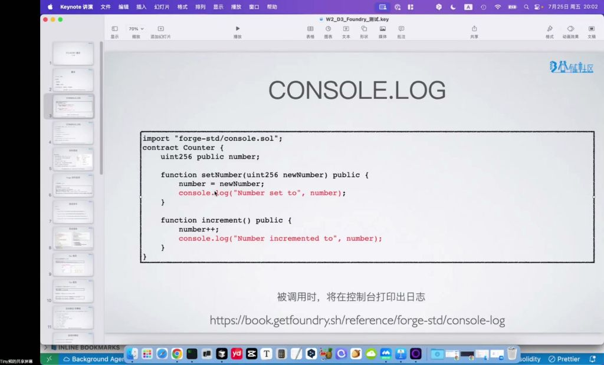
- 基本语法：
- 实际应用：
    - 在合约函数被调用时自动打印日志
    - 示例中展示了在 `setNumber()` 和 `increment()` 函数中添加日志打印
- 例题：`console.log` 使用方法
    - 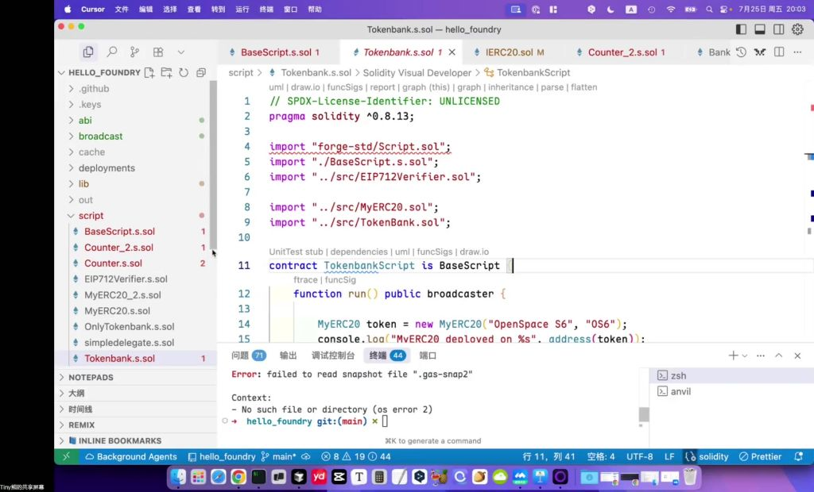
    - 部署脚本调用：
        - 通过 `forge script` 命令执行部署脚本
        - 添加 `--rpc-url` 和 `--broadcast` 参数
        - 执行后会显示 `console.log` 输出的调试信息
    - 参数说明：
        - 支持最多 4 个参数
        - 基本类型：`uint`、`string`、`bool`、`address`
        - 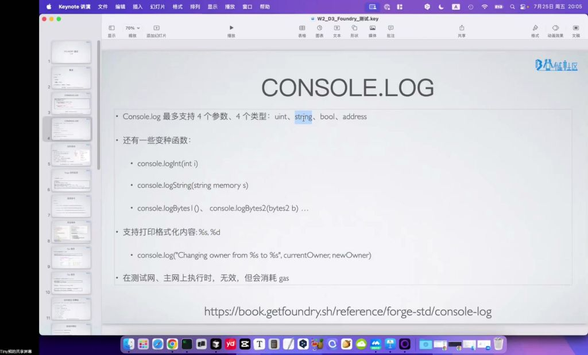
    - 变种函数：
        - `console.logInt(int i)`
        - `console.logString(string memory s)`
        - `console.logBytes(bytes b)`
    - 格式化输出：
        - 支持 `%s`（字符串）、`%d`（数字）等格式化符号
        - 示例：`console.log("Changing owner from %s to %s", currentOwner, newOwner)`
        - 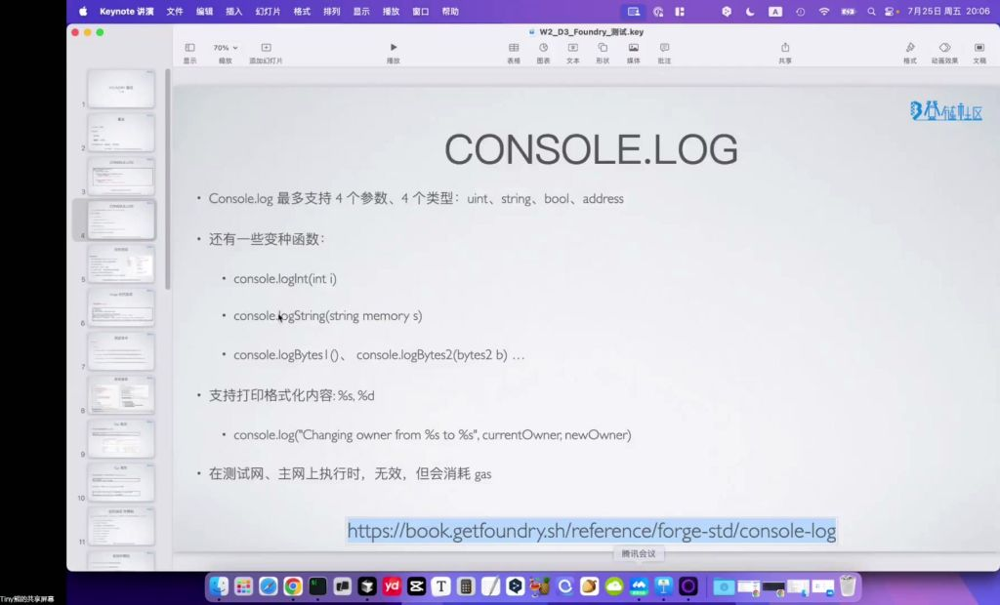
    - 支持类型：
        - 基本类型：`uint`、`string`、`bool`、`address`
        - 通过变种函数支持：`int`、`bytes` 等
    - 文档参考：
        - 完整用法参考 **Foundry** 官方文档
        - 文档链接：https://book.getfoundry.sh/reference/forge-std/console-log

### 2. 合约测试

#### 1）编写测试用例

- 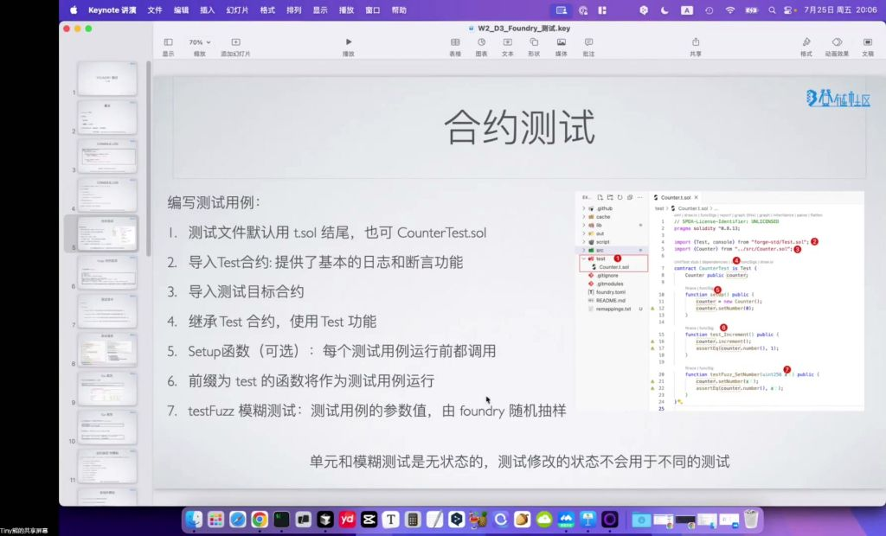
- 测试文件命名：默认以 `t.sol` 结尾，也可使用 `CounterTest.sol` 等更具描述性的名称
- 基础导入：
    - 必须导入 `Test` 合约，提供基本日志和断言功能
    - 需要导入待测试的目标合约
- 继承关系：测试合约需继承 `Test` 合约以使用其功能
- `Setup` 函数：可选的前置函数，每个测试用例运行前都会调用
- 测试函数命名：前缀为 `test` 的函数会自动作为测试用例运行
- 模糊测试：使用 `testFuzz` 前缀，参数值由 `foundry` 随机抽样

#### 2）测试环境特性

- 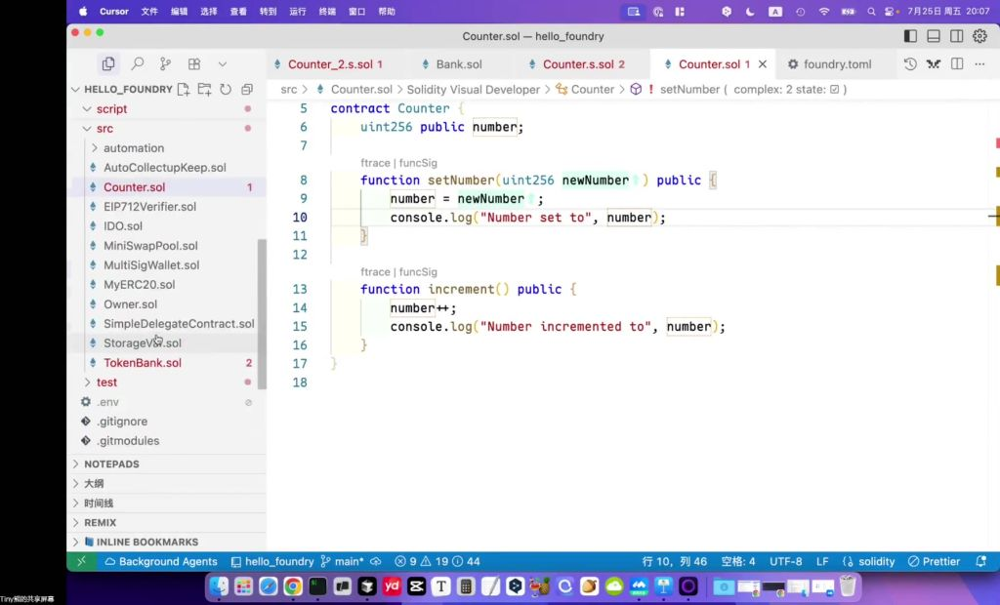
- 无状态性：单元和模糊测试都是无状态的
- 环境隔离：每个测试用例运行后状态不会保留，下一个测试会从全新环境开始
- 独立执行：即使同一文件中的多个测试用例也是完全独立的

#### 3）执行测试用例

- 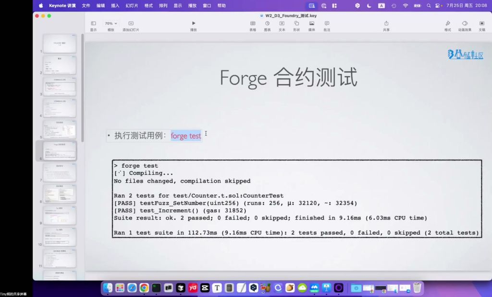
- 默认执行：`forge test` 会执行 `test` 目录下所有测试文件
- 指定文件：可通过 `forge test` 文件路径执行特定测试文件
- 过滤选项：
    - `--match-test`：按正则匹配测试函数名
    - `--match-contract`：按正则匹配合约名
    - 对应 `--no-match` 版本可排除特定测试

#### 4）测试报告

- 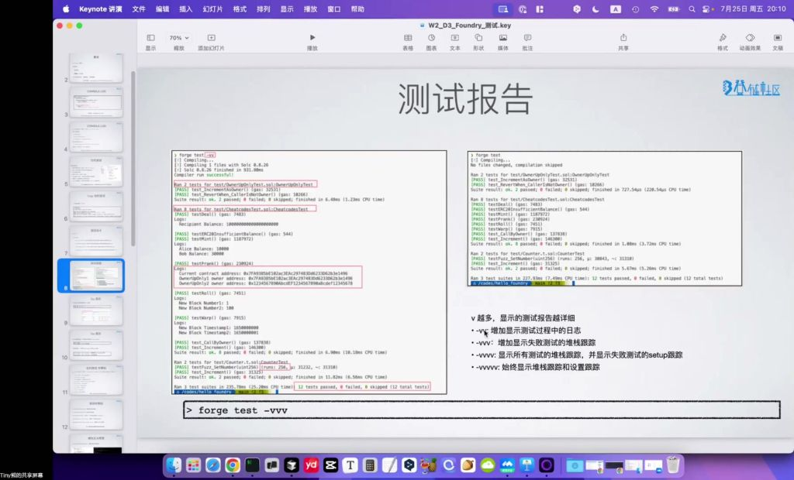
- 日志级别：
    - `-v`：显示基本日志
    - `-vv`：增加显示测试过程中的详细日志
    - `-vvv`：显示失败测试的堆栈跟踪
    - `-vvvv`：显示所有测试的堆栈跟踪
    - `-vvvvv`：始终显示完整堆栈和设置跟踪
- 最佳实践：通常 `-vv` 即可满足大多数调试需求

#### 5）Gas 报告

- 生成 **Gas** 报告
    - 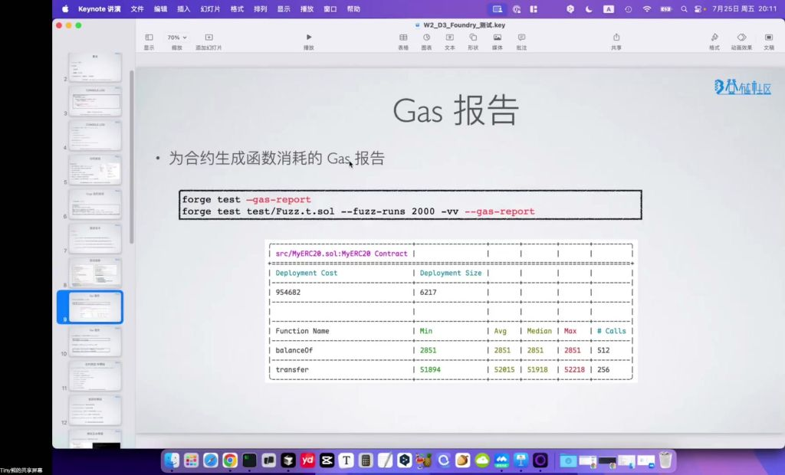
    - 命令：`forge test --gas-report`
    - 内容：展示每个函数的 **Gas** 消耗统计，包括：
        - 最小消耗 (**Min**)
        - 平均消耗 (**Avg**)
        - 中位数 (**Median**)
        - 最大消耗 (**Max**)
        - 调用次数 (**Calls**)
    - 快照管理
        - 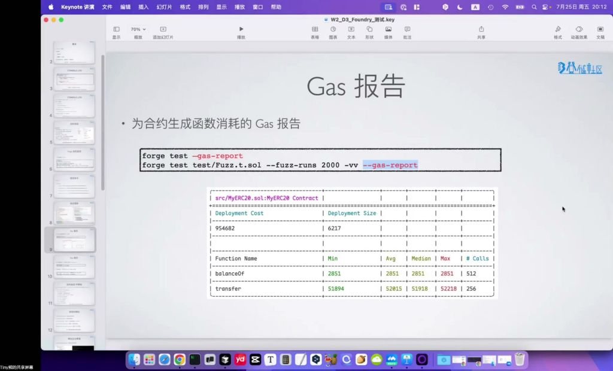
        - 生成快照：`forge snapshot` 生成默认 `.gas-snapshot` 文件
        - 命名快照：`forge snapshot --snap <文件名>`
        - 差异对比：
            - `forge snapshot --diff <快照文件>`：与当前运行结果对比
            - `forge snapshot --check <快照文件>`：对比并显示具体差异
- 作弊码使用
    - 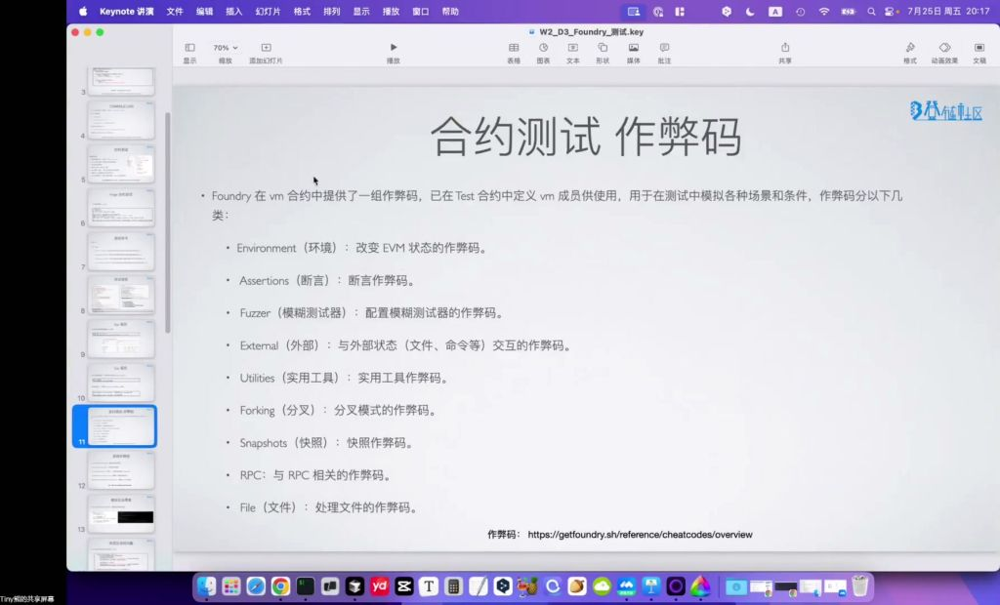
    - 环境修改：改变 **EVM** 状态的作弊码，如设置区块号、时间戳等
    - 断言验证：提供各种断言检查功能
    - 模糊测试：配置模糊测试参数
    - 实用工具：各种测试辅助功能
    - 分叉测试：支持从特定网络分叉进行测试
    - 常用场景：
        - 模拟账户余额 (`deal`)
        - 修改区块时间 (`warp`)
        - 切换调用者身份 (`prank`)

### 3. 分叉测试

- 应用场景：当需要与线上现有合约进行交互时特别有用，例如与主网上的稳定币合约交互测试
- 核心原理：每个分叉是一个独立的 **EVM** 环境，在分叉的快照之上有独立的存储空间
- 两种方法：分叉模式和分叉作弊码

#### 1）分叉模式

- 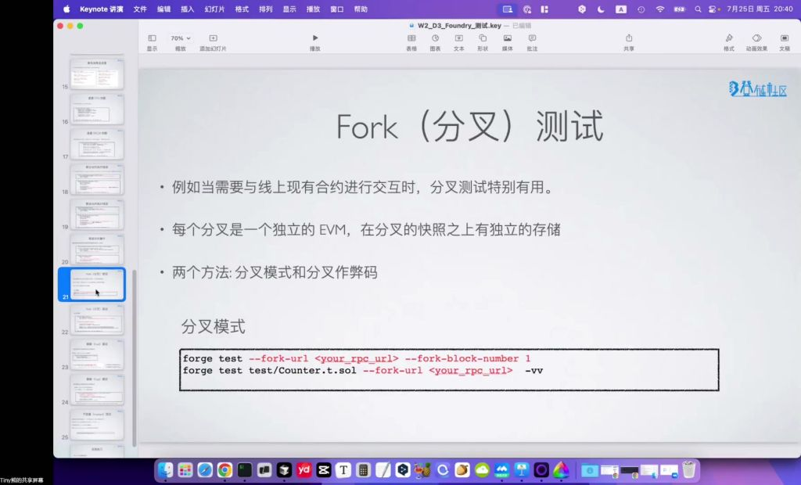
- 基本命令：
- **RPC** 来源：可通过 **ChainList** 等网站获取节点 **RPC URL**
- 区块高度：可指定特定区块高度 **fork**，但较早的区块可能不被所有节点支持

#### 2）分叉作弊码

- 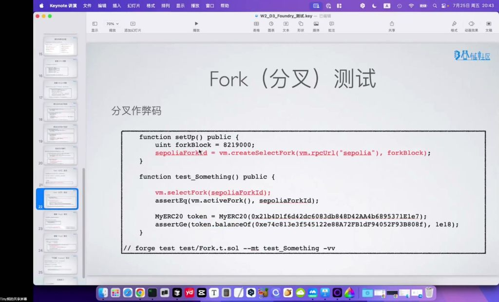
- 代码实现：
- 多分叉环境：可以创建多个分叉环境（如 **Sepolia** 和 **Polygon**），通过 `forkId` 切换
- 测试验证：可以直接读取链上真实合约状态进行断言验证

### 4. 模糊 (Fuzz) 测试

- 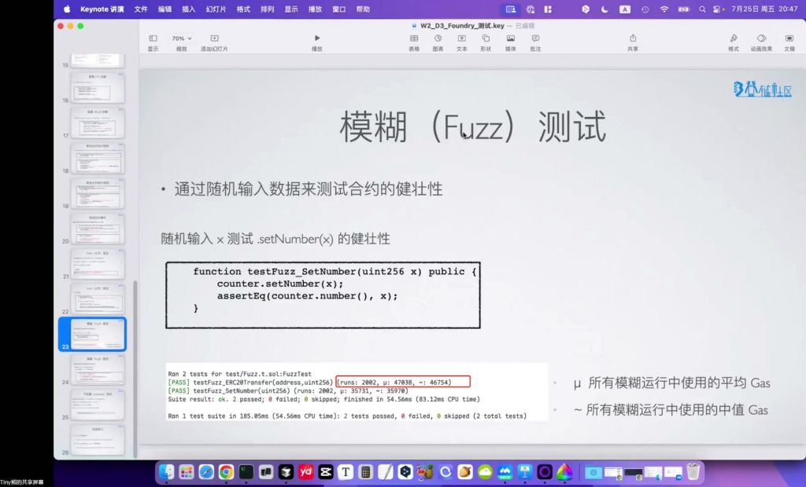
- 核心思想：通过随机输入数据来测试合约的健壮性
- 默认设置：每个测试函数默认运行 256 次随机输入
- 运行次数调整：可通过 `--fuzz-runs` 参数指定运行次数

#### 1）输入限制

- 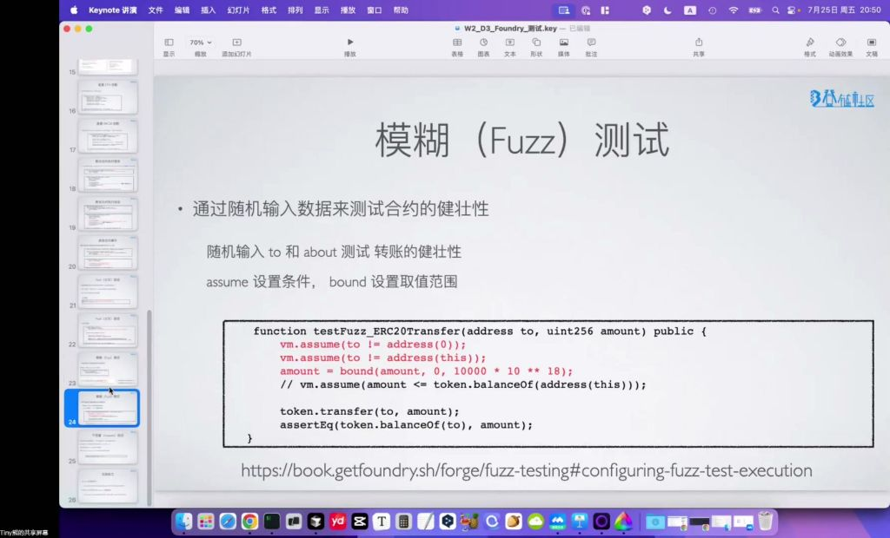
- `assume` 方法：设置输入必须满足的条件
- `bound` 方法：限制输入取值范围
- 性能指标：
    - **μ**：所有模糊运行中使用的平均 **Gas**
    - **~**：所有模糊运行中使用的中值 **Gas**

### 5. 不变量 (invariant) 测试

- 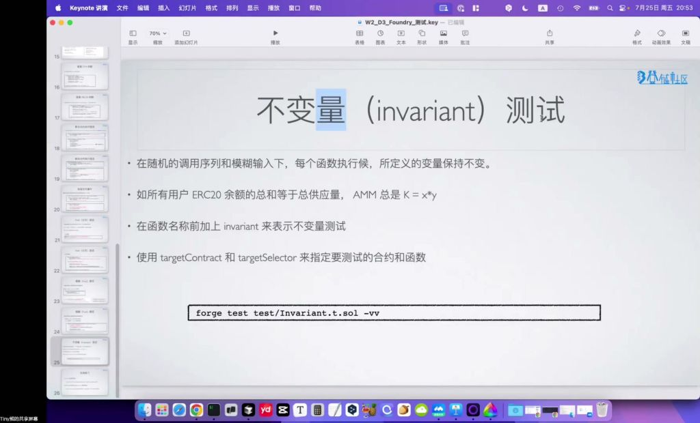
- 定义：在随机的调用序列和模糊输入下，每个函数执行后所定义的变量保持不变
- 典型应用：
    - **ERC20** 余额总和等于总供应量
    - **AMM** 保持 $K = x * y$ 不变

#### 1）实现方法

- 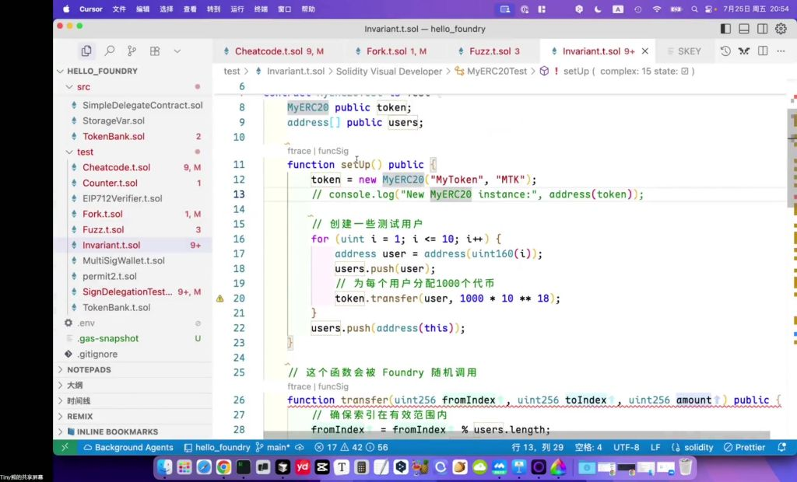
- 命名规范：函数名称前加 `invariant_` 前缀
- 核心检查：
- 目标指定：
- 执行流程：随机调用指定函数后自动执行不变量检查

