## 一、Web3 应用开发

### 1. 回顾

#### 1）Web 发展历程

- 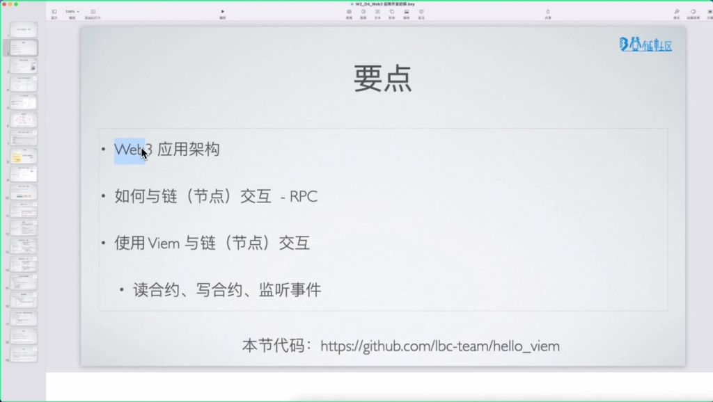
- **Web1.0** 特征：
    - 只读互联网，用户仅能查看内容
    - 典型代表：静态博客网站
    - 用户无法发布内容或进行交互
- **Web2.0** 特征：
    - 可读可写的交互式互联网
    - 典型应用：微信、抖音、淘宝、京东、**Google** 等
    - 用户可发布内容、点赞、购物等交互行为
- **Web2.0** 核心问题：
    - 数据存储在服务商服务器
    - 用户对自身内容缺乏控制权
- **Web3.0** 核心特征：
    - 引入 "**Own**" 所有权概念
    - 用户真正拥有数据资产
    - 通过区块链网络确保数据不可篡改
    - 典型代表：比特币、以太坊、稳定币 (**USDC**/**USDT**)、**DeFi** 项目（如 **Uniswap**）

#### 2）Web3 相关资源

- 
- 推荐书籍：
    - 书名：《**Read Write Own: Building the Next Era of the Internet**》
    - 作者：**Chris Dixon** (**a16z** 合伙人)
    - 内容：探讨区块链重塑互联网未来的潜力
    - 作者背景：资深科技投资人，曾投资 **Facebook** 等 **Web2** 公司
- 获取渠道：
    - 英文原版：**Amazon**、**Barnes&Noble** 等平台
    - 中文版本：目前仅有繁体版（京东可购）

### 2. 网络的进化

#### 1）Web 发展阶段

- 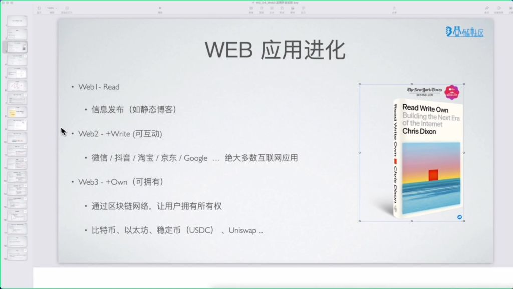
- **Web1.0**：以 **Read**（读取）为主要特征，典型应用如静态博客，主要用于信息发布。
- **Web2.0**：增加了 **Write**（写入）功能，代表应用包括微信、抖音、淘宝、京东等绝大多数互联网应用。
- **Web3.0**：引入 **Own**（拥有）概念，通过区块链网络让用户拥有数据所有权，代表应用如 **USDC**、**Uniswap** 等。

#### 2）Web 架构对比

- **Web2** 架构
    - 基本结构：前端（页面或移动端）+ 后端服务器
    - 数据流向：前端向后端发起请求，后端响应并返回数据
    - 控制权：后端完全掌握数据控制权，前端仅负责展示
    - 响应速度：通常在毫秒级别完成请求响应
- **Web3** 架构
    - 核心差异：通过区块链实现数据所有权
    - 交易机制：
        - 签名验证：每个交易需要用户钱包签名确认
        - 节点处理：请求发送到区块链节点，节点验证签名后才执行
        - 共识机制：多个节点共同验证交易，防止单点作恶
    - 响应特点：
        - 延迟较高：以太坊交易确认约需半分钟
        - 异步处理：请求和返回结果不同步，需要额外读取链上状态
        - 事件监听：部分结果需要通过监听链上事件获取

#### 3）DApp 架构设计

- 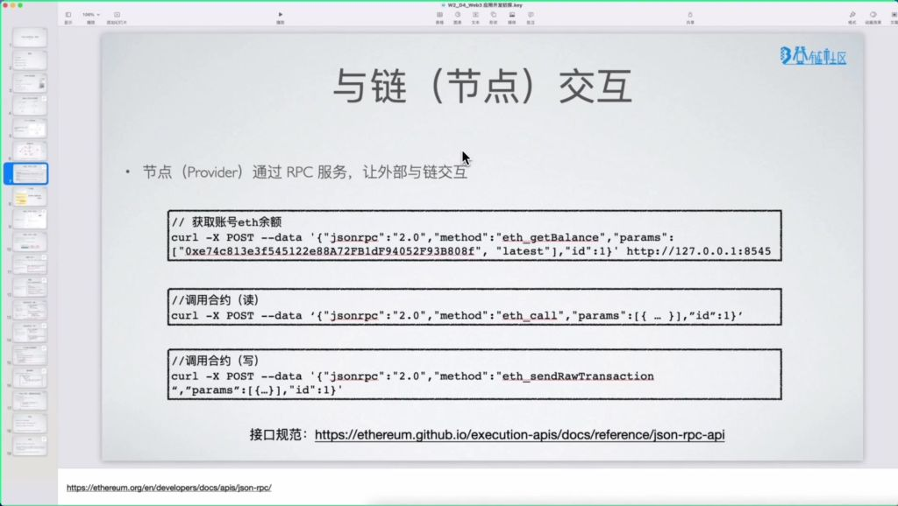
- 数据层：
    - 链上存储：核心交易数据直接写入智能合约
    - 链下缓存：建立独立数据库缓存链上数据，优化读取性能
- 交互方式：
    - 写入路径：用户直接与区块链交互，绕过中间服务
    - 读取路径：前端可通过后端 **API** 获取缓存数据
- 实时数据：用户余额等实时数据可直接从链上读取

#### 4）节点交互机制

- 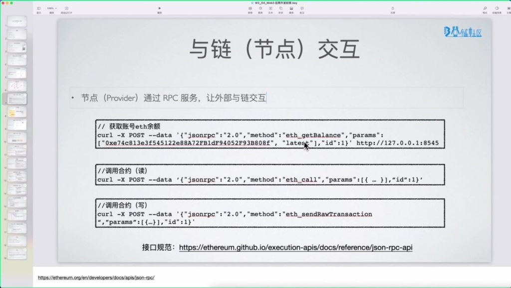
- **Provider** 角色：区块链节点通过 **RPC** 服务提供外部交互接口
- 交互方式：
    - 余额查询：使用 `eth_getBalance` 方法
    - 合约调用：
        - 读操作：`eth_call`
        - 写操作：`eth_sendRawTransaction`
- 接口规范：遵循 **JSON-RPC 2.0** 标准
- 请求示例：

#### 5）实践演示

- 本地节点：启动后监听 `127.0.0.1:8545` 端口
- 余额查询：
    - 返回值为 16 进制格式，如 10000 **ETH** 表示为 `0x...`（实际值为 $10000 \times 10^{18}$）
- 区块高度查询：使用 `eth_blockNumber` 方法
- 错误处理：无效请求返回 `-32600` 错误码

### 3. Web3 应用架构

#### 1）与链交互

- 获取账号 **ETH** 余额
    - 与链交互的方式
        - 节点交互方式：节点（**Provider**）通过 **RPC** 服务，让外部与链交互。
        - 获取账号 **ETH** 余额：使用 `curl` 命令，通过 **POST** 请求获取账号 **ETH** 余额，示例如下：

```bash
curl -X POST --data '{"jsonrpc": "2.0", "method": "eth_getBalance", "params": ["0xf39Fd6e5laad88F6F4ce6aB8827279cffFb92266", "latest"], "id": 1}' http://127.0.0.1:8545
```

- **调用合约（读）**：使用 `eth_call` 方法读取合约，参数较多需查看具体规范，示例如下：

```bash
curl -X POST --data '{"jsonrpc": "2.0", "method": "eth_call", "params": [{...}], "id": 1}'
```

- **调用合约（写）**：使用 `eth_sendRawTransaction` 方法写入合约，示例如下：

```bash
curl -X POST --data '{"jsonrpc": "2.0", "method": "eth_sendRawTransaction", "params": [{...}], "id": 1}'
```

- **接口规范**：
    - 规范地址 1：[https://ethereum.github.io/execution-apis/docs/reference/json-rpc-api](https://ethereum.github.io/execution-apis/docs/reference/json-rpc-api)
    - 规范地址 2：[https://ethereum.org/en/developers/docs/apis/json-rpc/](https://ethereum.org/en/developers/docs/apis/json-rpc/)

- **JSON-RPC API** 概述
    - 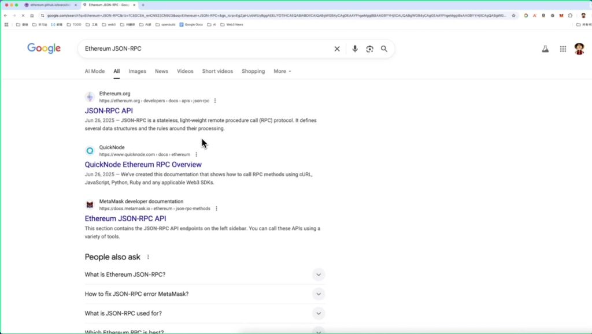
    - 定义：**JSON-RPC** 是一个无状态的轻量级远程过程调用（**RPC**）协议，定义了多种数据结构及其处理规则。
    - 特点：
        - 无状态：不保存调用状态。
        - 轻量级：协议简单高效。
        - 传输无关：可在同一进程、套接字、**HTTP** 或多种消息传递环境中使用。
    - 数据格式：使用 **JSON** (**RFC 4627**) 作为数据格式。
    - 应用场景：软件应用通过读取区块链数据或发送交易到网络与以太坊区块链交互时，必须连接到以太坊节点。
    - 统一方法集：每个以太坊客户端实现 **JSON-RPC** 规范，提供统一的方法集，应用程序可依赖这些方法，无论具体节点或客户端实现如何。

- **JSON-RPC API** 规范与文档
    - 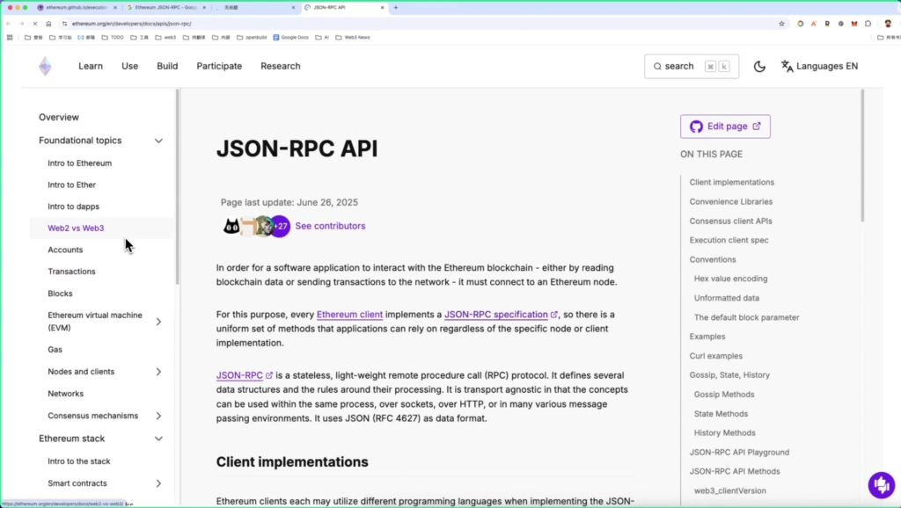
    - 规范文档：
        - 以太坊 **JSON-RPC** 规范：为以太坊客户端提供标准接口规范。
        - **API** 参考文档：提供详细的 **API** 参考。
    - 调用方法：可使用 `cURL`、`JavaScript`、`Python`、`Ruby` 及任何适用的 **Web3 SDK** 调用 **RPC** 方法。
    - **MetaMask** 开发者文档：包含 **JSON-RPC** 方法说明。
    - 内部 **API**：节点内部用于客户端间通信的 **API** 称为 “**Engine API**”，规范可在 **GitHub** 获取。

- **JSON-RPC API** 数据类型与编码
    - 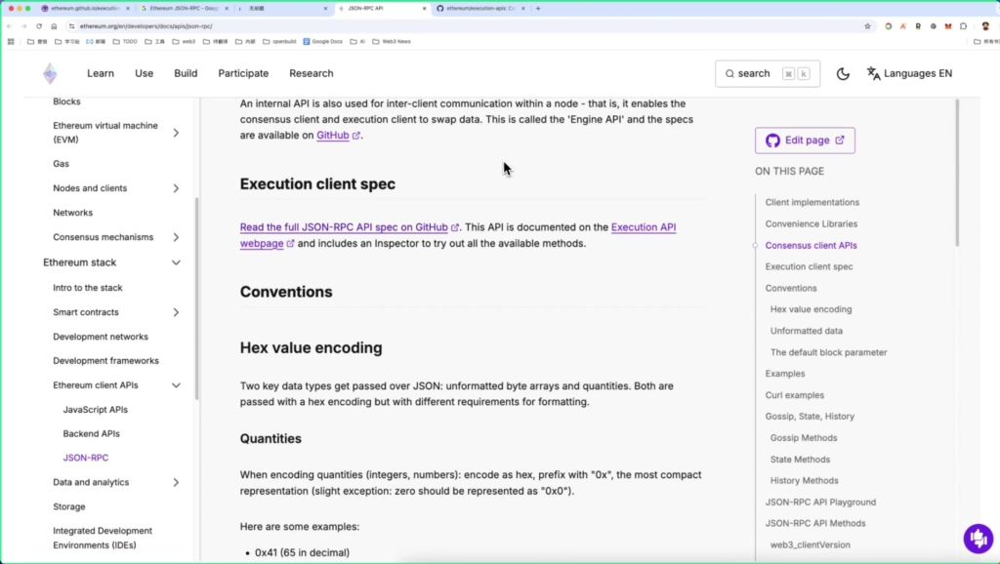
    - 数据类型：**JSON-RPC API** 传递的两种主要数据类型为未格式化的字节数组和数量。
    - 编码要求：
        - 未格式化的字节数组：使用十六进制编码。
        - 数量（整数、数字）：
            - 编码为十六进制，前缀为 `0x`。
            - 使用最紧凑的表示形式（零应表示为 `0x0`）。
    - 示例：
        - 数量编码示例：`0x41`（十进制为 65）。

- **Ethereum JSON-RPC** 规范
    - **JSON-RPC** 简介
        - 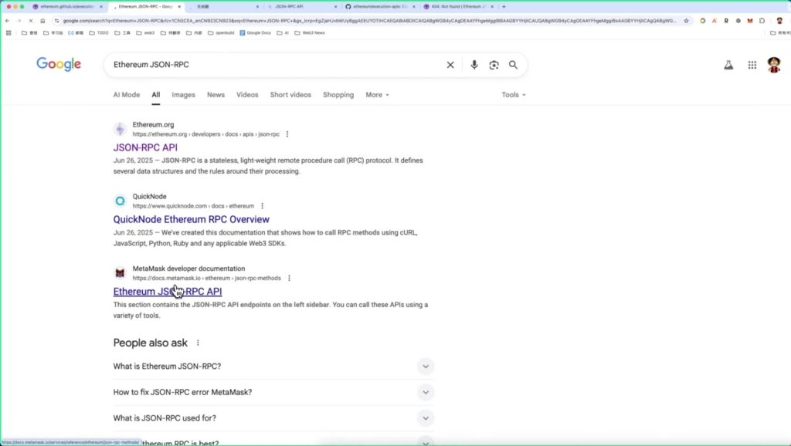
        - 协议特性：**JSON-RPC** 是一种无状态、轻量级的远程过程调用 (**RPC**) 协议，定义了数据结构及其处理规则。
        - 开发资源：
            - 官方文档：[https://ethereum.org/developers/docs/apis/json-rpc](https://ethereum.org/developers/docs/apis/json-rpc)
            - 第三方实现：**QuickNode** 提供 `cURL`/`JavaScript`/`Python` 等多种调用方式
            - **MetaMask** 文档：包含完整的 **JSON-RPC API** 端点列表
    - 获取区块信息
        - 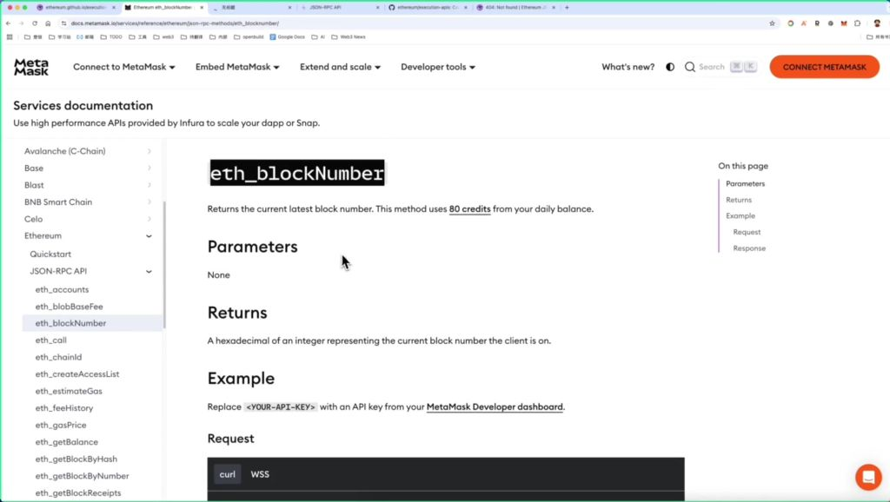
        - 方法说明：
            - 调用方式：通过 `eth_blockNumber` 方法获取当前最新区块号
            - 返回格式：十六进制整数表示的区块高度
            - 调用示例：
        - 实际请求：
            - 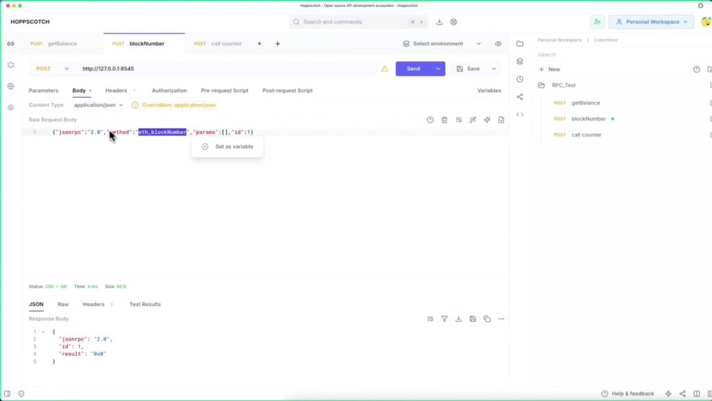
            - 请求结构：必须包含标准 **JSON-RPC 2.0** 格式字段
            - 响应示例：返回结果如 `"result": "0x05"` 表示当前区块高度为 5
    - `eth_call` 方法
        - 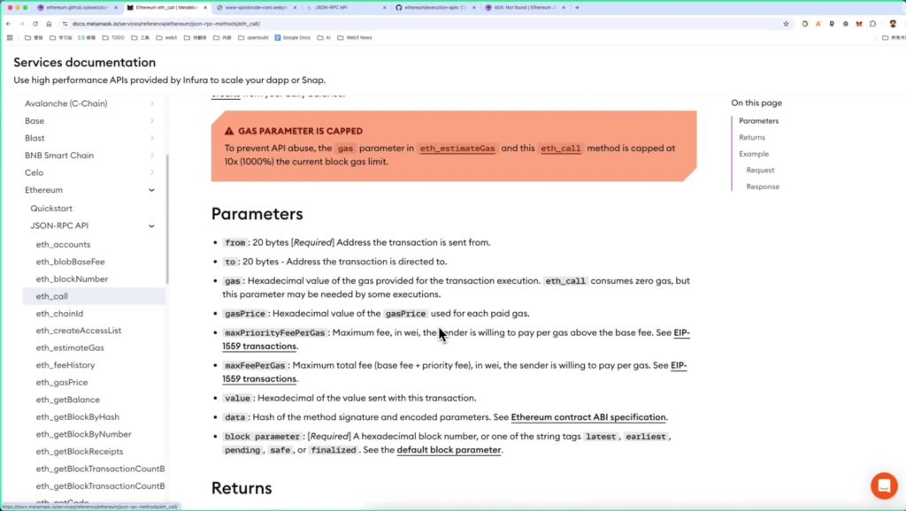
        - 核心功能：用于调用合约的 `view`/`pure` 方法读取链上状态
        - 关键参数：
            - `to`：20 字节的合约地址（必填）
            - `data`：方法签名和参数的 **ABI** 编码（必填）
            - `gas` 限制：为防止 **API** 滥用，**gas** 参数上限为当前区块 **gas limit** 的 10 倍
        - 调用流程：
            - 将函数调用转换为 **HEX** 格式
            - 构造包含合约地址和编码数据的交易对象
            - 通过 **JSON-RPC** 发送请求
            - 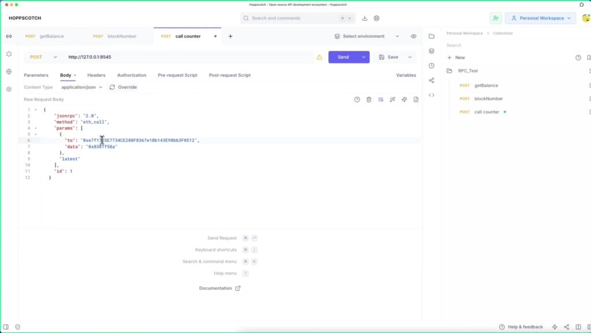
        - 实际案例：调用 **counter** 合约的 `count` 方法
            - `data` 字段：包含函数选择器 `0x8381f58a`
            - `block` 参数：可使用 `latest` 等标签指定查询区块
    - 交易与签名
        - 读写区别：
            - 读操作：使用 `eth_call` 无需签名和 **gas** 费用
            - 写操作：使用 `eth_sendRawTransaction` 需要完整交易签名
        - 交易构造：
            - 必需字段：`from`/`to`/`value`/`gas`/`data` 等
            - 签名过程：需用私钥对交易数据进行签名
            - **EIP-1559** 参数：`maxPriorityFeePerGas` 和 `maxFeePerGas`
            - 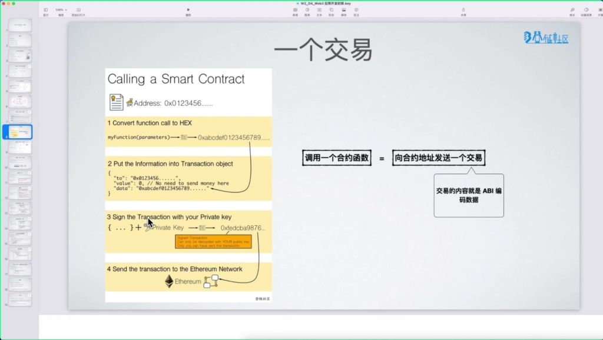
        - 完整流程：
            - 编码函数调用数据
            - 构造原始交易对象
            - 使用私钥签名
            - 通过节点广播交易
        - 安全机制：节点会验证签名有效性，网络共识确认后交易才最终生效
    - 与节点交互的库
        - 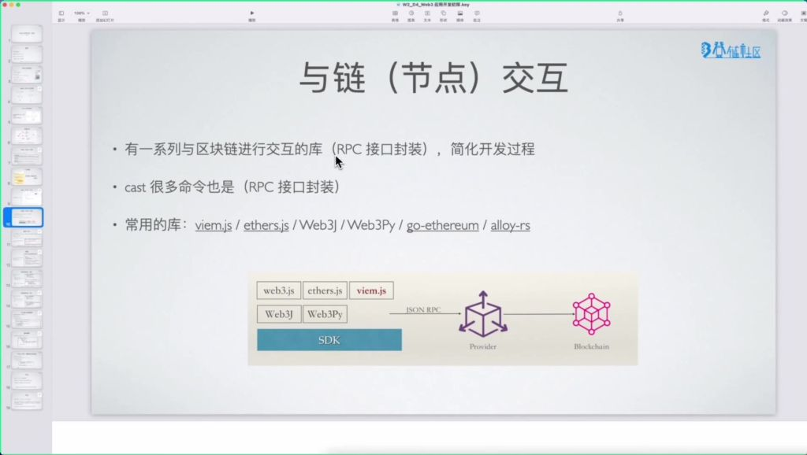
        - 主流工具：
            - **JavaScript**：`viem.js`/`ethers.js`/`web3.js`
            - **Java**：`Web3J`
            - **Python**：`Web3Py`
            - **Go**：`go-ethereum`
            - **Rust**：`alloy-rs`
        - 封装优势：
            - 简化参数构造过程
            - 提供类型检查和错误处理
            - 支持 **Promise** 等现代编程特性
        - 底层原理：所有库最终都转换为标准 **JSON-RPC** 请求与节点交互

- 应用案例
    - `cast` 命令使用
        - 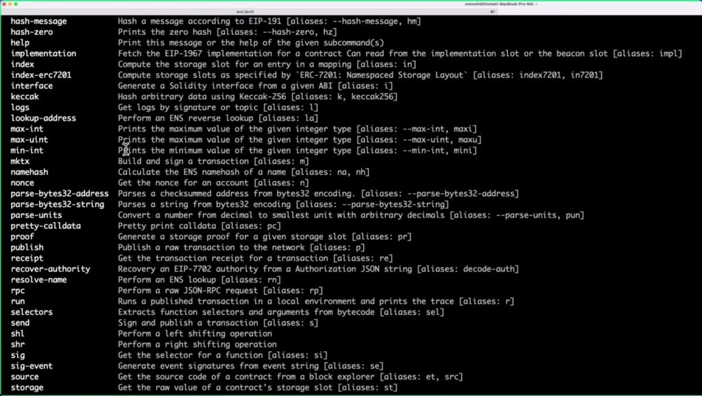
        - 功能概述: `cast` 命令包含多种与区块链交互的功能，是对 **JSON-RPC** 接口的封装
        - 常用命令:
            - `hash-message`: 根据 **EIP-191** 标准哈希消息
            - `hash-zero`: 打印零哈希
            - `keccak`: 使用 **Keccak-256** 算法哈希任意数据
            - `namehash`: 计算 **ENS** 名称哈希
            - `nonce`: 获取账户 **nonce** 值
            - `parse-units`: 将十进制数转换为最小单位
            - `send`: 签名并发布交易
            - `storage`: 获取合约存储槽原始值
            - 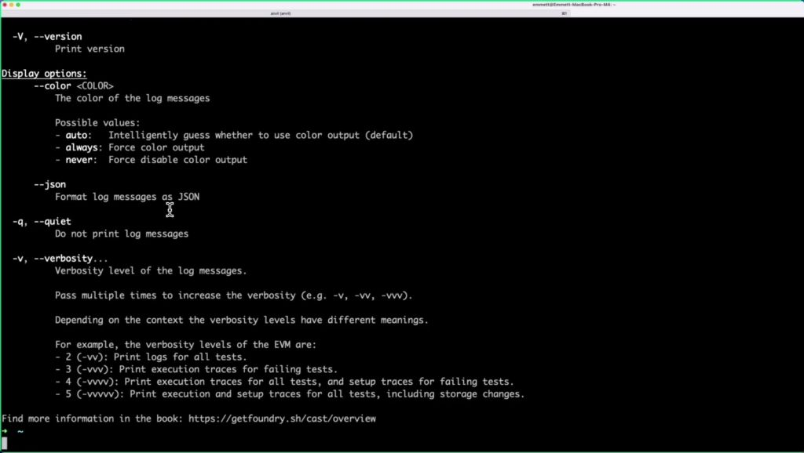
        - 命令选项:
            - `--color`: 控制日志颜色输出 (`auto`/`always`/`never`)
            - `--json`: 以 **JSON** 格式输出日志
            - `-q`/`--quiet`: 不打印日志消息
            - `-V`/`--verbosity`: 设置日志详细级别 (可叠加使用)
                - `-v`: 基本详细
                - `-vv`: 打印所有测试日志
                - `-vvv`: 打印失败测试的执行跟踪
                - `-vvvv`: 打印所有测试的执行跟踪
    - **Web3** 开发库
        - 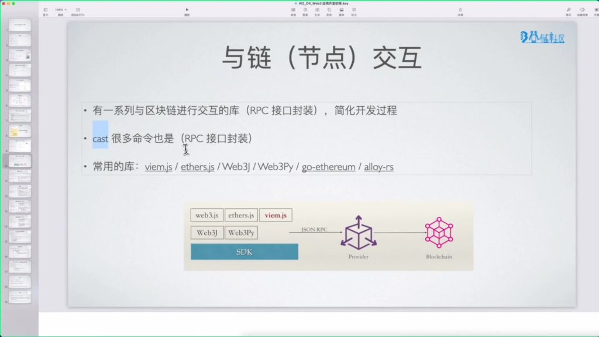
        - 本质: 都是对 **JSON-RPC** 接口的封装，简化开发过程
        - 主流库:
            - **JavaScript**: `viem.js`/`ethers.js`/`web3.js`
            - **Java**: `Web3J`
            - **Python**: `Web3Py`
            - **Go**: `go-ethereum`
            - **Rust**: `alloy-rs`
        - 核心概念:
            - **Provider**/**Client**: 与区块链节点连接的抽象
            - 不同语言库用法相似，掌握一个即可触类旁通
            - 
        - **viem** 特点:
            - 轻量级、模块化设计
            - 完全类型安全 (**TypeScript**)
            - 性能优于其他库
            - 文档完善 (含中文版)
        - 基本使用:
    - 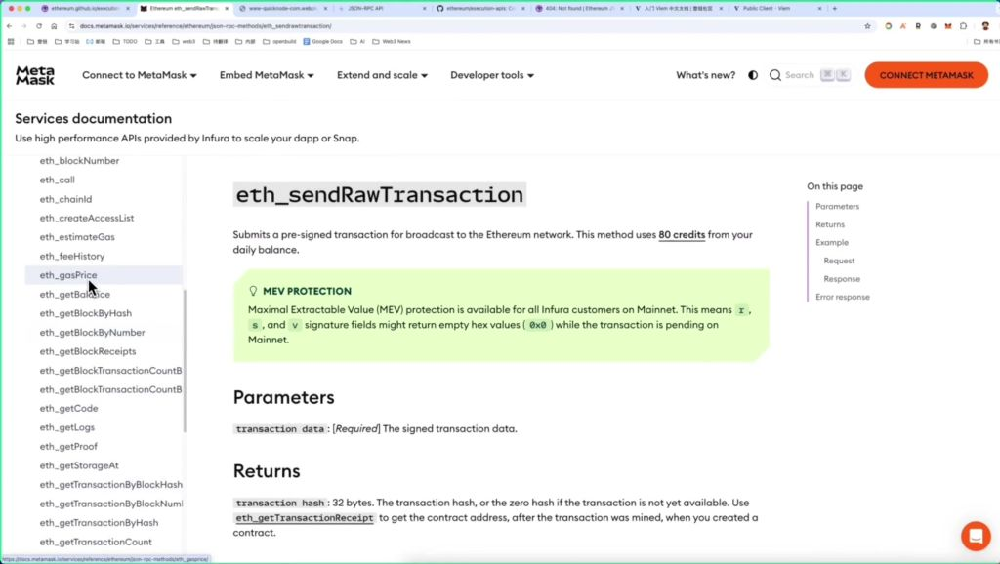
    - 封装方法:
        - `eth_blockNumber`: 获取最新区块号
        - `eth_call`: 执行合约调用
        - `eth_getBalance`: 查询账户余额
        - `eth_sendRawTransaction`: 广播签名交易
        - `eth_getTransactionReceipt`: 获取交易收据
    - 开发库选择建议
        - 当前趋势:
            - 最常用: `viem.js`
            - 次常用: `ethers.js`
            - 已淘汰: `web3.js`
        - 学习建议:
            - 掌握一个库即可理解核心概念
            - 不同语言库本质相同，只是语法差异
            - 实际使用时查阅对应文档即可
#### 2）使用 Viem

- **Viem 介绍**：**Viem.sh** 逐步取代 **ethers.js** 和 **web3.js**，具有高性能、模块化、轻量级、更出色的开发人员体验。
- **安装**：**Node.js v16** 以上，使用 `pnpm install viem` 或 `npm install viem`。
- **Client 作用**：**Client** 是交互载体，使用所需的链传输协议创建 **Client** 读取链上数据。

##### Viem 应用示例

- 
- **创建公共客户端**：
    - 导入模块：从 `viem` 导入 `createPublicClient`，`http`；从 `viem/chains` 导入 `mainnet`。
    - 创建过程：使用 `createPublicClient` 函数，指定链为 `mainnet`，传输协议为 `http()`，代码示例如下：

```typescript
import { createPublicClient, http } from 'viem'
import { mainnet } from 'viem/chains'
const client = createPublicClient({ 
    chain: mainnet, 
    transport: http() 
})
```

- **获取区块高度**：通过创建的 `client` 调用 `getBlockNumber` 方法获取区块高度，示例代码如下：

```typescript
const blockNumber = await client.getBlockNumber()
```

- **获取地址余额**：
    - **格式化余额**：使用 `formatEther` 方法对获取的余额进行格式化。
    - **获取过程**：通过 `publicClient` 调用 `getBalance` 方法，传入地址参数获取余额，示例代码如下：

```typescript
const tbalance = formatEther(await publicClient.getBalance({
    address: "0xf39Fd6e51aad88F6F4ce6aB8827279cffFb92266",
}));
console.log(`The balance of 0xf39 is ${tbalance}`);
```

- **创建钱包客户端**：
    - **导入私钥到账户**：从 `viem/accounts` 导入 `privateKeyToAccount`。
    - **创建过程**：使用 `privateKeyToAccount` 方法传入环境变量中的私钥创建账户，再通过 `createWalletClient` 方法传入账户创建钱包客户端，示例代码如下：

```typescript
import { privateKeyToAccount } from "viem/accounts";
const account = privateKeyToAccount(process.env.PRIVATE_KEY! as string);
const walletClient = createWalletClient({ account });
```

- **题目解析**：
    - **代码结构**：代码分为创建公共客户端、获取区块高度、获取地址余额、创建钱包客户端几个部分。
    - **关键方法**：`createPublicClient`、`getBlockNumber`、`getBalance`、`privateKeyToAccount`、`createWalletClient`。
    - **环境变量**：使用 `dotenv.config()` 加载环境变量，通过 `process.env` 获取 `RPC_URL` 和 `PRIVATE_KEY`。
    - **示例地址**：代码中使用的地址为 `0xf39Fd6e51aad88F6F4ce6aB8827279cffFb92266`，合约地址为 `0x5FbDB2315678afecb367f032d93F642f64180aa3`。
    - **传输协议**：创建公共客户端时，传输协议 `transport` 有两种，一种是 `web socket`，一种是 `http`，当要监听链上的一些数据的时候，就用 `web socket`。

##### 应用案例：转账操作

- **框架特点**:
    - 逐步替代 **ethers.js** 和 **web3.js**
    - 具有高性能、模块化、轻量级特性
    - 提供更出色的开发人员体验
- **安装要求**:
    - **Node.js v16** 以上版本
    - 安装命令：`pnpm install viem` 或 `npm install viem`
- **PublicClient**:
    - 用于读取链上数据
- **WalletClient**:
    - 用于发起交易（需要签名）
    - 需要配置私钥信息（通常通过 `.env` 文件）
- 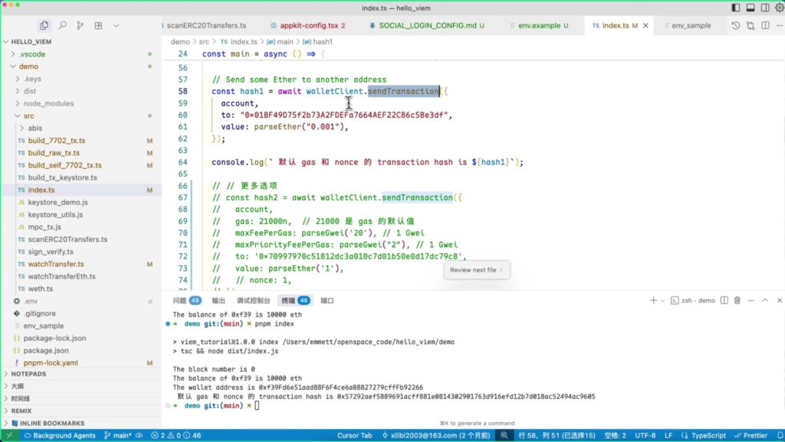
- **交易特点**:
    - 发起交易后不能立即获取结果，只能获取交易哈希
    - 交易结果需要等待区块确认后才能获取
- **转账示例**:
    - 基础转账
    - 自定义参数转账
- 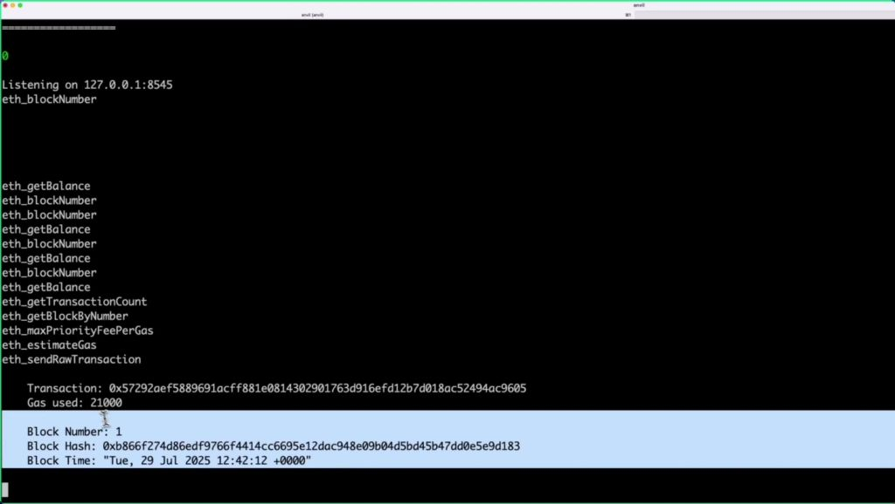
- **交易验证**:
    - 通过区块高度变化确认交易完成
    - 余额变化验证（扣除转账金额和手续费）
    - 手续费计算基于最近交易的平均 **gas** 消耗
    - 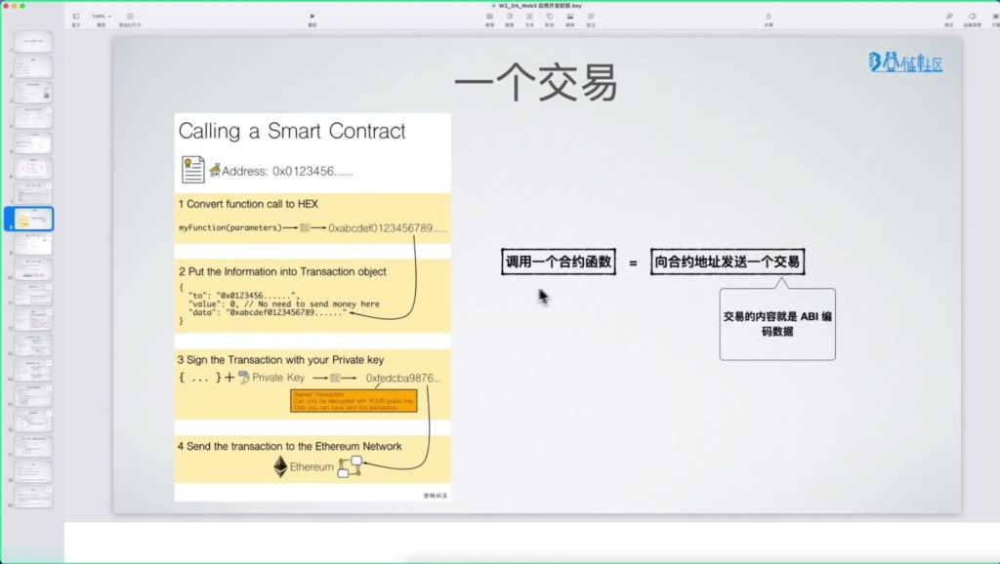
- **合约调用流程**:
    - 将函数调用转换为 **HEX** 格式：`myFunction(parameters) -> 0xabcdef0123456789`
    - 构建交易对象
    - 使用私钥签名交易
    - 将交易发送到以太坊网络
- **合约读取方法**:
    - 方法一：创建合约对象后调用 `read` 方法
        - 需要合约地址和 **ABI**
        - 示例：`balanceOf` 方法调用
    - 方法二：通过 `publicClient` 直接调用
        - 使用 `readContract` 方法
        - 需要提供合约地址、**ABI**、方法名和参数
    - 两种方法最终都会将调用转换为 **ABI** 编码发送到链上

##### 应用案例：合约调用

- 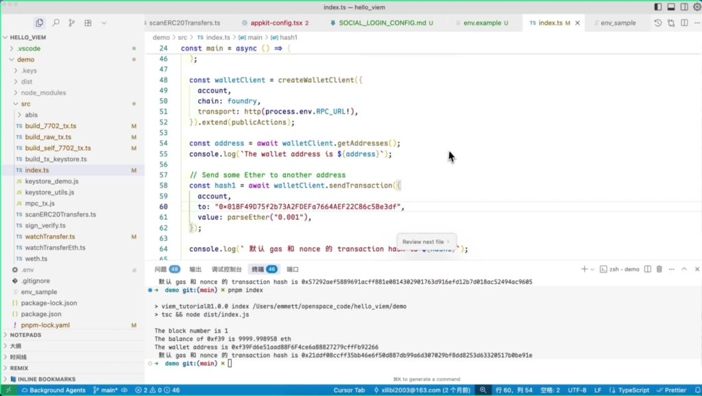
- **创建合约对象**：
    - **Client** 类型：如果要写合约对象，后面要加上 **Wallet Connect**；如果仅仅是读合约，使用 **Public** 即可。
    - 代码示例：

```typescript
const walletClient = createWalletClient({
    account,
    transport: http(process.env.RPC_URL!),
}).extend(publicActions);
```

- **读取合约数据**：
    - **获取钱包地址**：

```typescript
const address = await walletClient.getAddresses();
console.log(`The wallet address is ${address}`);
```

    - **发送交易**：

```typescript
const hash1 = await walletClient.sendTransaction({
    account,
    to: "0x01BF49D75f2b73A2FDEFa7664AEF22C86c5Be3df",
    value: parseEther("0.001"),
});
console.log(`默认 gas 和 nonce 的 transaction hash is ${hash1}`);
```

- **部署 ERC20 合约**：
    - **Foundry 工具**：**Foundry** 是一个快速、便携、模块化的以太坊应用开发工具包，用 **Rust** 编写。
    - **Foundry 组件**：
        - **Forge**：以太坊测试框架（类似 **Truffle**、**Hardhat** 和 **DappTools**）。
        - **Cast**：与 **EVM** 智能合约交互、发送交易和获取链数据的瑞士军刀。
        - **Anvil**：本地以太坊节点，类似于 **Ganache** 和 **Hardhat Network**。
        - **Chisel**：快速、实用、详细的 **Solidity REPL**。
    - **部署步骤**：
        - 使用 `forge script` 部署 **ERC20** 合约。
        - 合约部署到本地节点。
        - 部署成功后，获取合约地址。

```solidity
// SPDX-License-Identifier: MIT
pragma solidity 0.8.0;
import "@openzeppelin/contracts/token/ERC20/ERC20.sol";
contract MyERC20 is ERC20 {
    constructor(string memory name, string memory symbol) ERC20(name, symbol) {
        _mint(msg.sender, 10000 * 10 ** 18);
    }
}
```

- **自定义 Gas 和 Nonce**：

```typescript
const hash2 = await walletClient.sendTransaction({
    maxFeePerGas: parseUnits("20", "gwei"),
    maxPriorityFeePerGas: parseGwei("2"),
    to: '0x70997970c51812dc3a010c7d01b50e0d17dc79c8',
    value: parseEther('1'),
    nonce: 1,
});
console.log(`自定义 gas 和 nonce 的 transaction hash is ${hash2}`);
```

- **交易信息**：
    - **交易 1**：
        - **Transaction**：`0x57292aef5889691acff881e0814302981763d916efd12b7d018ac52494ac9605`
        - **Gas used**：`21000`
        - **Block Number**：`1`
        - **Block Hash**：`0xb866f274d86edf9766f4414cc6695e12dac948e09b04d5bd45b47dd0e5e9d183`
        - **Block Time**：`"Tue, 29 Jul 2025 12:42:12 +0000"`
    - **交易 2**：
        - **Transaction**：`0x21ddf08ccff35bb46e6f50d887db99a6d307029bf8dd8253d63320517b0be91e`
        - **Gas used**：`21000`
        - **Block Number**：`2`
        - **Block Hash**：`0xbb806f3334742ead7f27f539bd531e6bd6f1fe40f0e582e1ad8fbaeea74ebae9`
        - **Block Time**：`"Tue, 29 Jul 2025 12:43:07 +0000"`
    - **交易 3**：
        - **Transaction**：`0xab6c847e02ecb2c7ca0974feadb6fa02f7135e5b82cef11fd838ae0faa616be2`
        - **Contract created**：`0x9fE46736679d2D9a65F0992F2272dE9f3c7fa6e0`
        - **Gas used**：`947952`
        - **Block Number**：`3`
        - **Block Hash**：`0x0c200330c2f28adf64e1344d23778c1ab1b7da40269f19b8e6352`
        - **Block Time**：`"Tue, 29 Jul 2025 12:49:00 +0000"`

- **与合约交互（读）**：
    - **使用 Viem 调用 ERC20 合约**：
        - **方法 1**：创建 **Client** (Public Client)，然后创建合约对象（合约地址 + ABI + Client），最后从合约获取数据（参数）。

```typescript
const contract = getContract({
    address: WETH_ADDRESS,
    abi: WETH_ABI,
    client: {
        public: publicClient,
        // wallet: walletClient,
    },
});
contract.read.balanceOf([userAddress]);
```

        - **方法 2**：使用 **Client** 的 `readContract`（合约地址 + ABI + 参数）。

```typescript
publicClient.readContract({
    address: WETH_ADDRESS,
    abi: WETH_ABI,
    functionName: "balanceOf",
    args: [address.toString()],
});
```

    - **导出 ABI**：

```bash
forge inspect MyERC20 abi-json > MyERC20.json
```

##### 深入 Viem

- **合约读取操作**
    - 
    - **ABI 导出方法**：使用 `forge inspect MyERC20 abi -json > MyERC20.json` 命令导出合约 **ABI**，生成的 **JSON** 文件可被前端工程调用
    - **工程结构建议**：智能合约工程可以与前端工程合并，也可分开存放。若分开存放需要手动拷贝 **ABI** 文件到前端工程目录
    - **余额读取方法 1**：
        - 创建 **Public Client** 连接区块链节点
        - 通过 `getContract` 创建合约对象（需合约地址 + **ABI** + **Client**）
        - 调用合约 `read` 方法获取数据，如 `contract.read.balanceOf([userAddress])`
    - **余额读取方法 2**：
        - 直接使用 `publicClient` 的 `readContract` 方法
        - 参数包含合约地址、**ABI**、函数名和参数数组
        - 两种方法读取结果相同，方法 1 可读性更好，方法 2 编写更便捷
        - 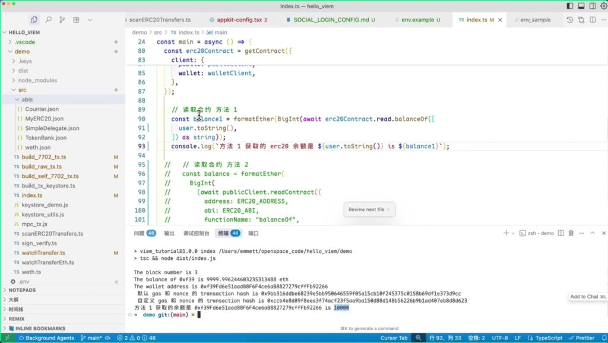
    - **数据格式化**：合约返回的余额数据是 $10^{18}$ 的大整数，需要使用 `formatEther` 进行格式化显示
    - **部署设置**：示例中 **MyERC20** 合约在部署时固定发行了 10000 个代币，这是通过构造函数中的 `_mint(msg.sender, 10000 * 10 ** 18)` 实现的
- **合约写入操作**
    - **核心区别**：写入操作需要钱包客户端 (**WalletClient**) 进行交易签名，而读取操作只需 **PublicClient**
    - **写入方法 1**：
        - 通过合约对象的 `write` 方法调用
        - 如 `counterContract.write.increment()`
        - 返回交易哈希而非直接结果
    - **写入方法 2**：
        - 使用 `walletClient` 的 `writeContract` 方法
        - 需完整指定合约地址、**ABI**、函数名和参数
    - **交易确认**：写入操作返回的是交易哈希，需要等待链上确认后才能获取最终执行结果
    - 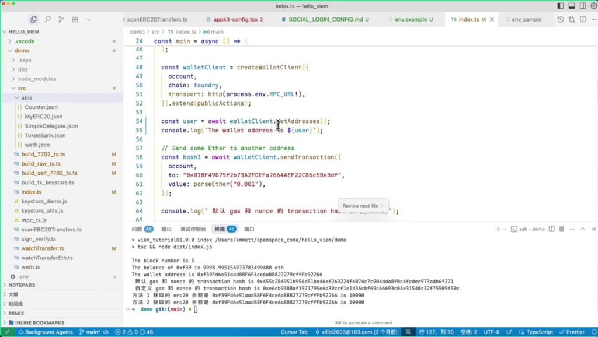
    - **无参函数调用**：示例中的 `increment` 函数不需要参数，若有参数需在前端调用时传入
    - **交易状态检查**：交易收据中的 `status` 字段表示执行是否成功，`true` 表示成功
    - **账户关联**：合约交互会使用 `walletClient` 关联的账户进行交易签名和 **gas** 支付

## 二、从交易中获取事件

### 1. 交易结果获取机制

- 
- **交易收据特性**：区块链交易不会直接返回执行结果，而是返回交易哈希（**Hash**），需要通过交易收据（**Receipt**）获取最终状态
- **结果获取方法**：
    - 使用 `waitForTransactionReceipt` 等待交易上链
    - 从收据的 `status` 字段读取交易状态（`success`/`failure`）
    - 示例代码：

### 2. 事件解析方法

- 
- **事件存储位置**：所有合约触发的事件都存储在交易收据的 `logs` 字段中
- **解析工具**：使用 `parseEventLogs` 方法解析特定事件
    - 需要提供：合约 **ABI**、事件名称、原始日志数据
    - 示例（解析 **Transfer** 事件）：
- **事件参数提取**：
    - 每个事件可能包含多个日志记录（数组形式）
    - 通过 **ABI** 定义的事件参数结构进行类型转换
    - 示例输出转账详情：

### 3. ERC20 事件结构

- 
- **标准事件格式**：**Transfer** 事件包含三个索引参数
    - `from`：转出地址（`indexed address`）
    - `to`：转入地址（`indexed address`）
    - `value`：转账金额（`uint256`）
- **ABI 定义示例**：
- **解析原理**：**ABI** 定义使解析器能正确识别日志中的参数位置和类型

### 4. 问题输出

- 
- **典型输出内容**：
    - 交易哈希（**Transaction Hash**）
    - 合约地址（**Contract Address**）
    - **Gas** 消耗（**Gas Used**）和费用（**Gas Cost**）
    - 交易状态（**Success**/**Failure**）
- **调试技巧**：
    - 打印完整收据对象查看所有可用字段
    - 注意日志数组可能包含多个合约的混合事件
    - 使用类型断言确保参数类型安全

## 三、监听事件

### 1. 获取交易结果

- 
- **交易结果获取方式**：区块链交易不会直接返回结果，而是返回交易哈希。需要通过等待交易上链并解析日志来获取最终结果。
- **代码实现**：

### 2. 实时监听事件

- 
- **监听场景**：当需要实时监听链上发生的事件时使用，特别是监控他人发起的与合约交互的交易。
- **技术实现**：
    - 使用 **WebSocket** 建立长连接
    - 通过 `watchEvent` 方法监听特定事件
- **代码示例**：

### 3. 监听事件注意事项

- **连接方式**：必须使用 **WebSocket** 协议而非 **HTTP**，因为需要保持长连接。
- **地址匹配**：监听时必须确保合约地址正确，否则无法捕获事件。
- **实际应用**：
    - 后端服务可将监听到的交易数据存入数据库
    - 用户端交互需要通过钱包发起，不能直接在代码中硬编码私钥
- **调试技巧**：可以通过在另一个终端执行交易来测试监听功能是否正常工作。

## 四、DApp 开发

### 1. 前端与合约交互

#### 1）不同点

- **钱包集成方式**：必须通过用户钱包创建 **Client**，而非直接使用私钥创建。**MetaMask** 等钱包插件会在安装后向页面注入 `window.ethereum` 对象
- **客户端创建**：通过 `createWalletClient` 方法创建客户端时，需使用 `window.ethereum` 作为 `transport` 参数

```typescript
const walletClient = createWalletClient({
  chain: foundry,
  transport: custom(window.ethereum)
});
```

#### 2）前端交互时，注意链上交易的异步特性

- **结果获取**：无法直接获取交易发起结果，需要通过事件监听或交易哈希查询
- **用户授权**：所有写操作需通过钱包插件弹出授权窗口，用户手动确认签名
- **网络切换**：需处理用户切换网络的情况（如从 **Foundry** 切换到主网）

#### 3）应用案例

- **示例代码**
    - 
    - **连接流程**：
        - 检查 `window.ethereum` 是否存在
        - 调用 `eth_requestAccounts` 请求账户授权
        - 监听账户变化事件 `accountsChanged`

```typescript
const connectWallet = async () => {
  if(typeof window.ethereum === 'undefined'){
    alert('请安装MetaMask');
    return;
  }
  const [address] = await window.ethereum.request({
    method: 'eth_requestAccounts'
  });
  // 后续处理...
}
```

- **示例代码**
    - 
    - **写操作实现**：
        - 使用 `walletClient.writeContract` 方法
        - 需包含合约地址、**ABI**、函数名等参数
        - 返回交易哈希而非直接结果

```typescript
const handleIncrement = async () => {
  const hash = await walletClient.writeContract({
    address: COUNTER_ADDRESS,
    abi: Counter_ABI,
    functionName: 'increment',
    account: address
  });
  console.log('Transaction hash:', hash);
}
```

- **完整项目**：参考 **GitHub** 示例代码库 [https://github.com/lbc-team/hello_viem/tree/main/viem-front](https://github.com/lbc-team/hello_viem/tree/main/viem-front)
- **调试技巧**：在 **Foundry** 本地网络开发时需确保 **MetaMask** 连接的是正确链 **ID**（如 31337）


## 一、Viem 介绍

- 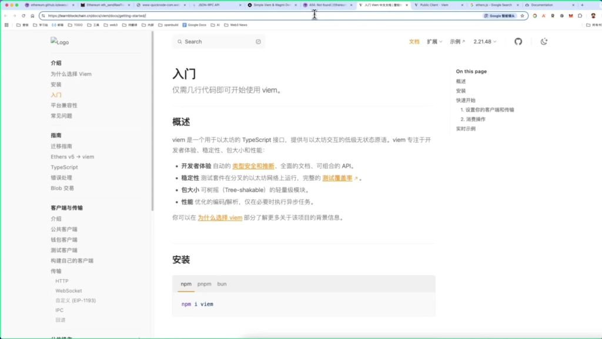
- **定义**: **Viem** 是以太坊的 **TypeScript** 接口，提供与以太坊交互的低级无状态原语
- **特点**:
    - **开发者体验**：自动类型安全和推断、全面文档、可组合 **API**
    - **稳定性**：测试套件在分叉以太坊网络运行，完整测试覆盖率
    - **包大小**：可树摇 (**Tree-shakable**) 的轻量级模块
    - **性能**：优化编码/解析，仅在必要时执行异步任务
- **代码示例**:

## 二、Solidity 介绍

### 1. ETH 与 Token 区别

- **ETH**:
    - 是以太坊的原生代币 (**Native Token**)
    - 不是智能合约，是区块链基础货币
    - 最小单位 **wei**，1 **ETH** = $10^{18}$ **wei**
- **Token**:
    - 通过智能合约实现的代币
    - 可以代表任何数字资产
    - **ERC20** 是最常见的代币标准
- **单位系统**:
    - **wei** 是最小单位
    - 1 **ether** = $10^{18}$ **wei**
    - 代码中单位仅表示 10 的幂次乘法关系
    - 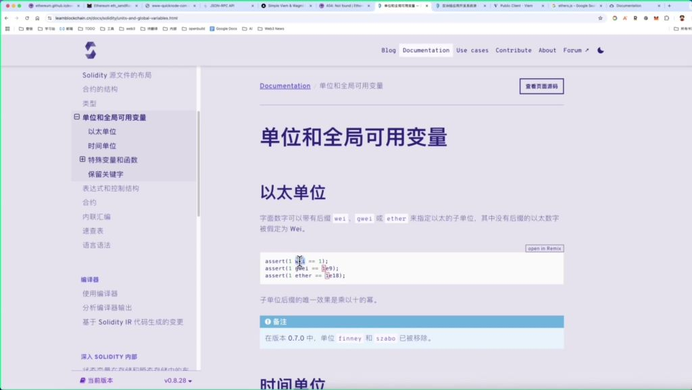
- **字面量后缀**:
    - **wei**: 基本单位（无后缀默认）
    - **gwei**: $10^9$ **wei**
    - **ether**: $10^{18}$ **wei**
- **注意**:
    - 版本 **0.7.0** 后移除了 **finney** 和 **szabo** 单位
    - 单位后缀仅执行 10 的幂次乘法运算

## 三、Remix 介绍

- 
- **功能**:
    - 智能合约编写、编译、部署和测试
    - 支持 **Solidity** 静态分析工具 (**Solhint**/**Slither**)
    - 提供项目模板（**ERC20**、**NFT** 等）
- **国内访问**:
    - 官方网址 `remix.ethereum.org` 可能受限
    - 可使用托管版本（功能稍旧但基础功能完整）
- **安全提示**:
    - 警惕“流动性抢跑机器人”相关视频
    - 注意合约部署和交互的安全风险
    - 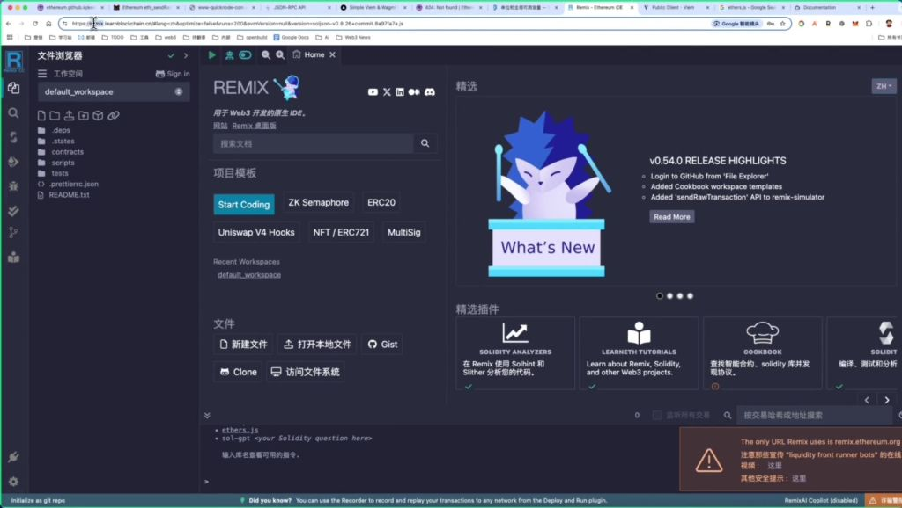
- **主要模块**:
    - 文件管理器：创建/打开合约文件
    - **Solidity** 编译器：编译合约代码
    - 部署与交互：测试合约功能
    - 分析工具：代码质量检查
- **学习资源**:
    - **Cookbook** 提供智能合约示例
    - **LearnETH** 教程涵盖 **Solidity** 基础
    - 支持 **ZK Semaphore** 等高级功能模板

## 四、生产级代码

- 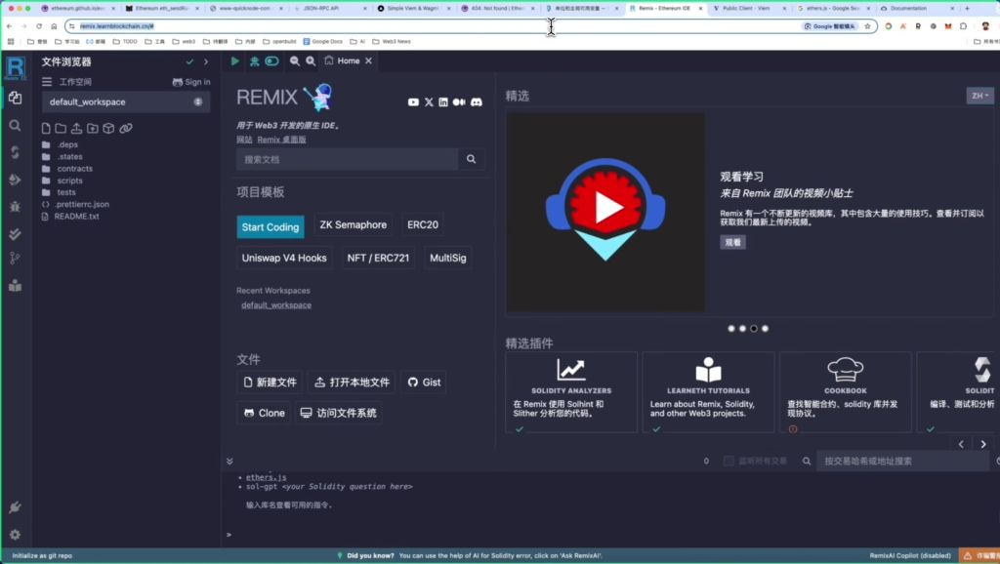
- **概念澄清**：在 **Web3** 开发中，“生产级代码”与传统软件开发不同，只要合约在主网上运行就是生产级代码，在测试网上运行就是测试级代码。
- **代码规模**：生产级智能合约通常很精简，可能只有 1-3 个文件，这与传统 **Java** 后端项目的庞大代码量形成鲜明对比。
- **实际案例**：即使管理数十亿美金资产的合约，其代码量也可能非常精简，如 **ERC20** 标准合约。
- 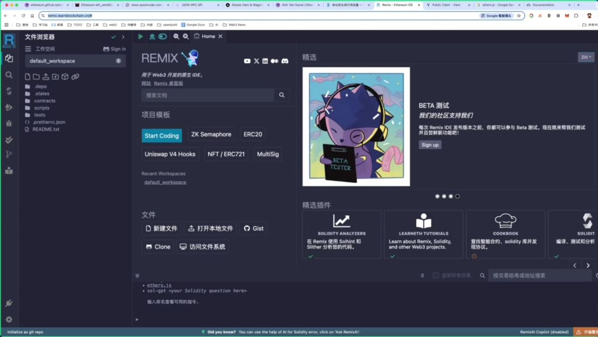
- **开发环境**：**Remix IDE** 是 **Web3** 开发的原生集成开发环境，提供合约编译、测试和分析功能。
- **学习资源**：**Remix** 团队维护着不断更新的视频库，包含大量使用技巧和教程。

## 五、Web3 应用

- 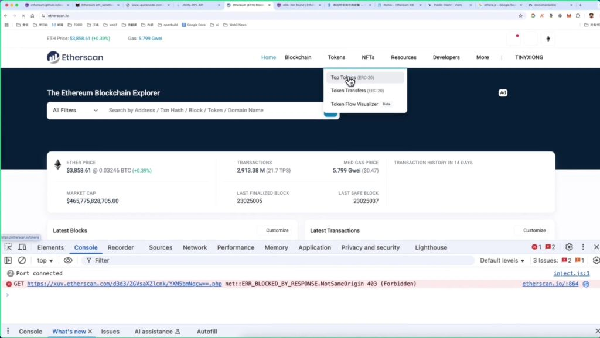
- **开发优势**：
    - 简化架构：无需自行开发支付系统、账号系统等基础设施
    - 公开透明：所有合约代码都在链上公开可查
    - 去中心化：应用不由单一实体托管，而是运行在公开区块链上
    - 
- **安全特性**：
    - 合约代码经过严格验证
    - 即使管理巨额资产，代码仍保持精简
    - 所有交易公开可查，提高透明度
- **与传统应用对比**：
    - 开发负担：显著降低后端开发复杂度
    - 部署方式：合约部署后即对所有用户开放
    - 维护成本：无需维护传统服务器架构

## 六、Token Tracker

### 1. ERC-20 代币市场数据

- 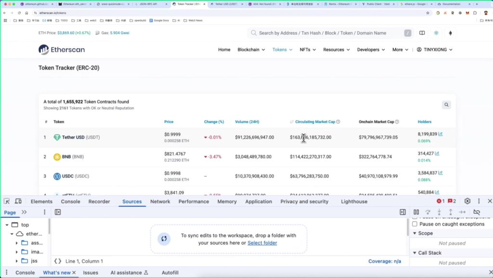
- **市场规模**: 共发现 1,655,922 个 **Token** 合约，其中 2,161 个具有 **OK** 或 **Neutral** 声誉评级
- **头部代币示例**:
    - **Tether USD (USDT)**: 价格 0.9999，24 小时交易量 91.2B，流通市值 $163.6B
    - **BNB**: 价格 821.4767，24 小时交易量 3.05B，流通市值 $114.4B
    - **USDC**: 价格 0.9998，24 小时交易量 10.37B，流通市值 $63.8B

### 2. Tether 合约分析

- 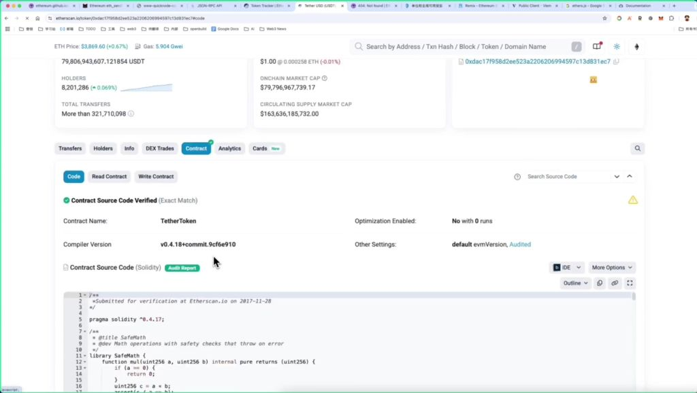
- **合约规模**: 实际有效代码约 200 行（含注释后 450 行）
- **代码特点**:
    - 使用 **Solidity 0.4.18** 编译器
    - 未启用优化选项
    - 采用默认 **EVM** 版本
    - 经过安全审计（**Calisto Network** - 2019 年 7 月 10 日）
- **关键函数**:
    - 包含 **SafeMath** 数学运算库
    - 设置参数函数 (`setParams`) 有硬编码限制：
        - 基础点数 (`newBasisPoints`) 必须小于 20
        - 最大费用 (`newMaxFee`) 必须小于 50

### 3. 合约开发理念

- **代码规模认知**:
    - **Web3** 开发不强调“生产级代码”概念
    - 代码长短与项目质量无必然联系
    - 示例：**Tether** 核心合约仅 200 行左右即支撑百亿美元市值
- **开发实践**:
    - 典型项目包含两个主要工程：
        - 合约开发工程（如 **Counter** 合约部署）
        - 后端调用工程（包含交互脚本）

## 七、工程初始化

- 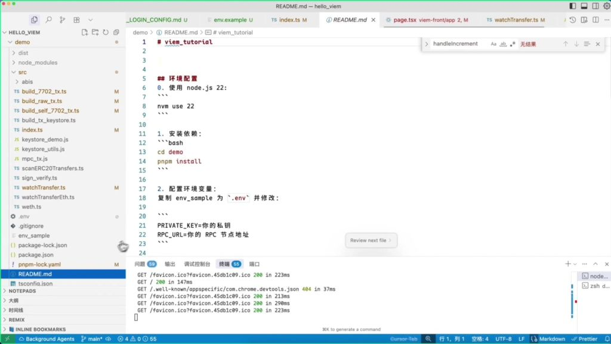
- **初始化方法**：使用 **Node.js** 进行工程初始化，执行 `npm init` 或 `yarn init` 命令即可创建基础项目结构
- **依赖安装**：通过 `pnpm install` 命令安装项目所需依赖
- **环境配置**：
    - 复制 `env_sample` 文件为 `.env` 并修改配置
    - 必须配置项包括：
        - `PRIVATE_KEY`=你的私钥
        - `RPC_URL`=你的 **RPC** 节点地址

## 八、前端页面调用

- 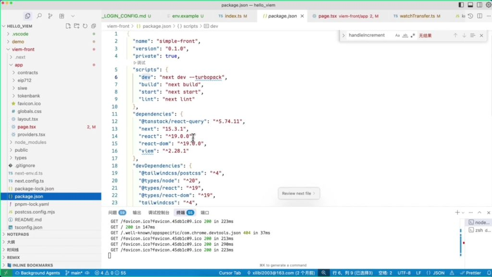
- **项目结构**：
    - 使用 **Next.js** 框架（版本 **15.3.1**）
    - **React** 版本为 **19.0.0**
    - 包含 **Viem** 库（版本 **2.28.1**）用于合约交互
- **核心依赖**：
    - `@tanstack/react-query`：数据管理
    - `tailwindcss`：样式处理
    - `typescript`：类型检查
- **脚本命令**：
    - `dev`：开发模式启动
    - `build`：生产构建
    - `start`：生产环境启动
    - `lint`：代码检查
    - 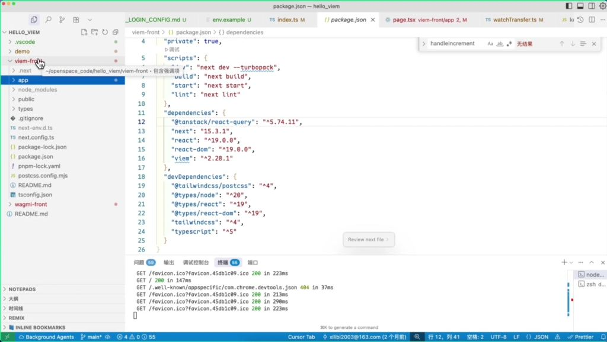
- **工程管理建议**：
    - 可以将合约工程和前端代码放在同一个项目目录下管理
    - 前端工程可独立运行，通过调用合约 **ABI** 进行交互
    - 项目采用模块化结构，包含：
        - `contracts` 目录存放合约代码
        - `app` 目录存放前端页面
        - `public` 目录存放静态资源

## 九、项目从零到一

### 1. 课程重点

- 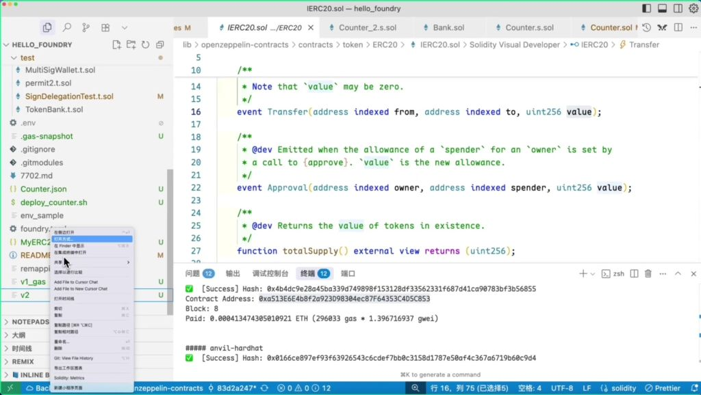
- **专注领域**: 本课程主要聚焦 **Web3** 开发相关内容，不涉及传统前端工程开发
- **技术栈说明**: 虽然会使用 **React** 等前端技术，但重点在于 **Web3** 集成而非前端实现
- **效率考量**: 课程设计避免传统开发内容的冗长讲解，确保在合理时间内完成 **Web3** 核心知识传授

### 2. 开发工具

- 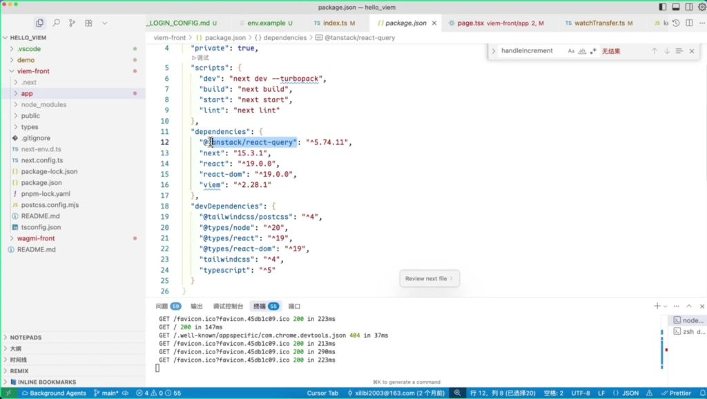
- **AI 辅助开发**: 讲师采用 **AI** 工具生成基础工程框架，重点关注 **Web3** 相关配置
- **关键依赖项**:
    - **Web3** 核心库：`viem@2.28.1`
    - 前端框架：`Next.js@15.3.1` + `React@19`
    - 状态管理：`@tanstack/react-query@5.74.11`
- **工程结构**:
    - 主要业务逻辑：`app/page.tsx`
    - 配置文件：`next.config.ts`/`postcss.config.mjs`
    - 类型定义：`next-env.d.ts`

## 十、工程创建

### 1. 实战演示

- 
- **代码来源**: 全部基础工程代码由 **AI** 生成，开发者只需关注 **Web3** 集成部分
- **核心文件**:
    - **WETH** 交互脚本：`weth.ts`
    - 交易构建脚本：`build_*.ts` 系列文件
    - 密钥管理：`keystore_*.js`

### 2. 合约交互示例

- 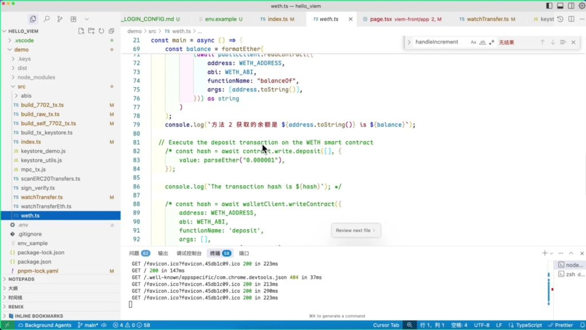
- **余额查询**:
- **存款操作**:
- **开发策略**: 通过封装基础合约交互方法，快速构建 **Web3** 应用核心功能

## 十一、后端调用方式

### 1. 工程创建和传统开发的区别

- 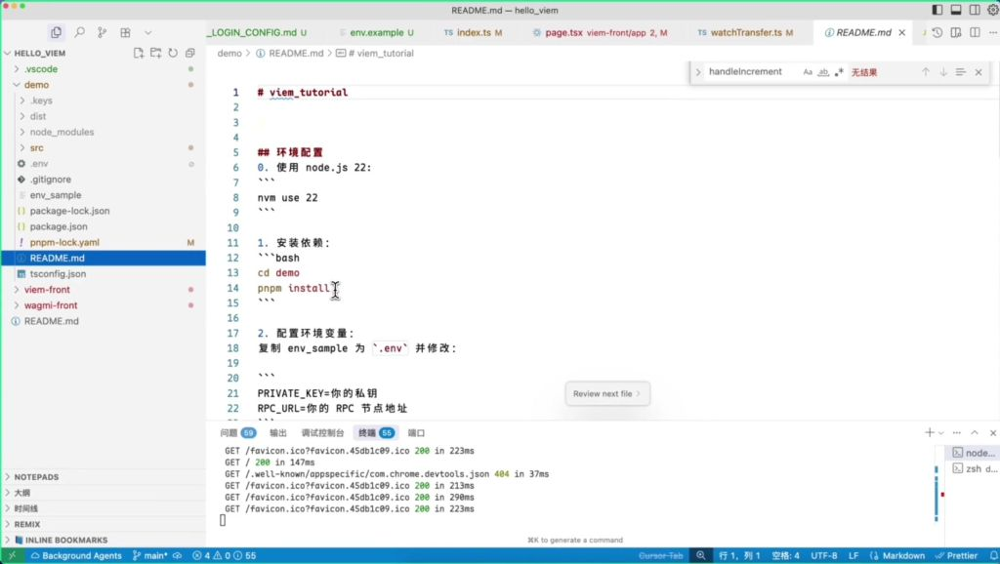
- **环境配置**：
    - 使用 **Node.js 22** 版本：`nvm use 22`
    - 安装依赖：`npm install`
    - 配置环境变量：复制 `env_sample` 为 `.env` 并修改 `PRIVATE_KEY` 和 `RPC_URL`
- **核心区别**：
    - 与传统前端开发的主要区别在于 **Web3** 交互部分
    - 需要安装特定的 **Web3** 包（如 **viem**）来实现区块链交互
    - 工程结构与传统项目类似，但增加了智能合约交互相关配置

### 2. 找工作需要掌握的技能

- **技能要求**：
    - 仅会 **Solidity** 语言远远不够
    - 需要了解整个 **Web3** 领域的知识体系
    - 前端技能（如 **React**、**TypeScript**）根据岗位需求而定
- **职业发展**：
    - 小型团队可能需要全栈能力
    - 大型团队通常有明确分工（前端/后端/合约开发）
    - 合约开发者需要了解如何与前端交互

### 3. 不同工种对技能的要求

- **岗位差异**：
    - 合约开发：重点在智能合约和安全审计
    - 前端开发：需要熟悉 `Web3.js`/`ethers.js` 等库
    - 后端开发：需要处理链下数据和节点交互
- **协作要点**：
    - 合约开发者需要为前端提供调用示例
    - 需要理解完整的 **DApp** 交互流程

### 4. 前端与合约的交互

- 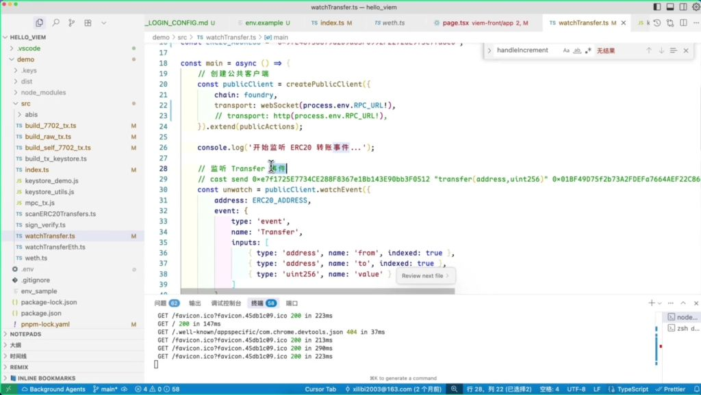
- **交互方式**：
    - 使用 **viem** 库创建公共客户端：`createPublicClient`
    - 监听 **ERC20** 转账事件：`watchEvent`
    - 事件参数包括：`from`（地址）、`to`（地址）、`value`（金额）
- **代码示例**：

```typescript
const publicClient = createPublicClient({
  chain: foundry,
  transport: webSocket(process.env.RPC_URL!)
}).extend(publicActions);
```

### 5. 编程语言学习的误区

- **常见误区**：
    - 认为学会一门语言就足够就业
    - 忽视领域专业知识的重要性
    - 低估 **AI** 对基础编程工作的影响
- **正确认知**：
    - 语言只是工具，领域知识才是核心
    - **Web3** 涉及 **DeFi**、数据解析等复杂概念
    - 简单的语法知识已无法满足就业需求

### 6. Web3 领域知识的重要性

- **知识体系**：
    - 包含但不限于：智能合约、**DeFi** 协议、**DAO** 治理
    - 需要理解区块链底层原理和经济模型
    - 安全审计和 **gas** 优化等高级技能
- **学习建议**：
    - 语言语法可在 2-3 天内掌握
    - 领域知识需要长期积累和实践
    - 课程设计注重实际应用而非语法教学

### 7. 课程重点及语言学习的时间

- **课程结构**：
    - 前 2-3 天完成语言基础教学
    - 后续 4-5 个月专注领域知识
    - 包含完整项目实践和案例分析
- **学习目标**：
    - 培养解决实际问题的能力
    - 理解 **Web3** 生态系统全貌
    - 掌握行业最新技术动态

### 8. dApp 的展示及客户群体

- 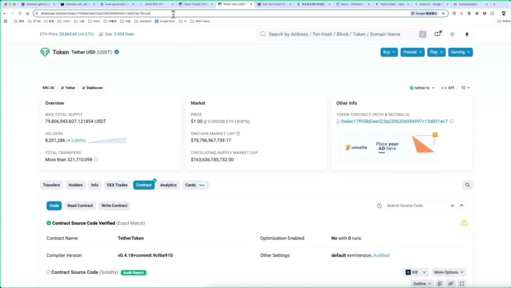
- **典型应用**：
    - 去中心化交易所（如 **Uniswap**）
    - 借贷协议（如 **Aave**）
    - 稳定币系统（如 **USDT**）
- **用户群体**：
    - 主要服务于全球加密用户
    - 金融领域应用最为广泛
    - 逐渐向传统领域渗透

### 9. dApp 开发的应用端类型

- **开发形式**：
    - 多数为网页应用（**Web** 前端）
    - 也可开发移动端应用
    - 部分项目提供多端支持
- **技术选择**：
    - 前端框架：**React**/**Vue** 等
    - 钱包集成：**MetaMask** 等
    - 后端服务：节点 **API** 或自建索引

### 10. 传统应用接入数字货币支付

- 
- **应用场景**：
    - **AI** 服务支付（如 **OpenRouter**）
    - 跨境支付和结算
    - 去中心化金融服务
- **实现方式**：
    - 集成 **Web3** 支付网关
    - 支持主流加密货币
    - 提供法币兑换通道

### 11. Web3 的全球性去中心化特性

- 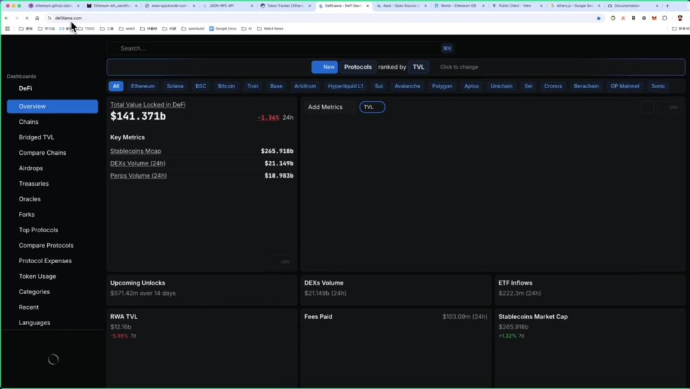
- **核心特征**：
    - 无国界限制，全球可访问
    - 无需传统公司架构
    - 协议即服务 (**Protocol as Service**)
- **就业影响**：
    - 远程工作成为主流
    - 项目制合作取代固定雇佣
    - 技能和贡献比地理位置更重要

## 十二、项目部署

### 1. 私钥管理

- 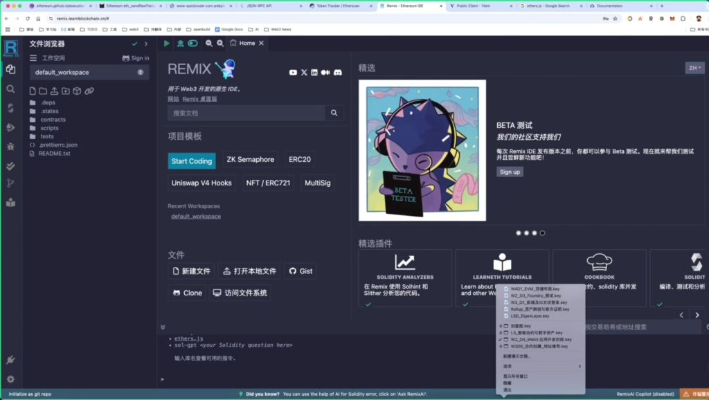
- **管理工具**：使用 **Foundry** 等开发工具进行私钥管理
- **演进过程**：
    - 初始阶段：通常由单个管理员账户管理
    - 成熟阶段：转为多签钱包管理
    - 去中心化阶段：通过治理合约实现社区投票管理

### 2. 治理合约

- 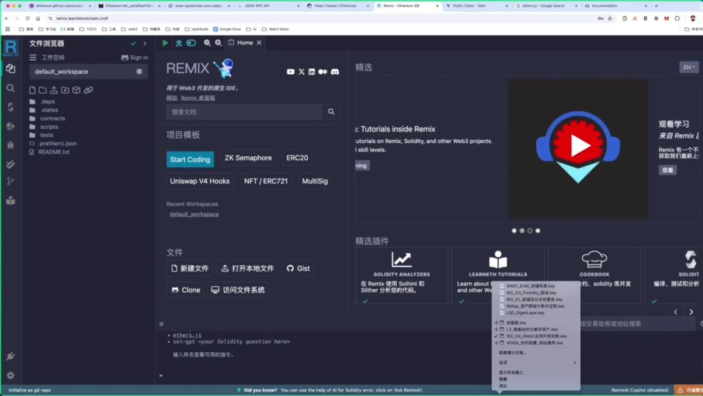
- **治理机制**：
    - 所有权分配：项目持币人即项目所有者
    - 决策流程：所有重大改进需通过持币人投票决定
    - 合约特点：实现完全去中心化的项目治理模式

### 3. 部署流程

- 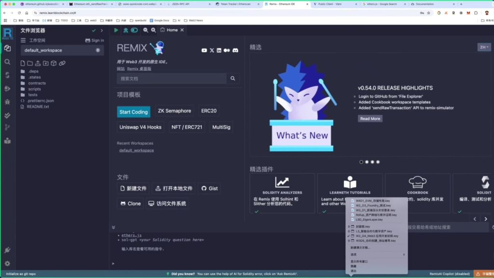
- **部署阶段**：
    - 初始部署：使用管理员账户完成首次部署
    - 权限转移：将控制权转移至多签钱包
    - 最终治理：升级为完全由治理合约控制的模式
- **安全建议**：避免长期使用单一管理员账户控制项目

## 十三、投票工具

- 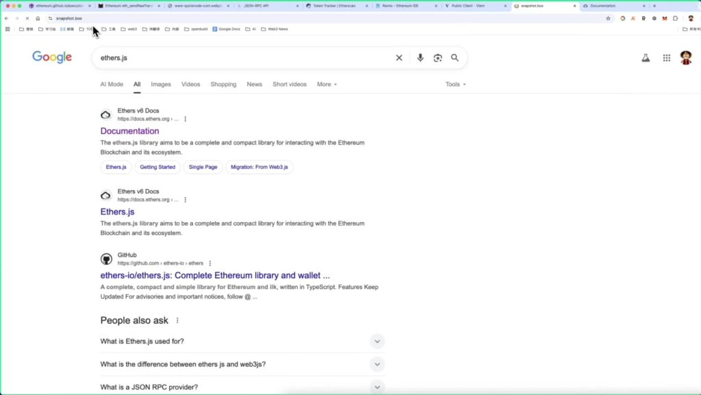
- **Ethers.js 功能**：一个完整且紧凑的 **JavaScript** 库，用于与以太坊区块链及其生态系统进行交互
- **主要特点**：
    - 提供与 `Web3.js` 类似的功能但更轻量
    - 支持 **TypeScript** 开发
    - 包含钱包功能
    - 文档资源：[https://docs.ethers.org](https://docs.ethers.org)

### 1. DAO 治理机制

- 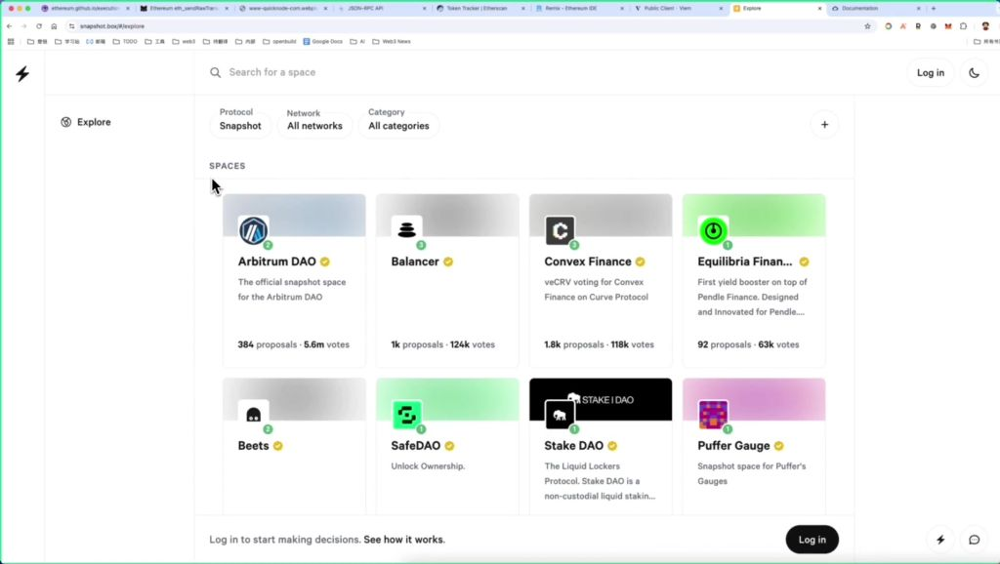
- **治理类比**：
    - 项目决策机制：类似于上市公司股东投票制度
    - 投票权分配：持币量决定投票权重，持币越多投票权越大
- **典型 DAO 案例**：
    - **Arbitrum DAO**：384 提案，560 万次投票
    - **Convex Finance**：1000 提案，12.4 万次投票
    - **Pendle Finance**：92 提案，6.3 万次投票

### 2. 提案执行流程

- 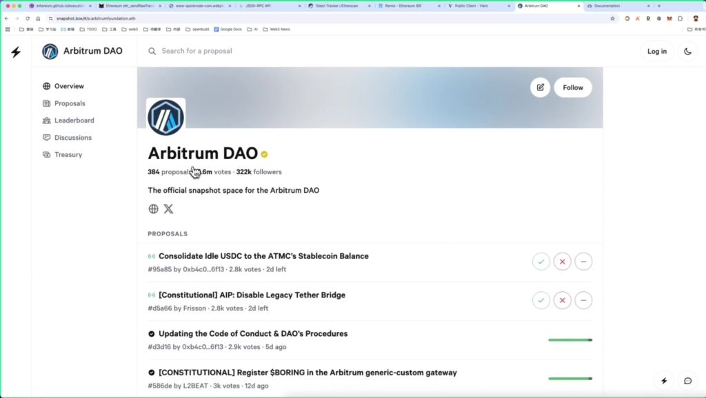
- **提案类型示例**：
    - 资金管理：如“合并闲置 **USDC** 到稳定币余额”
    - 协议升级：如“禁用旧版 **Tether** 桥接”
    - 治理规则：如“更新行为准则和 **DAO** 程序”
- **投票特征**：
    - 每个提案显示投票截止时间
    - 实时显示当前得票数
    - 宪法类提案需要更高通过门槛

### 3. 多签合约机制

- 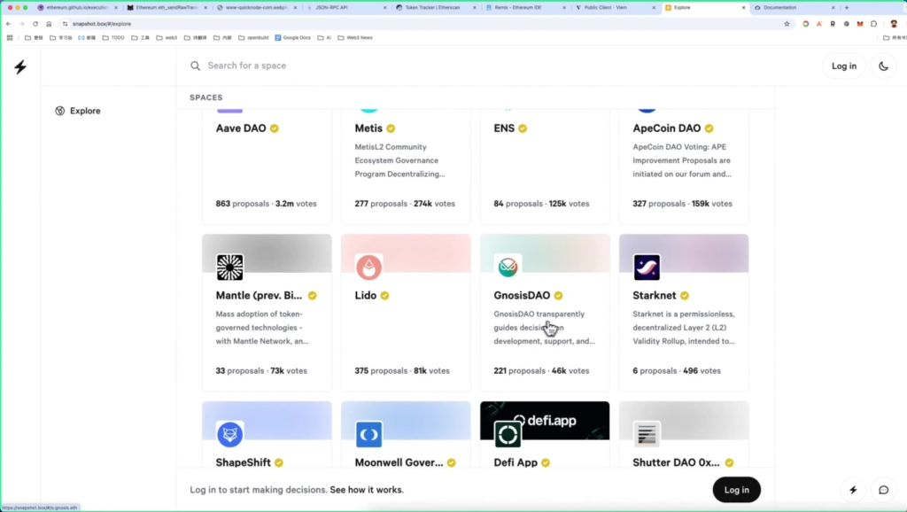
- **技术实现**：
    - 基于智能合约的多重签名验证
    - 需要达到预设阈值才能执行交易
- **治理案例**：
    - **Aave DAO**：863 提案，320 万次投票
    - **ENS**：84 提案，12.5 万次投票
    - **Lido**：375 提案，8.1 万次投票

### 4. 交易哈希生成

- 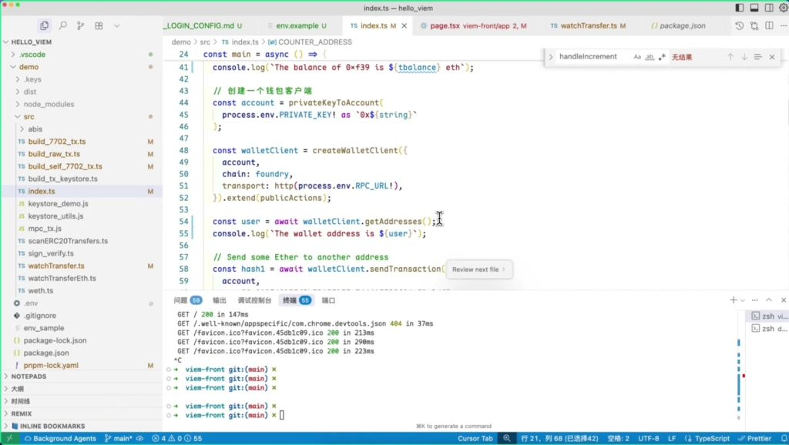
- **哈希生成机制**：
    - 由交易参数 + 固定算法计算得出
    - **RPC** 节点仅验证并传播交易
- **异步特性**：
    - 交易发送是即时操作
    - 确认需要等待区块打包
    - 与传统 **HTTP** 请求的同步模式不同

### 5. 实践作业

- 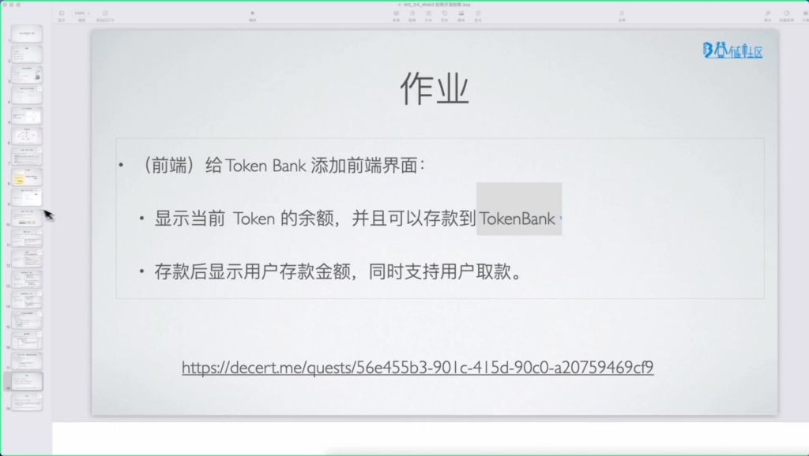
- **功能要求**：
    - 显示用户 **Token** 余额
    - 实现存款/取款功能
    - 实时更新余额显示
- **技术要点**：
    - 需要连接钱包获取余额
    - 调用智能合约进行存取款
    - 交易确认后更新 **UI** 状态


## 十四、Web3 应用解析

### 1. 异步请求与智能合约的交互

- 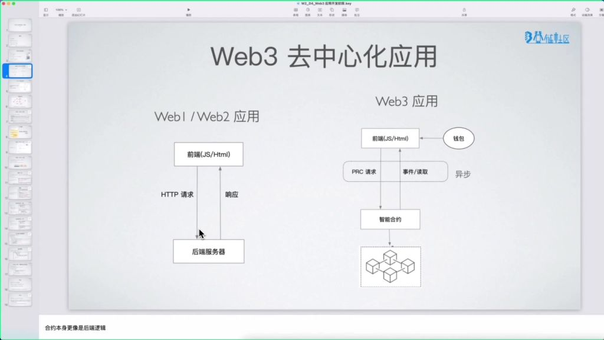
- **异步特性**：所有与智能合约的交互请求都是异步操作，需要通过异步语法处理返回结果
- **合约定位**：智能合约在 **Web3** 应用中承担类似 **Web2** 后端服务器的角色，处理核心业务逻辑
- **前端差异**：**Web3** 前端通过钱包 **RPC** 请求与合约交互，而 **Web2** 前端使用 **HTTP** 请求与后端通信

### 2. 钱包 RPC 请求事件与读取异步智能合约

- 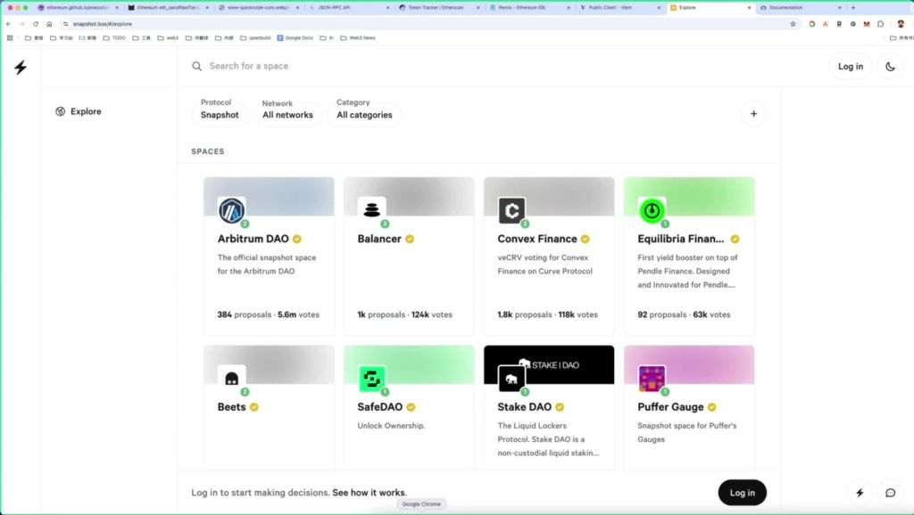
- **哈希计算**：交易哈希是本地计算得出，不需要等待远程节点确认
- **请求处理**：基础请求（如哈希计算）在本地即可完成，无需发送到区块链节点
- **性能表现**：基本操作响应速度很快，不像远程调用需要长时间等待

### 3. 正式开发与生产级应用的区别

- **核心差异**：生产级与非生产级 **Web3** 应用的主要区别在于 **UI** 美观度，而非核心功能
- **服务器需求**：去中心化应用通常不需要自有服务器（缓存层等特殊情况除外）
- **开发流程**：教学演示项目与正式开发流程完全一致，可直接用于生产环境

### 4. 业务逻辑与脚本、前端参数的处理

- 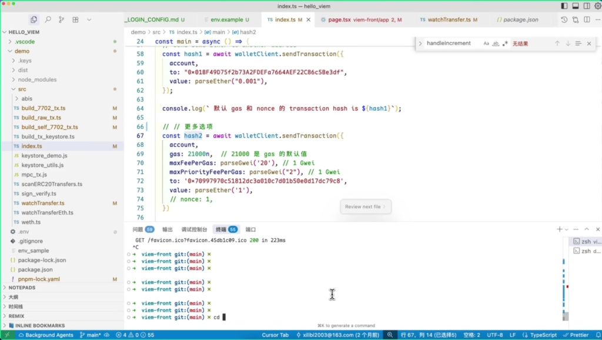
- **脚本处理**：演示脚本中硬编码的地址参数在实际业务中应替换为用户输入
- **参数获取**：前端应用通过表单等方式获取用户输入的转账目标地址等参数
- **开发工具**：**Remix IDE** 可以直接读取浏览器嵌入钱包的信息进行开发调试

### 5. 浏览器嵌入钱包信息的读取

- 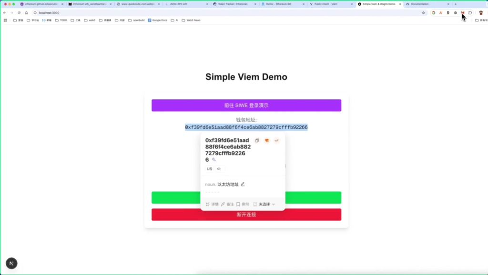
- **地址获取**：前端应用可以通过 **JavaScript** 读取 **MetaMask** 等钱包插件提供的地址信息
- **网络信息**：同时可以获取当前连接的区块链网络 **ID** 和账户余额等基础信息
- **交互验证**：演示界面成功显示钱包地址证明读取功能正常工作

### 6. 钱包安全与加密存储

- **存储机制**：钱包私钥采用加密存储，不是明文保存在本地
- **安全类比**：类似 **1Password** 等密码管理工具的安全存储原理
- **风险提示**：虽然加密存储相对安全，但仍需防范电脑被入侵的风险

### 7. 钱包创建、签名与分层确定性原理

- **教学内容**：课程将涵盖钱包创建、交易签名等核心功能实现
- **技术原理**：重点讲解分层确定性 (**HD**) 钱包的生成算法和工作原理
- **数据来源**：包括助记词、种子等关键数据的生成和使用方法

### 8. Web3 求职与招聘网站概览

- 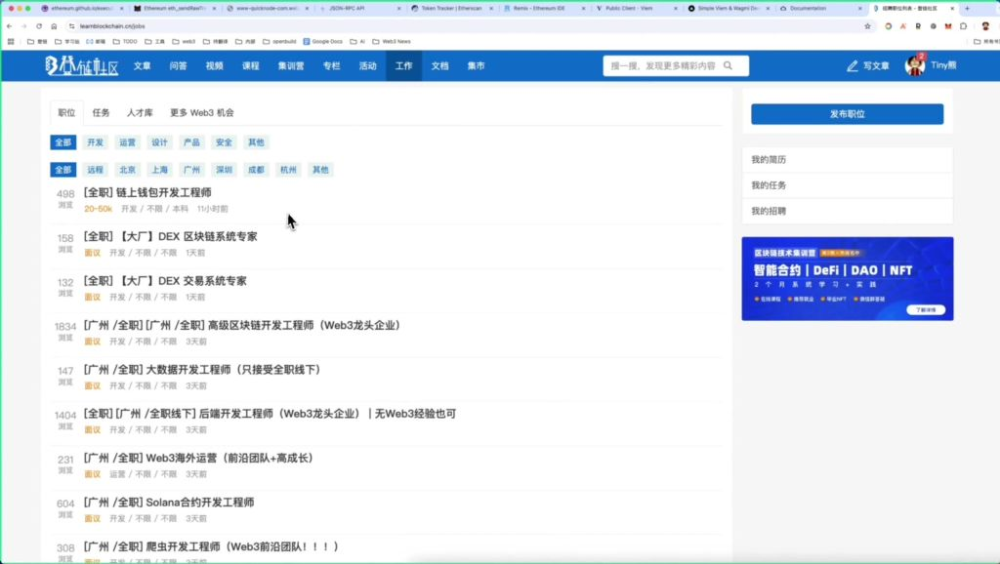
- **国内平台**：登链社区等中文平台提供 **Web3** 开发、运营等多岗位招聘信息
- **国际机会**：**CryptoJobsList**、**Web3.career** 等专注海外/远程 **Web3** 职位
- **岗位类型**：涵盖智能合约开发、**DEX** 系统专家、区块链安全等多元化方向
- **薪资范围**：国内 **Web3** 开发岗位薪资普遍在 20-50k 区间（示例数据）

## 十五、课程内容总结

### 1. Web3 技术栈与职业发展

- 
- **职业方向**：区块链开发者、智能合约开发者、全栈开发者、产品经理、设计师等
- **学习建议**：
    - **实践重要性**：仅听课容易遗忘，必须通过实践作业巩固知识
    - **掌握程度**：同班学习效果差异大，关键在于真正掌握而非简单完成课程
    - **作业设计**：课程作业经过精心设计，剥离复杂业务逻辑，聚焦核心技术点

### 2. Web3 应用架构

- 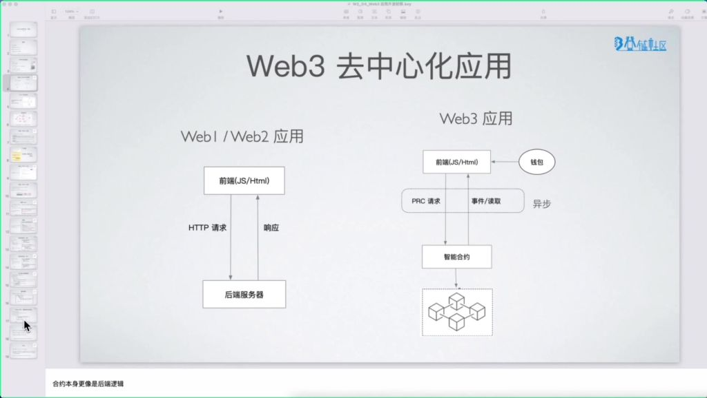
- **技术架构**：
    - 前端：使用 **JS**/**HTML** 与钱包交互，通过 **RPC** 请求读取智能合约
    - 智能合约：承担后端业务逻辑功能
- **与传统 Web 对比**：
    - **Web1**/**Web2** 采用 **HTTP** 请求-响应模式与中心化服务器交互
    - **Web3** 通过异步方式与去中心化网络交互

### 3. 实践作业示例

- 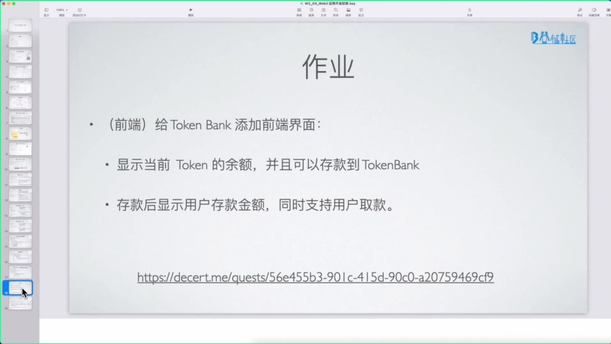
- **作业要求**：
    - 实现 **Token Bank** 前端界面
    - 显示当前 **Token** 余额
    - 实现存款/取款功能
    - 展示交易记录
- **教学目的**：
    - 通过简化业务场景聚焦核心技术实现
    - 避免无关复杂度干扰学习重点


## 十六、招聘网站与岗位要求

- 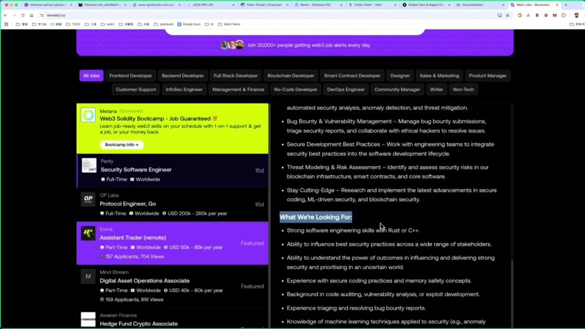
- **岗位职责**：
    - 设计实现安全软件，审计代码漏洞
    - 开发 **ML** 工具实现自动化安全分析
    - 管理漏洞赏金计划，协调白帽黑客
    - 实施安全开发生命周期最佳实践
- **任职要求**：
    - 精通 **Rust**/**C++** 编程
    - 熟悉安全编码和内存安全概念
    - 具有漏洞分析和利用开发经验
    - 了解机器学习在安全领域的应用
- **薪资范围**：
    - **协议工程师**: 200k - 260k/年
    - **助理交易员**: 50k - 85k/年
    - **数字资产运营**: 40k - 80k/年


## 十七、链上钱包开发工程师

- 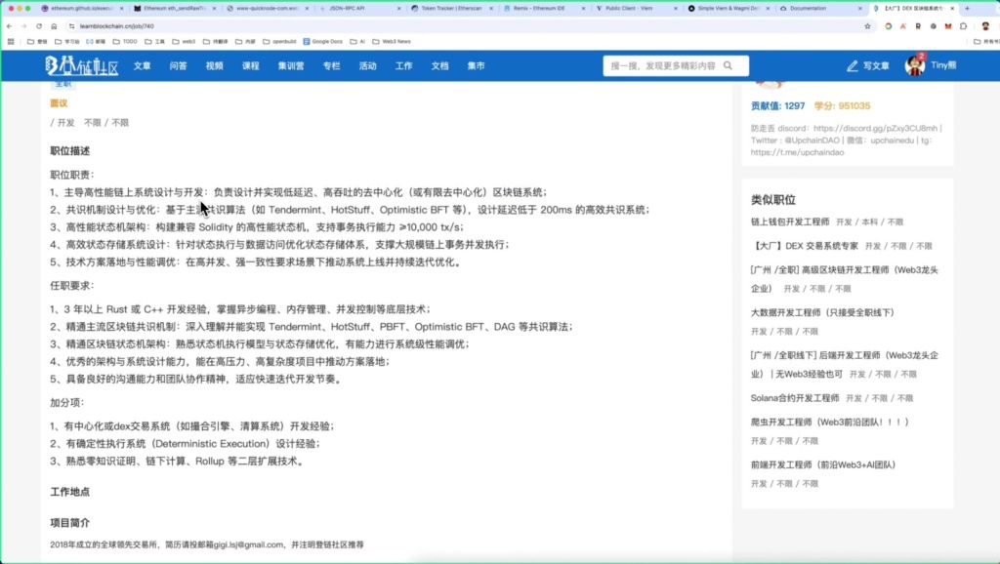

### 1. 链上钱包开发工程师任职要求

- **核心技能**：需掌握 **Rust** 或 **C++** 开发，具备异步编程、内存管理和并发控制能力
- **共识机制**：要求精通 **Tendermint**、**HotStuff**、**PBFT** 等主流区块链共识算法
- **性能指标**：需设计延迟低于 200ms 的共识系统，支持 $\geqslant 10,000$ **tx/s** 的事务处理能力
- **架构能力**：能够优化状态存储系统，支撑大规模链上事务并发执行

### 2. 岗位要求的技能与经验

- **经验门槛**：部分企业硬性要求 3 年以上开发经验，但实际能力可能更重要
- **能力评估**：技术水平比工作年限更重要，类似“武侠悟性高的人短期可超越多年修炼者”
- **简历策略**：若实际能力达标，可适当美化工作年限，但需确保技术真实掌握

### 3. Web3 岗位的多样性

- **岗位类型**：包含前端、后端、合约开发、**App** 开发等，与传统开发领域相似
- **技术难度**：实际工作技术难度可能低于学习阶段，大量时间用于需求对接
- **工作本质**：基础开发工作与 **Web2** 相似，都是“增删改查”类的基础开发

### 4. 实际工作与学习作业的差异

- **工作特点**：面试要求高（造火箭），实际工作简单（打螺丝），国内开发者过剩导致内卷
- **海外优势**：海外远程岗位工作内容更合理，竞争压力相对较小
- **技术应用**：工作中用到的技术可能比学习作业更简单，重点在需求理解和沟通

### 5. 海外远程工作的面试经验与英语要求

- **英语要求**：不要求流利，但需基本沟通能力，能理解对方表达
- **心理建设**：需克服语言恐惧，非母语者结巴表达也会被接受
- **实践建议**：直接投递简历获取真实面试体验，比理论准备更有效

### 6. 海外工作对项目经验与开源参与的重视

- **GitHub 价值**：开源贡献和项目经验比学历更重要
- **LinkedIn 优化**：完善资料可能吸引招聘方主动联系
- **证明方式**：技术文章、开源项目参与都是重要加分项

### 7. 如何打造自己的 GitHub

- 
- **基础方法**：完成课程作业并上传，形成项目经验
- **进阶策略**：**fork** 经典项目进行重构或改进
- **内容类型**：学习笔记、完整项目、合约代码均可展示能力

### 8. 完整项目经验的重要性

- **项目价值**：完整项目能展示问题解决能力和开发流程理解
- **描述技巧**：需能清晰说明项目背景、遇到的问题及解决方案
- **实践建议**：开发过程中会自然产生优化想法，不必过度追求初始完美

### 9. 经典项目与创新

- **项目选择**：**Token** 相关项目（如 **DEX**、**NFT** 市场）是 **Web3** 开发经典案例
- **创新压力**：实际项目多数借鉴现有方案，不要求完全创新
- **技术深度**：合约升级、多签、安全等是值得深入的专业方向
- 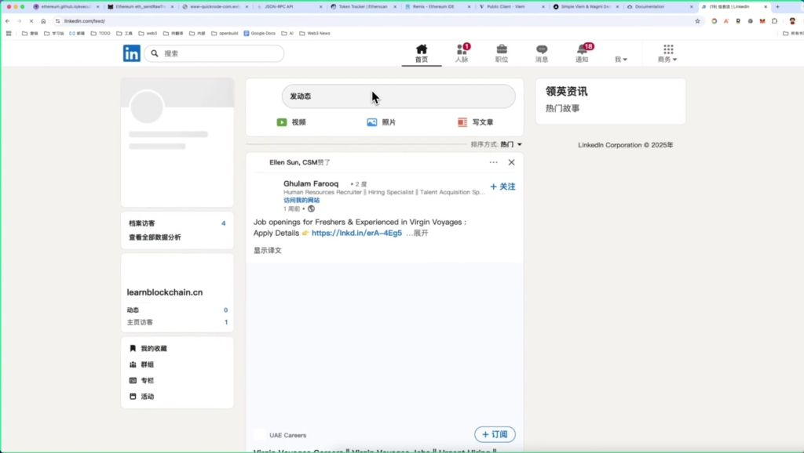


## 十八、课程结束

### 1. 大型项目与创新的重要性

- 
- **项目规模判断标准**：交易量是衡量交易所项目规模的重要指标，当前最大的交易所是 **Uniswap**，24 小时交易量达 90 亿美元
- **创新与基础的关系**：项目开发应注重基本功而非过度追求创新，如同练武需先扎马步，**Web3** 项目开发的基础框架能力比花哨功能更重要
- **项目开发建议**：实际开发经验和在项目中的思考过程比单纯创新更有价值，建议先掌握基础再考虑创新

### 2. 头部公司招聘活跃情况

- 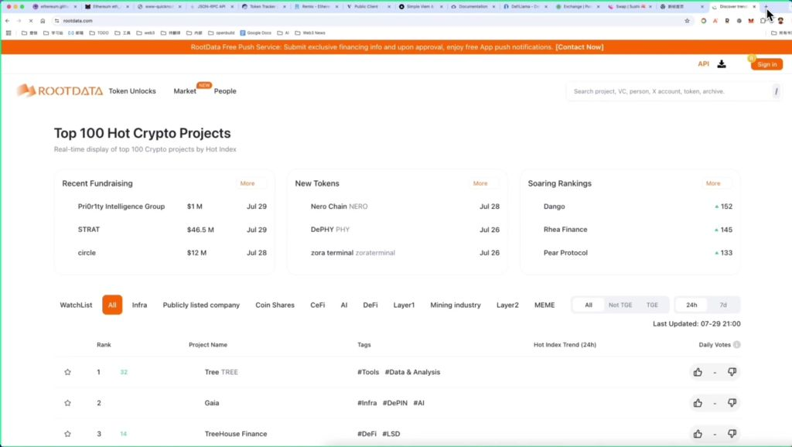
- **头部公司识别方法**：
    - 通过币价排行前列的项目识别
    - 使用 **DefiLlama** 等数据分析平台查看热门项目
    - 追踪推特上的招聘信息和融资动态
- **行业特点**：**Web3** 公司普遍规模较小，除交易所外，多数团队仅 10-20 人

### 3. 热门项目与数据面板概览

- 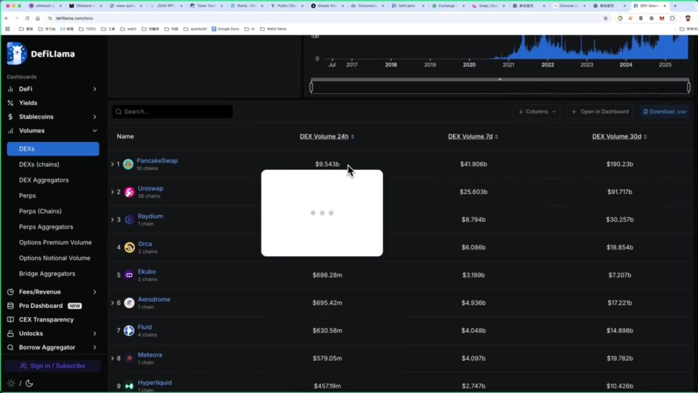
- **数据分析工具**：**DefiLlama** 是 **DeFi** 领域专业数据面板，提供：
    - 各链 **TVL**（总锁定价值）数据
    - **DEX** 交易量排行（如 **Uniswap**、**PancakeSwap** 等）
    - 项目分类和比较功能
- **项目分类**：**DeFi** 包含 **DEX**、借贷、流动性挖矿等多个细分领域


