## 一、 链社区

### 1. 与链交互

- 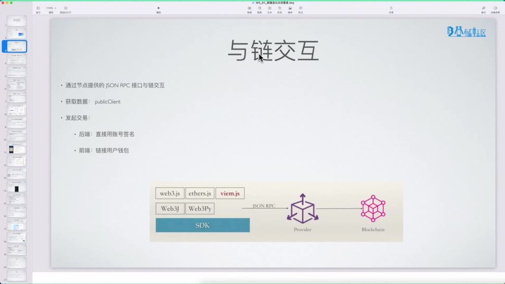
- **JSON-RPC** 接口：区块链节点提供的标准交互接口，可通过 **HTTP** 请求直接调用。
- **SDK** 封装：主流语言都有对应的 **SDK** 封装（如 `web3.js` / `ethers.js` / `viem.js` 等），简化开发流程。
- **客户端分类**：
    - `PublicClient`：用于查询链上数据（不同库可能称为 `Provider`）。
    - `WalletClient`：用于发起交易，需要签名授权。
- **签名方式**：
    - **后端**：直接导入私钥、助记词、**KeyStore** 等。
    - **前端**：需连接用户钱包（如 **MetaMask**）进行授权。

### 2. 使用 MetaMask 在页面中注入 window.ethereum 对象链接用户的钱包

- 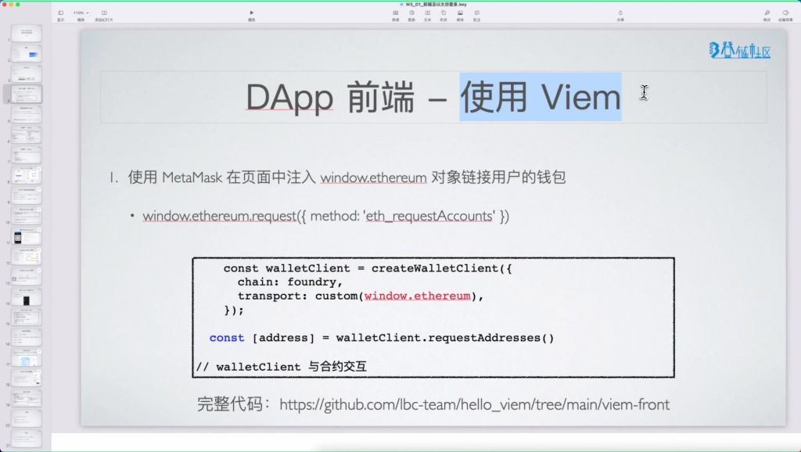
- **注入机制**：浏览器插件钱包（如 **MetaMask**）会自动注入全局 `window.ethereum` 对象。
- **授权流程**：需要用户明确授权才能获取账户地址。
- **多账户支持**：可同时授权多个账户，返回地址数组。

#### 1）仿真请求获取用户账号

- **核心代码**：
- **实现细节**：
    - 需要指定链信息（如 **Foundry** 测试链）。
    - 使用 `custom transport` 适配不同钱包实现。
    - 完整示例代码参考：`hello_viem` 项目。

#### 2）应用演示

- 
- **状态管理**：
    - 需要跟踪交易状态（`pending` / `confirmed`）。
    - 处理异步操作时的 `loading` 状态。
    - 实时更新链上数据（如余额变化）。
- **开发建议**：
    - `Viem` 库更适合基础交互场景。
    - 复杂 **DApp** 建议使用状态管理更完善的 `Wagmi`。
    - 注意处理网络切换和断开连接的情况。
- **典型实现**：
    - 使用 **React Hooks** 管理状态（`useState` / `useEffect`）。
    - 分离公共客户端和钱包客户端。
    - 需要处理钱包未安装的边界情况。
- **注意事项**：
    - 交易确认可能需要较长时间（不同链差异大）。
    - 需要处理 **RPC** 请求失败的情况。
    - 前端需要妥善保管 `Session` 而非私钥。

### 3. Wagmi 前端库

- 
- **功能定位**：一个 **React Hooks** 库，专门用于简化 **DApp** 前端开发。
- **核心功能**：
    - **状态管理**：自动维护钱包连接状态、网络变化监听、合约状态缓存与更新。
    - **常用 Hooks**：
        - `useConnect()`：处理钱包连接。
        - `useAccount()`：获取账户信息。
        - `useBalance()`：查询余额。
        - `useReadContract()`：读取合约数据。
        - `useWriteContract()`：写入合约数据。
- **适用场景**：95% 以上的 **Web3** 前端应用使用 **React** 开发。

#### 1）Wagmi 简单演示

- 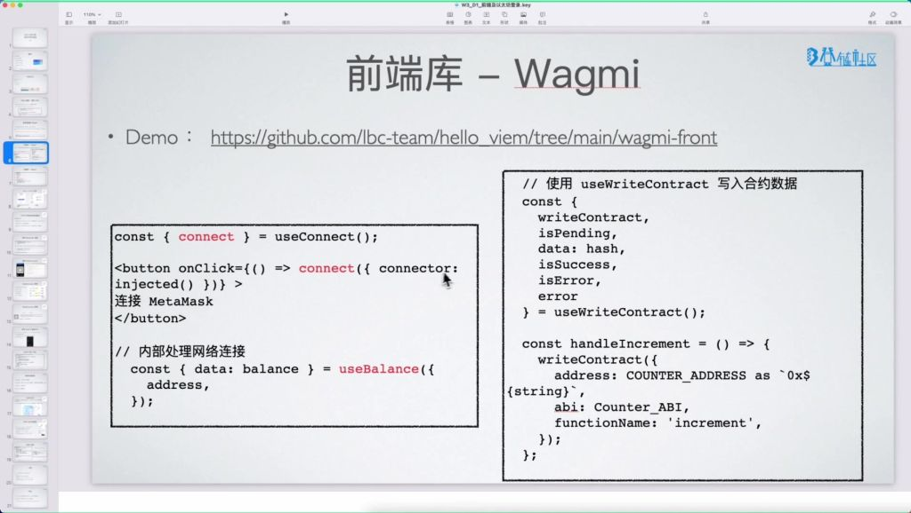
- **钱包连接**：
    - **代码示例**：
    - **实现原理**：`injected()` 表示浏览器插件钱包（如 **MetaMask**）。
- **余额查询**：
    - **代码示例**：
- **合约交互**：
    - **写入操作**：
    - **状态管理**：自动处理交易 `pending`、成功、失败等状态。

#### 2）Wagmi 安装

- 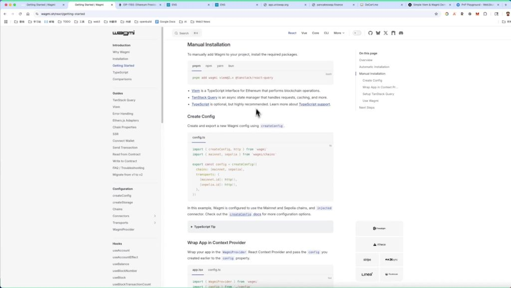
- **安装步骤**：
    - **基础安装**：`npm i @reown/appkit-adapter-wagmi wagmi`
    - **完整配置**：需要额外安装 `npm add @tanstack/react-query`
- **配置要点**：
    - 必须创建并导出 `config` 对象。
    - 需要配置支持的链（如 `mainnet` / `sepolia`）。
    - 需要将应用包装在 `WagmiProvider` 中。

#### 3）Wagmi 使用演示

- 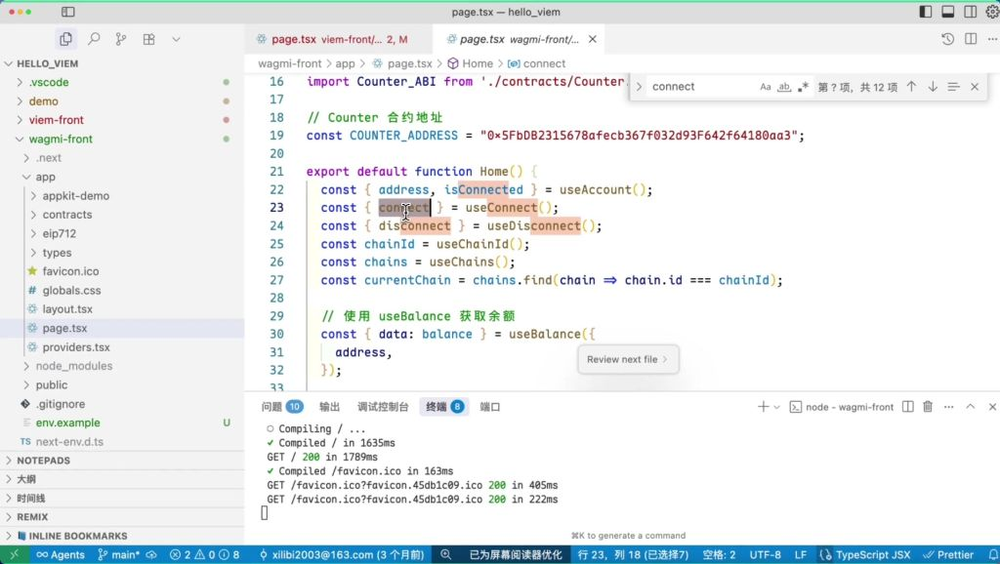
- **完整功能演示**：
    - **连接状态管理**：自动处理连接 / 断开连接状态。
    - **链信息获取**：使用 `useChainId()` 和 `useChains()`。
    - **合约交互**：
        - **读取**：`useReadContract()`
        - **写入**：`useWriteContract()`
- **优势对比**：
    - 相比原生实现，代码量减少 50% 以上。
    - 自动处理所有底层状态管理。
    - 内置错误处理和交易状态跟踪。

### 4. Web2 vs Web3 登录方式对比

- 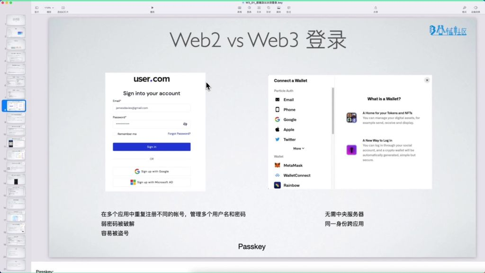
- **Web2 登录特点**：
    - **传统方式**：邮箱 / 密码 或 手机验证码。
    - **主要问题**：
        - 各应用账号系统完全独立。
        - 需要管理大量账号密码。
        - 密码泄露风险高（如 **CSDN** 明文泄露事件）。
- **Web3 登录优势**：
    - **统一身份**：钱包地址作为跨应用统一身份。
    - **安全机制**：基于密码学签名而非密码。
    - **新兴方案**：**Passkey** 等生物识别验证方式。
- **发展趋势**：
    - **Web3** 正在整合 **Passkey** 等现代验证方式。
    - **ENS** 等系统提供身份聚合功能。

### 5. Web2 vs Web3 登录

#### 1）登录 Web3 应用

- **数字钱包概述**
    - 
    - **核心功能**：数字钱包是 **Web3** 用户的数字资产之家，用于发送、接收、存储和显示通过以太坊和 **EVM** 链的数字资产。
    - **创新特性**：不同于传统银行账户，用户完全掌控资产所有权，只需连接钱包即可访问各类 **Web3** 应用。
    - **主流钱包类型**：
        - 浏览器插件钱包（如 **MetaMask**）
        - 移动端钱包（如 **Rainbow** / **Coinbase Wallet**）
        - 硬件钱包（如 **Ledger**）
        - 智能合约钱包（如 **Argent**）
- **钱包登录机制**
    - 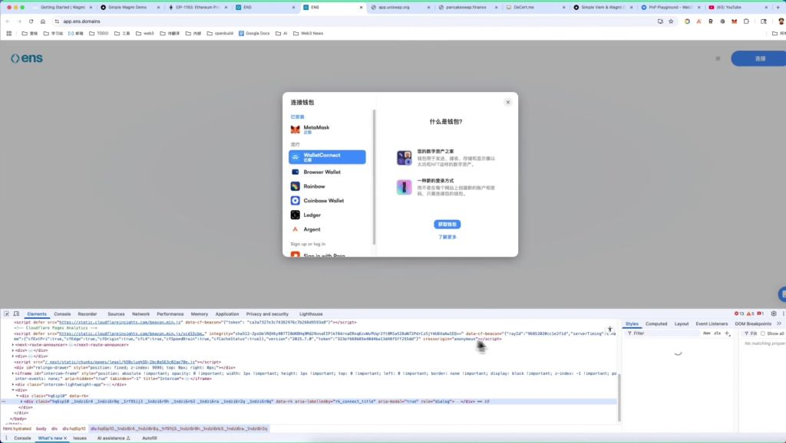
    - **通用身份体系**：通过 **ENS**（以太坊域名服务）实现跨应用身份识别，例如 `vitalik.eth` 等 `.eth` 域名可解析用户所有加密地址。
    - **自动显示功能**：当用户拥有 **ENS** 时，登录 **Web3** 应用会自动显示注册的域名和关联的 **NFT** 头像等信息。
    - **典型问题**：网络连接问题可能导致钱包弹窗延迟或失败（如“网络有些问题拿不到”的情况）。
- **Web2 与 Web3 登录对比**
    - 
    - **Web2 痛点**：
        - 需在每个网站重复注册。
        - 管理多组用户名密码。
        - 存在弱密码和盗号风险。
    - **Web3 优势**：
        - 去中心化身份（通过 **EIP-1193** 标准实现）。
        - 同一加密身份跨应用通用。
        - 自动关联 **ENS** 域名和数字资产信息。
    - **技术标准**：钱包登录遵循 **EIP-1193** 规范，**MetaMask** 是最早实现该标准的钱包之一。
- **钱包兼容性**
    - 
    - **钱包多样性**：除 **MetaMask** 外，还有 **OKX Wallet**、**Phantom**、**Rabby** 等兼容 **EIP-1193** 的钱包。
    - **冲突处理**：同时安装多个钱包扩展可能导致冲突，需要禁用部分钱包（如“有冲突”的情况）。
    - **开发调试**：**Chrome** 开发者模式可管理钱包扩展，方便开发者测试不同钱包的集成效果。
- **实际应用案例**
    - 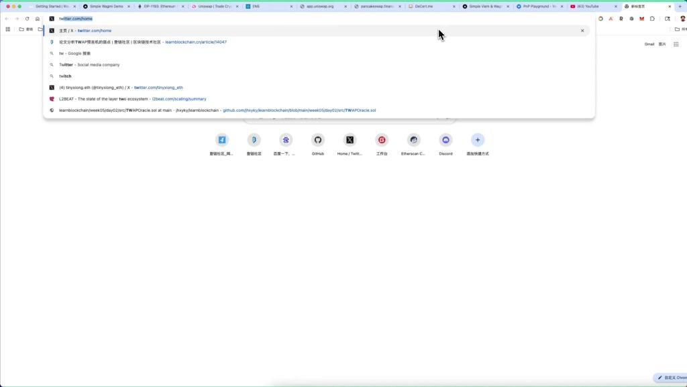
    - **身份整合**：用户 `tinyxiong.eth` 的 **ENS** 域名同时关联：
        - **Web3** 应用中的显示名称。
        - **NFT** 头像资产。
        - **Twitter** 等 **Web2** 平台的昵称。
    - **信息同步**：修改 **ENS** 记录中的个人信息会自动同步到所有集成的 **Web3** 应用。

#### 2）DApp 实现加密钱包登录

- **使用 WalletConnect**
    - 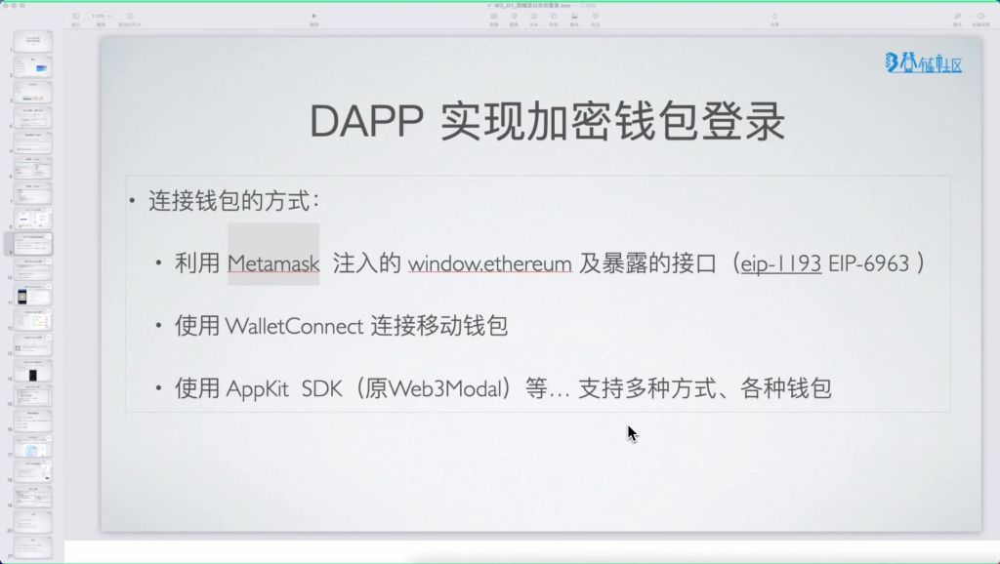
    - **多种连接方式**：
        - 利用 **MetaMask** 注入的 `window.ethereum` 及暴露的接口（**EIP-1193** / **EIP-6963**）。
        - 使用 **WalletConnect** 连接移动钱包。
        - 使用 **AppKit SDK**（原 **Web3Modal**）支持多种钱包连接。
    - **接入难点**：需要处理不同钱包的兼容性问题，特别是当用户未安装浏览器插件钱包时，需支持移动端钱包连接。
    - **WalletConnect 原理**
        - 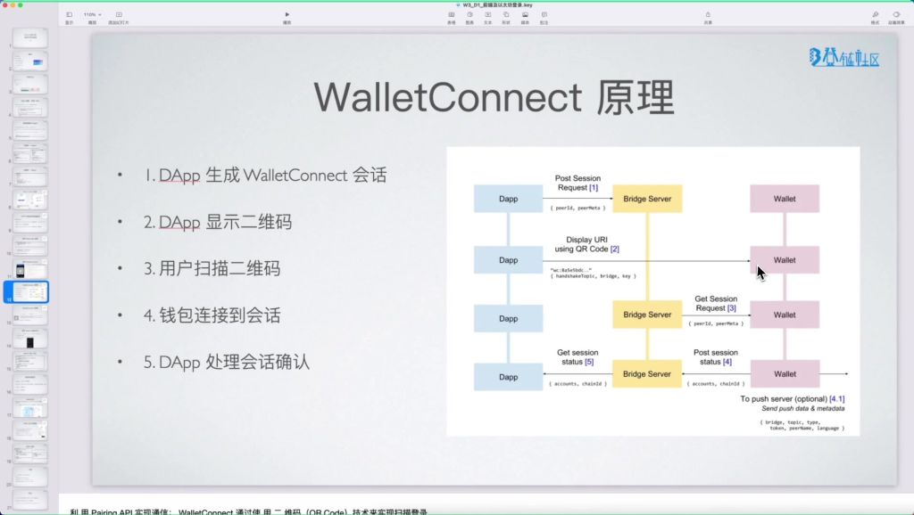
        - **连接流程**：
            - **DApp** 生成 **WalletConnect** 会话。
            - **DApp** 显示二维码。
            - 用户扫描二维码。
            - 钱包连接到会话。
            - **DApp** 处理会话确认。
        - **关键技术**：
            - 使用二维码（**QR Code**）技术实现扫描登录。
            - 通过桥接服务器（**Bridge Server**）中转信息。
            - 采用对称加密保证通信安全（`symKey` 字段）。
        - **会话信息**：
            - 包含会话标识符（`wc:...`）。
            - 过期时间戳（`expiryTimestamp`）。
            - 中继协议（`relay-protocol`）。
            - 对称加密密钥（`symKey`）。
- **使用 AppKit 登录 SDK**
    - 
    - **平台升级**：**WalletConnect** 升级为 **Reown**，从钱包连接协议发展为链上用户体验平台。
    - **核心功能**：
        - 整合钱包功能到应用的 **SDK**。
        - 支持多种钱包登录、社交登录。
        - 提供网络切换（多链支持）。
        - 支持智能合约交互。
    - **配套工具**：
        - **AppKit**：面向应用开发者的工具。
        - **WalletKit**：面向钱包开发者的工具。
    - **AppKit 接入方法**
        - 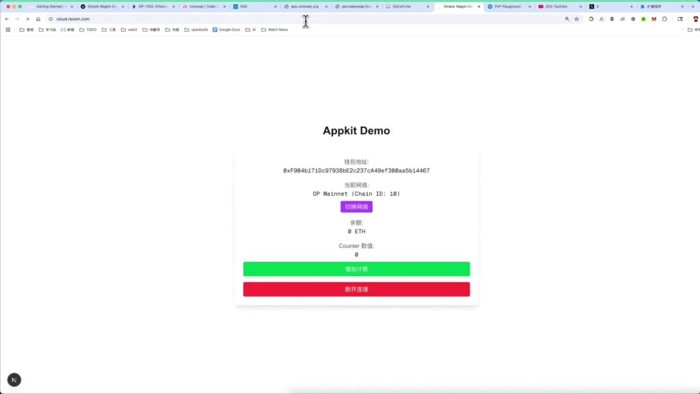
        - **配置步骤**：
            - 从 **Reown** 云平台获取 `projectId`。
            - 定义元数据（名称、描述、**URL**、图标等）。
            - 创建 `WagmiAdapter` 处理底层连接。
            - 创建 `AppKit` 实例并配置支持网络。
        - **实现要点**：
            - 元数据会在钱包连接界面显示，帮助用户识别应用。
            - 需要配置支持的网络列表（如 `[mainnet, arbitrum]`）。
            - 调用 `useAppKit` 的 `open` 函数显示连接模态框。
        - **优势**：简化多种钱包接入流程，统一处理连接、网络切换等操作。

### 6. 其他的链接库

#### 1）RainbowKit

- 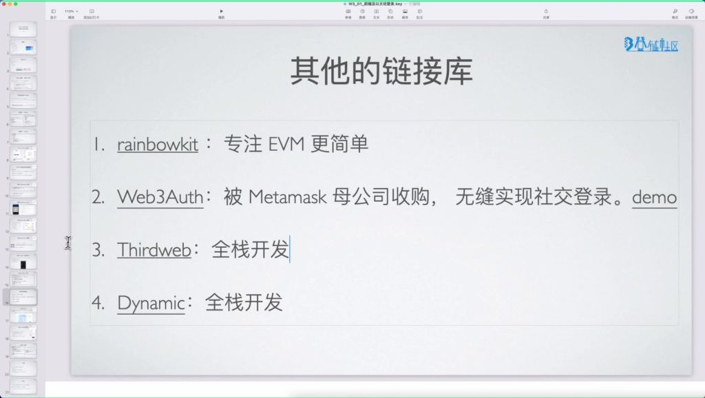
- **专注领域**：专注于 **EVM**（以太坊虚拟机）生态开发。
- **特点**：提供更简单的开发体验，适合以太坊生态应用开发。

#### 2）Web3Auth

- 
- **技术原理**：
    - **MPC 机制**：使用多方安全计算（**MPC**）技术，将私钥分成 3 个分片。
    - **分片存储**：1 片存储在用户设备本地，1 片由 **Web3Auth** 网络管理，1 片作为备份。
    - **签名方式**：各分片可单独签名后合并，或重建完整私钥签名。
- **验证流程**：
    - 通过 **Google** 等社交账号授权验证身份。
    - 返回包含用户邮箱和 **Google** 签名的 **token ID**。
    - 服务端分片签名后与本地分片合并形成完整签名。
- **优势**：被 **MetaMask** 母公司收购，实现无缝社交登录体验。

#### 3）SIWE 以太坊登录

- **基本原理**
    - 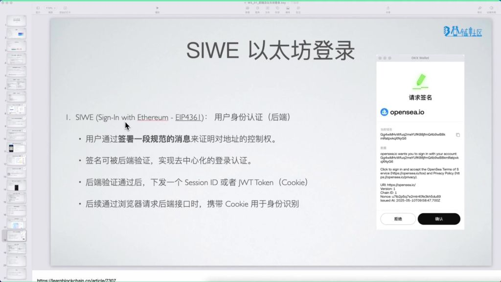
    - **标准定义**：基于 **EIP-4361** 标准（**Sign-In with Ethereum**）。
    - **验证流程**：
        - 用户签署规范消息证明地址控制权。
        - 后端验证签名实现去中心化认证。
        - 验证通过后下发 **Session ID** 或 **JWT Token**。
        - 后续请求携带 **Cookie** 进行身份识别。
    - **应用场景**：后端系统需要验证用户身份时使用。
- **实现方式**
    - 
    - **消息创建**：
    - **签名请求**：
    - **签名验证**：
    - **会话管理**：验证通过后下发 **Cookie**，后续请求携带该 **Cookie**。
- **实际应用**
    - 
    - **请求内容**：包含域名、链 **ID**、随机 `nonce`、版本等信息。
    - **用户确认**：钱包会显示完整的签名请求详情供用户审查。
    - **安全特性**：
        - 不会触发区块链交易或消耗 **gas** 费用。
        - 认证状态默认 7 天后重置。
    - **开发资源**：**AppKit** 提供 **SIWE** 扩展（**SIWX**），简化实现流程。

